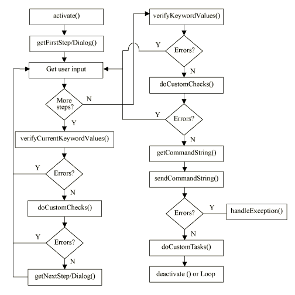
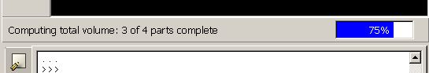

# 7.2 模式处理

模式通常通过GUI中的按钮激活。一旦模式被激活，它负责收集用户输入、处理输入、发送命令以及执行与该模式或其发送的命令相关的任何错误处理。本节描述模式如何处理。以下主题被涵盖：

- ["模式处理序列，" 第7.2.1节](pt04ch07s02.md#cus-mod-modes-processing-sequence)
- ["激活模式，" 第7.2.2节](pt04ch07s02.md#cus-mod-modes-processing-activating)
- ["步骤和对话框处理，" 第7.2.3节](pt04ch07s02.md#cus-mod-modes-processing-step)
- ["命令处理，" 第7.2.4节](pt04ch07s02.md#cus-mod-modes-processing-command)
- ["进行中的工作，" 第7.2.5节](pt04ch07s02.md#cus-mod-modes-processing-wip)
- ["命令错误处理，" 第7.2.6节](pt04ch07s02.md#cus-mod-modes-processing-error)

### 7.2.1 模式处理序列

在输入收集过程中，模式允许您执行一些中间错误检查。例如，如果用户应该输入0到1之间的值但输入了该范围之外的值，您可以在继续收集更多输入之前标记错误。在从用户收集所有输入之后，模式验证输入、构造命令并将命令发送到kernel。如果kernel抛出异常，模式将处理该异常。[图7-1](pt04ch07s02.md#cus-mod-modes-flow)显示了模式处理序列。

**图7-1** 模式处理序列。



要为模式提供自定义处理，您可以覆盖[图7-1](pt04ch07s02.md#cus-mod-modes-flow)中所示的许多方法。如果您覆盖方法，您应该使用与该方法完全相同的原型，包括该方法可能具有的相同默认值。请参阅[Abaqus GUI工具包参考指南](../gui/gui-link.md#gui)以确定方法的原型。

### 7.2.2 激活模式

模式通常通过向其发送ID设置为ID_ACTIVATE且类型为SEL_COMMAND的消息来激活。此消息导致调用模式的activate方法。有关更多信息，请参阅["目标和消息，" 第6.5.4节](pt04ch06s05.md#cus-com-commands-targets)。

如果您需要在模式开始从用户收集输入之前执行任何处理，您可以重新定义activate方法。例如，您可以检查当前视口是否包含部件，然后再开始需要用户选择部件上内容的模式，如以下方法所示：

```
    def activate(self):

        if getDisplayedObjectType() == PART:
            AFXForm.activate(self)
        else:
            showAFXErrorDialog(getAFXApp().getAFXMainWindow(),
                 'A part must be displayed in the \
                  current viewport.')
```

如果您编写自己的activate（或deactivate）方法，如果未遇到错误条件，则必须调用基类版本的该方法。基类方法执行使模式正常运作所需的额外处理。

### 7.2.3 步骤和对话框处理

模式激活后，它循环执行一系列事件，从用户收集输入并验证输入。在用户提交每个步骤或对话框后，模式调用以下方法：

**verifyCurrentKeywordValues**

`verifyCurrentKeywordValues`方法为与当前步骤或对话框关联的每个关键字调用`verify`方法，并在必要时显示错误对话框。如果未遇到错误，`verifyCurrentKeywordValues`方法返回True；否则，它返回False并终止进一步处理。

**doCustomChecks**

`doCustomChecks`方法在基类中有一个空实现。您可以重新定义此方法以对关键字值执行任何额外检查，通常执行范围检查或检查值之间的一些相互依赖性。如果未遇到错误，`doCustomChecks`方法应返回True；否则，它应返回False，以便终止进一步的命令处理。`doCustomChecks`方法在步骤和对话框处理期间以及命令处理期间由模式调用。

### 7.2.4 命令处理

当模式完成从用户收集输入时，它调用一系列方法。如果需要，您可以重新定义一些方法来自定义模式的行为。以下列表描述了模式调用的每个方法：

**verifyKeywordValues**

`verifyKeywordValues`方法为与模式关联的每个命令的每个关键字调用`verify`方法，并在必要时显示错误对话框。如果未遇到错误，`verifyKeywordValues`方法返回True；否则，它返回False并终止进一步命令处理。

**doCustomChecks**

`doCustomChecks`方法在基类中有一个空实现。您可以重新定义此方法以对关键字值执行任何额外检查，通常执行范围检查或检查值之间的一些相互依赖性。如果未遇到错误，`doCustomChecks`方法应返回True；否则，它应返回False，以便终止进一步的命令处理。`doCustomChecks`方法在步骤和对话框处理期间以及命令处理期间由模式调用。

以下示例显示了如何使用`doCustomChecks`方法查找无效值，并作为响应显示错误对话框并将光标放入相应的窗口部件。如果关键字连接到对话框中的文本字段，`onKeywordError`方法会找到文本字段窗口部件，选择其内容，并将焦点放在该窗口部件上。

```
def doCustomChecks(self):

    if self.lengthKw.getValue() >= 1000:
        showAFXErrorDialog(self.getCurrentDialog(),
            'Length must be less than 1000.')
        self.getCurrentDialog().onKeywordError(self.lengthKw)
        return False
```

**issueCommands**

`issueCommands`方法负责构造命令字符串、向kernel发出命令、处理命令的任何异常以及在必要时停用模式。`issueCommands`方法调用以下方法：

- `getCommandString`：此方法返回一个字符串，表示从与模式关联的每个命令收集的命令。必需关键字始终随命令一起发送，但可选关键字仅在其值发生更改时才发送。命令按在模式中构造的相同顺序发送到kernel。如果您的命令不符合模式生成的命令的标准样式，您可以重新定义此方法以生成您自己的命令字符串。

- `sendCommandString`：此方法获取从`getCommandString`方法返回的命令字符串，并将其发送到kernel进行处理。您不应该覆盖此方法，否则您的模式可能无法正常执行。

- `doCustomTasks`：此方法在基类中有一个空实现。您可以重新定义此方法以在kernel处理命令后执行任何额外任务。

在调用这些方法之后，如果用户按下"确定"按钮，`issueCommands`方法将停用模式。

`issueCommands`方法还控制命令写入重放和日志文件。GUI基础设施始终使用`writeToReplay`=**True**和`writeToJournal`=**False**调用`issueCommands`。如果您想更改行为，您可以覆盖此方法并为参数指定不同的值。如果您覆盖`issueCommands`方法，必须指定两个参数，并且应始终从您的方法中调用基类方法，否则您的模式可能无法正常执行。例如：

```
def issueCommands(self, writeToReplay, writeToJournal):
    AFXForm.issueCommands(self, writeToReplay=True,
        writeToJournal=True)

```

在大多数情况下，您不需要调用`issueCommands`，因为基础设施会自动调用它；但是，如果中断正常的模式处理流程，则必须调用`issueCommands`来完成处理。例如，如果要在发出命令之前询问用户执行命令的权限，可以从`doCustomChecks`方法显示警告对话框。在此示例中，您必须从`doCustomChecks`方法返回**False**以停止命令处理。然后应用程序将等待用户从警告对话框中进行选择。当用户点击警告对话框中的按钮时，您必须捕获对话框发送到表单的消息。如果用户点击"是"，您应该继续命令处理，如以下示例所示：

```
class MyForm(AFXForm):

    ID_OVERWRITE = AFXForm.ID_LAST

    def __init__(self, owner):

        AFXForm.__init__(self, owner)
        FXMAPFUNC(self, SEL_COMMAND,
            self.ID_OVERWRITE, MyForm.onCmdOverwrite)
        ...

    def doCustomChecks(self):

        import os
        if os.path.exists(self.fileNameKw.getValue()):
            db = self.getCurrentDialog()
            showAFXWarningDialog(db,
                'File already exists.\n\nOK to overwrite?',
                AFXDialog.YES|AFXDialog.NO, self,
                self.ID_OVERWRITE)
            return False

        return True

    def onCmdOverwrite(self, sender, sel, ptr):

        if sender.getPressedButtonId() == \
            AFXDialog.ID_CLICKED_YES:
                self.issueCommands(writeToReplay=True,
                    writeToJournal=True)
        return 1
```

通常，GUI基础设施在模式提交时自动负责将命令发送到kernel。如果需要在模式提交之前发出命令，您可以自己调用`issueCommands`。在其他情况下，您可能希望在不使用表单基础设施的情况下发送命令。您可以使用`sendCommand(cmd)`方法将命令字符串直接发送到kernel。有关更多信息，请参阅["执行命令，" 第6.3节](pt04ch06s03.md)。

**deactivate**

模式成功发出命令后，它将调用`deactivate`方法执行各种清理任务，除非模式循环或按下了"应用"按钮，在这种情况下，模式返回等待用户的进一步输入。如果需要为模式执行您自己的清理任务，您可以覆盖此方法；但您也应该确保调用基类方法以确保模式被正确终止，如以下示例所示。

```
def deactivate(self):

    # 在这里执行您的处理

    # 调用基类方法
    AFXForm.deactivate(self)
```

**cancel**

如果您需要以编程方式取消模式（而不是用户单击"取消"按钮），您可以调用模式的`cancel`方法，使用其参数的默认值。`cancel`方法将调用`deactivate`方法，因此模式的清理任务仍会执行。

如果您想给用户一个确认是否应取消模式的机会，可以让系统调用bailout对话框。如果您正在编写表单模式，可以在对话框的构造函数中指定bailout标志。如果您正在编写过程模式，应该编写`checkCancel`方法。`checkCancel`方法的返回值决定了在取消过程时是否提示用户确认。例如：

```
def checkCancel(self):

    if self.getCurrentStep() == self.step1:
        # 如果在第一步中取消，不
        # 要询问用户确认取消。
        return AFXProcedure.BAILOUT_OK
    else:
        # 在第一步之后，取消前
        # 询问用户确认。
        return AFXProcedure.BAILOUT_NOTOK

```

默认情况下，当Abaqus/CAE中的上下文更改时，所有表单都会被取消；例如，当用户打开新数据库或更改当前模型时。如果您有一个不想被取消的表单模式，您可以按如下方式在表单代码中覆盖基类实现：

```
def okToCancel(self):
    return False

```

### 7.2.5 进行中的工作

如果发送到kernel的命令花费超过一定时间（约一秒），GUI将锁定并显示忙光标。如果要为命令的进度提供额外反馈，可以在kernel代码中添加进行中的工作命令。有关更多信息，请参阅["状态命令，" Abaqus Scripting Reference Guide的第53.6节](../ker/ker-link.md#ker-utl-status-pyc)。

以下语句说明了如何使用`milestone`命令提供体积计算进度的反馈：

```
numObjects = 4
for i in range(numObjects+1):
    milestone('Computing total volume', 'parts', i, numObjects)
    ...
    *compute volume here*
    ...
```

**图7-2** 显示命令的进度。



### 7.2.6 命令错误处理

如果发送到kernel的命令引发异常，模式基础设施调用`handleException`方法。`handleException`显示包含异常消息的错误对话框。或者，如果您想执行自己的错误处理，可以重新定义`handleException`方法，如以下示例所示：

```
def handleException(self, exception):

    exceptionType = exception[0]
    exceptionValue = exception[1]

    # 在这里执行一些特殊的错误处理

    # 显示错误对话框
    #

    db = self.getCurrentDialog()
    showAFXErrorDialog(db, str(exceptionValue))
```
