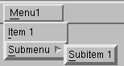
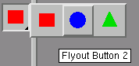

# 8.2 GUI模块示例

本节包括以下主题：

- ["派生新模块类，" 第8.2.1节](pt05ch08s02.md#cus-app-module-class)
- ["树标签页，" 第8.2.2节](pt05ch08s02.md#cus-app-module-treetabs)
- ["菜单栏项目，" 第8.2.3节](pt05ch08s02.md#cus-app-module-menus)
- ["工具栏项目，" 第8.2.4节](pt05ch08s02.md#cus-app-module-toolbar)
- ["工具箱项目，" 第8.2.5节](pt05ch08s02.md#cus-app-module-toolbox)
- ["注册工具集，" 第8.2.6节](pt05ch08s02.md#cus-app-module-toolsets)
- ["Kernel模块初始化，" 第8.2.7节](pt05ch08s02.md#cus-app-module-kernel)
- ["实例化GUI模块，" 第8.2.8节](pt05ch08s02.md#cus-app-module-instantiating)

`AFXModuleGui`基类提供各种模块基础设施支持功能。例如，`AFXModuleGui`基类跟踪模块的菜单及其工具栏和工具箱图标。因此，当用户切换模块时，菜单、工具栏和图标可以自动换入和换出。

以下示例显示如何创建模块GUI；后续章节解释此示例的细节。

```
from abaqusGui import *
from myModes import mode_1, mode_2, mode_3
from myIcons import *
from myToolsetGui import MyToolsetGui
class MyModuleGui(AFXModuleGui):
    #~~~~~~~~~~~~~~~~~~~~~~~~~~~~~~~~~~~~~~~~~~~~~~~~~~~~~~~~~~~
    def __init__(self):

        # 构造基类
        #
        mw=getAFXApp().getAFXMainWindow()
        AFXModuleGui.__init__(self, moduleName='My Module',
            displayTypes=AFXModuleGui.PART)
        mw.appendApplicableModuleForTreeTab('Model',
            self.getModuleName() )
        mw.appendVisibleModuleForTreeTab('Model',
            self.getModuleName() )

        # 菜单项目
        #
        menu = AFXMenuPane(self)
        AFXMenuTitle(self, '&Menu1', None, menu)
        AFXMenuCommand(self, menu, '&Item 1', None, mode_1,
            AFXMode.ID_ACTIVATE)

        subMenu = AFXMenuPane(self)
        AFXMenuCascade(self, menu, '&Submenu', None, subMenu)
        AFXMenuCommand(self, subMenu, '&Subitem 1', None, mode_2,
            AFXMode.ID_ACTIVATE)

        # 工具栏项目
        #
        group = AFXToolbarGroup(self)
        icon = FXXpmIcon(getAFXApp(), iconData1)
        AFXToolButton(group, '\tTool Tip', icon, mode_1,
            AFXMode.ID_ACTIVATE)

        # 工具箱项目
        #
        group = AFXToolboxGroup(self)
        icon = FXXPMIcon(getAFXApp(), iconData2)
        AFXToolButton(group, '\tTool Tip', icon, mode_1,
            AFXMode.ID_ACTIVATE)

        popup = FXPopup(getAFXApp().getAFXMainWindow())
        AFXFlyoutItem(popup, '\tFlyout Button1', squareIcon,
            mode_1, AFXMode.ID_ACTIVATE)
        AFXFlyoutItem(popup, '\tFlyout Button 2', circleIcon,
            mode_2, AFXMode.ID_ACTIVATE)
        AFXFlyoutItem(popup, '\tFlyout Button 3', triangleIcon,
            mode_3, AFXMode.ID_ACTIVATE)
        AFXFlyoutButton(group, popup)

        # 注册工具集
        #
        self.registerToolset(MyToolsetGui(),
            GUI_IN_MENUBAR|GUI_IN_TOOL_PANE)

    #~~~~~~~~~~~~~~~~~~~~~~~~~~~~~~~~~~~~~~~~~~~~~~~~~~~~~~~~~~~
    def getKernelInitializationCommand(self):
        return 'import myModule'

# 实例化模块
#
MyModuleGui()
```

### 8.2.1 派生新模块类

要创建你自己的模块GUI，首先从`AFXModuleGui`基类派生一个新类。或者，如果另一个模块GUI类提供了你所需的大部分功能，你可以从该类派生然后进行修改。有关更多信息，请参阅[第10章，"自定义现有模块或工具集"](pt05ch10.md)。

在新类构造函数的主体内部，必须调用基类构造函数并将`self`作为第一个参数传递。`moduleName`是GUI基础设施用来识别此模块的字符串。`displayTypes`是指定在此模块中显示的对象类型的标志或标志。可能的值为AFXModuleGui.PART、AFXModuleGui.ASSEMBLY、AFXModuleGui.ODB、AFXModuleGui.XY_PLOT和AFXModuleGui.SKETCH。如果你指定AFXModuleGui.ASSEMBLY，你的模块必须导入assembly kernel模块，因为assembly kernel模块需要初始化某些assembly显示选项。有关更多信息，请参阅["Kernel模块初始化，" 第8.2.7节](pt05ch08s02.md#cus-app-module-kernel)。

### 8.2.2 树标签页

默认情况下，当用户切换到自定义模块时，`TreeToolsetGui`中的标签页不可见。要指定标签页应该对模块可见或适用，使用`appendApplicableModuleForTreeTab`和`appendVisibleModuleForTreeTab`方法。["GUI模块示例，" 第8.2节](pt05ch08s02.md)中的示例指定Model标签页将在"My Module"中适用且可见。如果用户在Part模块中并切换到"My Module"，Results标签页将被隐藏，如果Model标签页尚未成为当前标签页，它将成为当前标签页。

### 8.2.3 菜单栏项目

菜单栏项目由控制菜单窗格的菜单标题组成。菜单窗格又包含菜单命令。菜单命令是调用模式的按钮。

["GUI模块示例，" 第8.2节](pt05ch08s02.md)中的示例创建一个包含子菜单的顶级菜单窗格。子菜单中的菜单命令通过向模式发送激活消息来指定菜单命令将调用的模式。有关更多信息，请参阅["模式处理，" 第7.2节](pt04ch07s02.md)。[图8-1](pt05ch08s02.md#app-module-menu)显示了示例创建的菜单和子菜单。

**图8-1** 创建菜单。



### 8.2.4 工具栏项目

工具栏项目显示在菜单栏下方的主窗口顶部，由包含图标的按钮组成。工具栏项目放在一个组中，该组仅在其模块或工具集为当前模块时显示。该组还包括一个分隔符，用于在视觉上区分工具栏中其他组的图标。

["GUI模块示例，" 第8.2节](pt05ch08s02.md)中的示例创建一个工具栏组并向工具栏添加一个按钮。新按钮调用与示例中第一个菜单项目相同的模式。有关更多信息，请参阅["模式处理，" 第7.2节](pt04ch07s02.md)。

### 8.2.5 工具箱项目

工具箱项目显示在主窗口左边缘，由包含图标的按钮组成。与工具栏项目一样，工具箱项目放在一个组中，该组仅在其模块或工具集为当前模块时显示。类似地，工具箱组之间有间距，以在视觉上区分工具箱中其他组的图标。

["GUI模块示例，" 第8.2节](pt05ch08s02.md)中的示例创建一个工具箱组并向工具箱添加一个按钮。新按钮调用与示例中第一个菜单项目相同的模式。

工具箱也可以包含飞出菜单。当用户按下飞出按钮上的鼠标按钮1并保持一定时间时，飞出按钮显示一个包含按钮的弹出窗口。如果用户只是快速单击飞出按钮上的鼠标按钮1，则不会显示飞出弹出窗口，飞出按钮充当常规按钮。飞出按钮显示当前功能的图标以及右下角的三角形。[图8-2](pt05ch08s02.md#app-module-flyout)显示了示例创建的飞出按钮。

**图8-2** 工具箱飞出按钮。



### 8.2.6 注册工具集

模块可以简单地通过注册来包含工具集。使用某个模块注册的工具集将在该模块为当前模块时可用。要注册工具集，你提供一个指向工具集的指针以及指定工具集在GUI中定义组件位置的位标志。支持以下位置：

| 标志 | GUI中的位置 |
| --- | --- |
| GUI_IN_NONE | 工具集在标准位置没有组件。 |
| GUI_IN_MENUBAR | 工具集在菜单栏中有组件。 |
| GUI_IN_TOOL_PANE | 工具集在"工具"菜单下拉窗格中有组件。 |
| GUI_IN_TOOLBAR | 工具集在工具栏中有组件。 |
| GUI_IN_TOOLBOX | 工具集在工具箱中有组件。 |

["GUI模块示例，" 第8.2节](pt05ch08s02.md)中的示例注册了一个在主菜单栏和工具菜单中包含元素的工具集。

如果你在创建了某些GUI组件的区域中未指定标志，这些组件将不会在应用程序中显示。

### 8.2.7 Kernel模块初始化

通常，GUI模块被设计为提供到kernel模块的接口。GUI从用户收集输入后，它构造一个命令字符串并发送到kernel进行处理。为了使命令在kernel端被识别，在发送命令之前必须已导入适当的kernel模块。

当GUI模块首次加载时，执行一个名为`getKernelInitializationCommand`的特殊方法。此方法在基类实现中是空的，由你编写一个返回适当命令的方法，该命令将在kernel端导入适当的模块。适当的模块包括你的GUI模块可以向其发出命令的任何模块。如果需要多个模块，可以用分号或"\n"字符分隔语句。为了避免与Abaqus加载的模块的名称空间冲突，你应该使用`import *moduleName*`样式导入模块，而不是`from *moduleName* import *`样式，如["GUI模块示例，" 第8.2节](pt05ch08s02.md)中的示例所示。

### 8.2.8 实例化GUI模块

模块GUI代码的最后一步是构造模块。你可以通过在模块GUI文件末尾调用模块构造函数来构造模块。这将构造构造函数主体中定义的所有对象。例如，

```
MyModuleGui()
```
