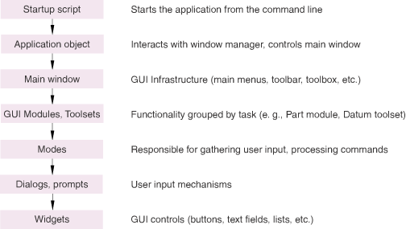

# 11.1 设计概述

应用程序由两个基本部分组成：
- Kernel代码
- GUI代码

Kernel代码由Python模块组成，这些模块包含用于执行各种任务的函数和类；例如，创建部件或后处理结果。GUI代码提供了收集kernel代码所需输入的便捷、用户友好的机制。Kernel编码在[Abaqus Scripting User's Guide](../cmd/cmd-link.md#cmd)和[Abaqus Scripting Reference Guide](../ker/ker-link.md#ker)中有描述。

要开发GUI代码，首先需要一个启动脚本，用于从命令行启动应用程序。该脚本创建一个应用程序对象，该对象与窗口管理器交互并控制主窗口。主窗口提供菜单栏、工具栏和工具箱等组件。在此基础上，你可以通过注册模块和工具集来向应用程序添加功能。

模块和工具集是一种将功能分组呈现给用户的方式。例如，Abaqus/CAE中的"部件"模块将所有与创建和修改部件相关的功能分组在一起。你的应用程序可以包含Abaqus/CAE模块和工具集，你也可以编写自己的模块和工具集来提供自定义功能。

部件库提供了对各种GUI控件（如按钮、复选框和文本字段）的访问，这些控件用于构建对话框。[图11-1](pt06ch11s01.md#cus-int-design)展示了这些概念。后续章节将详细描述每个步骤。

**图11-1** GUI代码概述。

