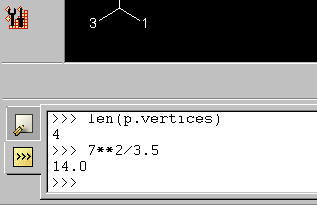

# 13.10 命令行界面


命令行界面（CLI）提供到kernel端Python命令解释器的接口。CLI不提供对GUI端Python解释器的任何访问。用户可以在CLI中输入Abaqus scripting interface命令，然后将其发送到kernel进行处理。此外，用户可以在CLI中输入标准Python命令。例如，用户可以使用CLI作为简单的计算器（参见[图13-3](pt06ch13s10.md#cus-app-cli)）。

**图13-3** 命令行界面。



Abaqus GUI Toolkit不希望用户使用CLI发出Abaqus Scripting Interface命令。通常，从GUI进程发送的所有命令都由GUI通过模式发送。有关更多信息，请参见[第7章，"模式"](pt04ch07.md)。如果应用程序不使用CLI，你可以隐藏它，如下所示：

```
mainWindow = getAFXApp().getAFXMainWindow()
mainWindow.hideCli()
```


