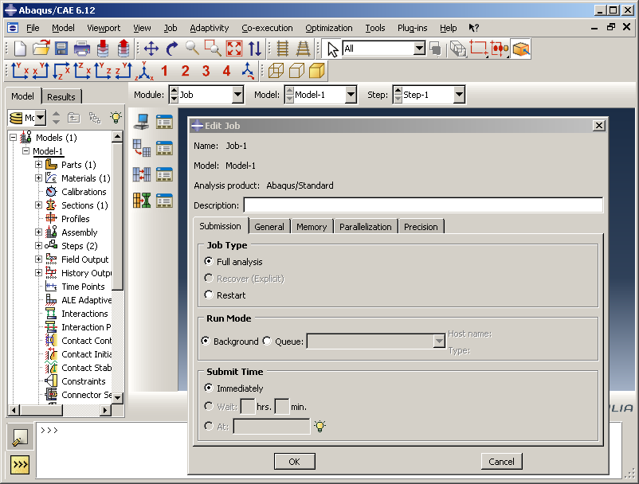

# 2.2 What are the components of an Abaqus GUI application?

There are many components involved in creating a GUI application. [Figure 2--1](pt02ch02s02.md#cus-gst-overview-figure) shows an overview of these components and how they are connected. This section provides a brief overview of each component. The components are discussed in more detail in subsequent chapters.

**Figure 2–1** An overview of an Abaqus GUI application.

**Widgets**

At the lowest level of an application, you use widgets to collect input from the user through a graphical user interface. For example, a text field widget presents a box into which the user can type numbers. Similarly, a check button widget presents a small box that the user can click on to toggle an option on or off.

**Layout managers**

Layout managers arrange widgets by providing alignment options. For example, a horizontal frame arranges widgets in a row. A vertical frame arranges widgets in a column.

**Dialog boxes**

Dialog boxes group widgets inside layout managers and present all the inputs required for a particular function. For example, the **Print** dialog box presents all the controls that allow the user to specify what should be printed and how it should be printed. 

**Modes**

Modes are GUI mechanisms that control the display of a particular user interface. Modes are also responsible for issuing the command associated with that user interface. For example, a mode is started when you select ****File****Print****. This mode posts the **Print** dialog box and issues the print command when the user clicks **OK**.

**Modules and toolsets**

Modules and toolsets group functionality together. A GUI module is a grouping of similar functionality, such as the Part module in Abaqus/CAE. A GUI toolset is similar to a GUI module in that it groups similar functionality, but it generally contains more specific functionality that may be used by one or more GUI modules. The Datum tools in Abaqus/CAE are an example of a GUI toolset. 

**The application**

The application is responsible for high-level activities, such as managing the GUI process used by the application and updating the state of the widgets. In addition, the application is responsible for interacting with the desktop’s window manager.

