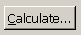
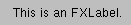
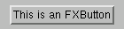
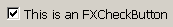
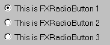
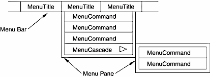
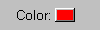

# 3.1 Labels and buttons


This section describes the widgets in the Abaqus GUI Toolkit that use labels and buttons. The following topics are covered:
- ["An overview of labels and buttons," Section 3.1.1](pt03ch03s01.md#cus-wgt-widget-labels-overview)
- ["Labels," Section 3.1.2](pt03ch03s01.md#cus-wgt-widget-labels-labels)
- ["Push buttons," Section 3.1.3](pt03ch03s01.md#cus-wgt-widget-labels-push)
- ["Check buttons," Section 3.1.4](pt03ch03s01.md#cus-wgt-widget-labels-check)
- ["Radio buttons," Section 3.1.5](pt03ch03s01.md#cus-wgt-widget-labels-radio)
- ["Menu buttons," Section 3.1.6](pt03ch03s01.md#cus-wgt-widget-labels-menus)
- ["Popup menus," Section 3.1.7](pt03ch03s01.md#cus-wgt-widget-labels-popup)
- ["Toolbar and toolbox buttons," Section 3.1.8](pt03ch03s01.md#cus-wgt-widget-labels-toolbar)
- ["Flyout buttons," Section 3.1.9](pt03ch03s01.md#cus-wgt-widget-labels-flyout)
- ["Color buttons," Section 3.1.10](pt03ch03s01.md#cus-wgt-widget-labels-color)

### 3.1.1 An overview of labels and buttons

Several widgets in the Abaqus GUI Toolkit support labels. If you want to put a label before a text field, for example, you should use ` AFXTextField` instead of creating a horizontal frame and adding a label widget and a text field widget. The following sections describe the specific widgets that support labels. 

The label and button constructors all take a text string argument. This text string can consist of three parts, where each part is separated by `\t`. The three parts of the text string are 

**Text**

The text displayed by the widget.

** Tip text**

The text displayed when the cursor is held over the widget for a short period of time. If there is only an icon associated with a widget, you must supply the tip text.

** Help text**

The text displayed in the application's status bar, assuming that the application has a status bar.

In addition, you can define a keyboard accelerator for the widget by preceding one of the characters in the text with an ampersand (`&`) character. For example, if you specify the string `&Calculate` for a button, the button label will appear as shown in [Figure 3--1](pt03ch03s01.md#cus-wgt-accelerate). You can use the accelerator to invoke the button by pressing the **[ Alt]** key along with the **[C]** key.

**Figure 3–1**  A keyboard accelerator applied to a button.



### 3.1.2 Labels

The `FXLabel` widget displays a read-only string. ` FXLabel` can also display an optional icon. 

```
FXLabel(parent, 'This is an FXLabel.\tThis is\nthe tooltip')
```

**Figure 3–2** An example of a text label from ` FXLabel`.



### 3.1.3 Push buttons

The `FXButton` widget contains a label and/or an icon. When the user clicks the button, an immediate action is invoked. 

```
 FXButton(parent, 'This is an FXButton')
```

**Figure 3–3** An example of a button from ` FXButton`.



### 3.1.4 Check buttons

The `FXCheckButton` widget provides an “On/Off” toggling capability. The button also supports a third “Maybe” or “Some” state. The “Maybe” state is often used to represent a partial selection; for example, the ` AFXOptionTreeList` widget makes use of the “Maybe” state. You can set the “Maybe” state only programmatically; the user cannot toggle the button to this state. 

```
FXCheckButton(parent, 'This is an FXCheckButton')
```

**Figure 3–4** An example of a check button and a label from `FXCheckButton`.



### 3.1.5 Radio buttons

The `FXRadioButton` widget provides a one-of-many selection from a group of buttons. 

```
FXRadioButton(parent, 'This is FXRadioButton 1') 
FXRadioButton(parent, 'This is FXRadioButton 2')
FXRadioButton(parent, 'This is FXRadioButton 3')
```

**Figure 3–5** An example of radio buttons from `FXRadioButton`.



### 3.1.6 Menu buttons

A menu consists of the following:
- A menu title created by `AFXMenuTitle`.
- A menu pane created by `AFXMenuPane`.
- A menu command created by `AFXMenuCommand`.

The menu title resides in a menu bar and controls the display of the menu pane associated with the menu title. The menu pane contains menu commands. Menu commands are buttons that generally invoke some action. A menu pane can also contain a cascading menu created by `AFXMenuCascade`. A cascading menu provides submenus within a menu. [Figure 3--6](pt03ch03s01.md#wgt-widget-menu-terms) illustrates the components of a menu.

**Figure 3–6**  The components of a menu.



The following example illustrates the use of cascading menus:

```
menu = AFXMenuPane(self)
AFXMenuTitle(self, '&Menu1', None, menu)
AFXMenuCommand(self, menu, '&Item 1', None, form1,
    AFXMode.ID_ACTIVATE)  
subMenu = AFXMenuPane(self)
AFXMenuCascade(self, menu, '&Submenu', None, subMenu) 
AFXMenuCommand(self, subMenu, '&Subitem 1', None,
    form2, AFXMode.ID_ACTIVATE)
```

**Figure 3–7** An example of cascading menu buttons from `AFXMenuCascade`.


In addition to specifying a mnemonic using the `&` syntax described in ["Labels and buttons," Section 3.1](pt03ch03s01.md), you can specify an accelerator in the menu item's label. You specify an accelerator by separating it from the button's text by a `\t`. For example,

```
AFXMenuCommand(self, menu, 'Graphics Options...\tCtrl+G', None,
    GraphicsOptionsForm(self), AFXMode.ID_ACTIVATE)
```

### 3.1.7 Popup menus

You can create a popup menu that appears when the user clicks mouse button 3 over a widget. For example, the following statements illustrate how you can create a popup menu that contains two buttons that appear when the user clicks mouse button 3 over a tree widget:

```
# In the dialog box constructor:

    def __init__(self, form):

        ...

        FXMAPFUNC(self, SEL_RIGHTBUTTONPRESS, self.ID_TREE,
            MyDB.onCmdPopup)
        FXMAPFUNC(self, SEL_COMMAND, self.ID_TEST1,
            MyDB.onCmdTest1)
        FXMAPFUNC(self, SEL_COMMAND, self.ID_TEST2,
            MyDB.onCmdTest2)

        self.menuPane = None

        FXTreeList(self, 5, self, self.ID_TREE,
            LAYOUT_FILL_X|LAYOUT_FILL_Y|
            TREELIST_SHOWS_BOXES|TREELIST_SHOWS_LINES|
            TREELIST_ROOT_BOXES|TREELIST_BROWSESELECT)
        ...

    def onCmdPopup(self, sender, sel, ptr):

        if not self.menuPane:
            self.menuPane = FXMenuPane(self)
            FXMenuCommand(self.menuPane, 'Test1', None, self,
                self.ID_TEST1)
            FXMenuCommand(self.menuPane, 'Test2', None, self,
                self.ID_TEST2)
            self.menuPane.create()

        status, x, y, buttons = self.getCursorPosition()
        x, y = self.translateCoordinatesTo(self.getRoot(), x, y )
        self.menuPane.popup (None, x, y)

        return 1
```

**Note:**The `AFXTable` has its own popup menu commands that you should use in place of the approach described in this section.

### 3.1.8 Toolbar and toolbox buttons

The ` AFXToolButton` widget displays no text in its button, but the button generally has a tool tip. You group the buttons created by `AFXToolButton` into toolbars using `AFXToolbarGroups` or into toolboxes using ` AFXToolboxGroups`. `AFXToolbarGroups` and ` AFXToolboxGroups` provide visual grouping between buttons in the toolbar or toolbox. For example,

```
# Create toolbar icons 
#
group = AFXToolbarGroup(self)
AFXToolButton(group, '\tMy Module\nToolbar Button',
    icon, sel)

# Create toolbox icons
#
group = AFXToolboxGroup(self) 
AFXToolButton(group, '\tMy Module\nToolbox Button',
    icon, sel)
```

### 3.1.9 Flyout buttons

The `AFXFlyoutButton` widget displays a flyout popup window. The flyout popup window contains `AFXFlyoutItem` widgets and appears when the user presses mouse button 1 on the button and holds down mouse button 1 for a certain time span. If the user simply clicks mouse button 1 quickly on the button, the flyout popup window will not be displayed, and the flyout button will act just like a regular button. The `AFXFlyoutButton` widget displays the icon of the current target along with a right triangle in the lower right corner to indicate that a flyout popup window can be invoked. For example,

```
group = AFXToolbarGroup(self)
popup = FXPopup(getAFXApp().getAFXMainWindow())
AFXFlyoutItem(popup, '\tFlyout Button 1', squareIcon)
AFXFlyoutItem(popup, '\tFlyout Button 2', circleIcon)
AFXFlyoutItem(popup, '\tFlyout Button 3', triangleIcon)
AFXFlyoutButton(group, popup)
popup.create()
```

**Figure 3–8** An example of flyout buttons from `AFXFlyoutItem`.


### 3.1.10 Color buttons

The `AFXColorButton` widget displays a push button that shows a color. Clicking the button posts the color selection dialog box, which the user can use to change the value of the color for the button. For example,

```
 AFXColorButton(parent, 'Color:')
```

**Figure 3–9** An example of an `AFXColorButton`.



When connected to an `AFXStringKeyword`, this widget will assign the value of the button's current color to the keyword in hex format; for example, "#FF0000".


