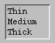
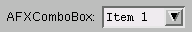
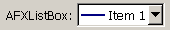

# 3.3 Lists and combo boxes


This section describes the widgets in the Abaqus GUI Toolkit that allow you to choose one or more items from a list.
- You use a list widget when there is enough room in the GUI and when it is helpful to display all or most of the choices at the same time.
- You use a combo box to conserve space in the GUI and when it is preferable to display only the current choice.

The following topics are covered:- ["Lists," Section 3.3.1](pt03ch03s03.md#cus-wgt-widget-lists-lists)
- ["Combo boxes," Section 3.3.2](pt03ch03s03.md#cus-wgt-widget-lists-comboboxes)
- ["List boxes," Section 3.3.3](pt03ch03s03.md#cus-wgt-widget-lists-listboxes)

### 3.3.1 Lists

`AFXList` allows one or more selections from its items.

The list created by `AFXList` supports the following selection policies:

**LIST_SINGLESELECT**

The user can select zero or one items.

** LIST_BROWSESELECT**

One item is always selected.

** LIST_MULTIPLESELECT**

The user can select zero or more items.

** LIST_EXTENDEDSELECT**

The user can select zero or more items; drag-, shift-, and control-selections are allowed.

The `AFXDialog` base class has special code designed to handle double-click messages from a list. If the user double-clicks in a list, the dialog box first attempts to call the **Apply** button message handler. If the **Apply** button message handler is not found, the dialog attempts to call the **Continue** button message handler. If the **Continue** button message handler is not found, the dialog attempts to call the **OK** button message handler. As a result, you do not need to do anything in your script to get this behavior. 

However, if you have special double-click processing needs, you can turn off this double-click behavior by specifying  AFXLIST_NO_AUTOCOMMIT as one of the list's option flags. If you turn off the double-click behavior, you must catch the SEL_DOUBLECLICKED message from the list in your dialog box and handle it appropriately.

**Note:**Because the list may be used in combination with other types of widgets, the list does not draw a border around itself. As a result, if you want a border around the list, you must provide the border by placing the list inside some other widget, such as a frame. If you do not want a horizontal scrollbar, use the HSCROLLING_OFF flag; this flag forces the list to size its width to fit its widest item.

The following is an example of a list within a vertical frame: 

```
vf = FXVerticalFrame(parent, FRAME_THICK|FRAME_SUNKEN,
    0, 0, 0, 0, 0, 0, 0, 0)
list = AFXList(vf, 3, tgt, sel, LIST_BROWSESELECT|HSCROLLING_OFF)
list.appendItem('Thin')
list.appendItem('Medium')
list.appendItem('Thick')
```

**Figure 3–14** An example of a list with a frame from `AFXList`. 



### 3.3.2 Combo boxes

`AFXComboBox` provides a one-of-many selection from its items. `AFXComboBox` combines a read-only text field with a drop-down list.

After the parent argument, the next three arguments to the `AFXComboBox` constructor are the width of the text field, the number of visible list items when the list is exposed, and the label. If you specify the width as zero, the combo box will automatically size itself to the widest item in its list. For example, 

```
comboBox = AFXComboBox(p, 0, 3, 'AFXComboBox:')
comboBox.appendItem('Item 1')
comboBox.appendItem('Item 2')
comboBox.appendItem('Item 3')
```

**Figure 3–15** An example of a combo box from `AFXComboBox`.



### 3.3.3 List boxes

The `AFXListBox` widget provides a one-of-many selection from its items. `AFXListBox` differs from `AFXComboBox` in that the items displayed by ` AFXListBox` can include icons. For example, 

```
listBox = AFXListBox(parent, 3, 'AFXListBox:', keyword)
listBox.appendItem('Item 1', thinIcon)
listBox.appendItem('Item 2', mediumIcon)
listBox.appendItem('Item 3', thickIcon) 
```

**Figure 3–16** An example of a list box from `AFXListBox`. 




