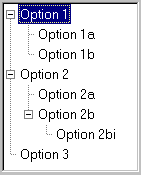
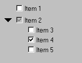

# 3.5 Tree widgets


This section describes the tree widgets in the Abaqus GUI Toolkit. A tree widget arranges its children in a hierarchical fashion and allows the various branches to be expanded or collapsed. A file browser such as Microsoft Windows Explorer is a common example of an application that makes use of a tree widget. The following topics are covered:
- ["Tree list," Section 3.5.1](pt03ch03s05.md#cus-wgt-widget-tree-treelist)
- ["Option tree list," Section 3.5.2](pt03ch03s05.md#cus-wgt-widget-tree-optiontree)

### 3.5.1 Tree list

The `FXTreeList` widget provides a tree structure of children that can be expanded and collapsed. The `FXTreeList` constructor is defined by the following prototype:

```
FXTreeList(p, nvis, tgt=None, sel=0,
    opts=TREELIST_NORMAL, x=0, y=0, w=0, h=0)
```
The arguments to the `FXTreeList` constructor are described in the following list:

**parent**

The first argument in the constructor is the parent. An `FXTreeList` does not draw a frame around itself; therefore, you may want to create an ` FXVerticalFrame` to use as the parent of the tree. You should zero out the padding in the frame so that the frame wraps tightly around the tree.

** number of visible items**

The number of items that will be visible when the tree is first displayed.

** target and selector**

You can specify a target and selector in the tree constructor arguments.

** opts**

The option flags that you can specify in the tree constructor are shown in the following table:

| Option flag | Effect |
| --- | --- |
| TREELIST_NORMAL (default) | TREELIST_EXTENDEDSELECT |
| TREELIST_EXTENDEDSELECT | Extended selection mode allows the user to drag-select ranges of items. |
| TREELIST_SINGLESELECT | Single selection mode allows the user to select up to one item. |
| TREELIST_BROWSESELECT | Browse selection mode enforces one single item to be selected at all times. |
| TREELIST_MULTIPLESELECT | Multiple selection mode is used for selection of individual items. |
| TREELIST_AUTOSELECT | Automatically select under cursor. |
| TREELIST_SHOWS_LINES | Show lines between items. |
| TREELIST_SHOWS_BOXES | Show boxes when item can expand. |
| TREELIST_ROOT_BOXES | Show root item boxes also. |

The following statements show an example of creating a tree: 

```
vf = FXVerticalFrame(gb, FRAME_SUNKEN|FRAME_THICK,
    0,0,0,0, 0,0,0,0)
tree = FXTreeList(vf, 5, None, 0,
    LAYOUT_FILL_X|LAYOUT_FILL_Y|
    TREELIST_SHOWS_BOXES|TREELIST_ROOT_BOXES|
    TREELIST_SHOWS_LINES|TREELIST_BROWSESELECT) 
```

You add an item to a tree by supplying a parent and a text label. You begin by adding root items to the tree. Root items have a parent of `None`. The Abaqus GUI Toolkit provides several ways of adding items to a tree; however, the most convenient approach uses the `addItemLast` method, as shown in the following example:

```
vf = FXVerticalFrame(gb, FRAME_SUNKEN|FRAME_THICK,
    0,0,0,0, 0,0,0,0)
self.tree = FXTreeList(vf, 5, None, 0,
    LAYOUT_FILL_X|LAYOUT_FILL_Y|
    TREELIST_SHOWS_BOXES|TREELIST_ROOT_BOXES|
    TREELIST_SHOWS_LINES|TREELIST_BROWSESELECT)
option1 = self.tree.addItemLast(None, 'Option 1')
self.tree.addItemLast(option1, 'Option 1a')
self.tree.addItemLast(option1, 'Option 1b')
option2 = self.tree.addItemLast(None, 'Option 2')
self.tree.addItemLast(option2, 'Option 2a')
option2b = self.tree.addItemLast(option2, 'Option 2b')
self.tree.addItemLast(option2b, 'Option 2bi')
option3 = self.tree.addItemLast(None, 'Option 3') 
```

**Figure 3–19** An example of a tree widget.



You can also specify icons to be used for each tree item. The “open” icon is displayed next to an item when it is selected; the “closed” icon is displayed when the item is not selected. These icons are not associated with the expanded/collapsed state of a branch. For example, Microsoft's Windows Explorer uses open and closed folder icons to show the selected state.

You can check if an item is selected using the tree's `isItemSelected` method. The tree widget will send its target a SEL_COMMAND message whenever the user clicks on an item. You can handle this message and then traverse all the items in the tree to find the selected item. The following example uses a message handler that assumes that the tree is browse-select and allows the user to select only one item at a time:

```
def onCmdTree(self, sender, sel, ptr):

    w = self.tree.getFirstItem()
    while(w):
        if self.tree.isItemSelected(w):
            # Do something here based on
            # the selected item, w.
            break
        if w.getFirst():
            w=w.getFirst()
            continue
        while not w.getNext() and w.getParent():
             w=w.getParent()
        w=w.getNext() 
```

### 3.5.2 Option tree list

The `AFXOptionTreeList` widget provides a tree structure of children that can be toggled. The tree structure includes branches along with leaves at the end of a branch. The user can toggle the leaves of the tree on or off. The user can also toggle the entire branch on or off. The toggle controls the settings of all the children of the branch—if the branch is toggled off, all the children are toggled off and vice versa. For example, 

```
tree = AFXOptionTreeList(parent, 6)
tree.addItemLast('Item 1')
item = tree.addItemLast('Item 2')
item.addItemLast('Item 3')
item.addItemLast('Item 4')
item.addItemLast('Item 5')
```

**Figure 3–20** An example of an option tree list from `AFXOptionTreeList`.




