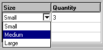

# 3.6 Table widget


The `AFXTable` widget arranges items in rows and columns, similar to a spreadsheet. The table can have leading rows and columns, which serve as headings. [Figure 3--21](pt03ch03s06.md#cus-wgt-table-layout) shows an example of how the Abaqus GUI Toolkit lays out a table.

**Figure 3–21**  The layout of a table.


The `AFXTable` widget has many options and methods that allow a lot of flexibility when you are trying to configure a table for specific purposes. These options and methods are discussed in the following sections. The following topics are covered:
- ["Table constructor," Section 3.6.1](pt03ch03s06.md#cus-wgt-tables-constructor)
- ["Rows and columns," Section 3.6.2](pt03ch03s06.md#cus-wgt-tables-rowsandcolumns)
- ["Spanning," Section 3.6.3](pt03ch03s06.md#cus-wgt-tables-spanning)
- ["Justification," Section 3.6.4](pt03ch03s06.md#cus-wgt-tables-justification)
- ["Editing," Section 3.6.5](pt03ch03s06.md#cus-wgt-tables-editing)
- ["Types," Section 3.6.6](pt03ch03s06.md#cus-wgt-tables-types)
- ["List type," Section 3.6.7](pt03ch03s06.md#cus-wgt-tables-listtype)
- ["Boolean type," Section 3.6.8](pt03ch03s06.md#cus-wgt-tables-booleantype)
- ["Icon type," Section 3.6.9](pt03ch03s06.md#cus-wgt-tables-icontype)
- [" Color type," Section 3.6.10](pt03ch03s06.md#cus-wgt-tables-colortype)
- ["Popup menu," Section 3.6.11](pt03ch03s06.md#cus-wgt-tables-popupmenu)
- ["Colors," Section 3.6.12](pt03ch03s06.md#cus-wgt-tables-colors)
- ["Sorting," Section 3.6.13](pt03ch03s06.md#cus-wgt-table-sorting)

### 3.6.1 Table constructor

The ` AFXTable` constructor is defined by the following prototype:

```
AFXTable(p, numVisRows, numVisColumns, numRows, numColumns,
    tgt=None, sel=0, opts=AFXTABLE_NORMAL,
    x=0, y=0, w=0, h=0,
    pl= DEFAULT_MARGIN, pr=DEFAULT_MARGIN,
    pt=DEFAULT_MARGIN, pb=DEFAULT_MARGIN)
```
The ` AFXTable` constructor has the following arguments:

** parent**

The first argument in the constructor is the parent. An `AFXTable` does not draw a frame around itself; therefore, you may want to create an `FXVerticalFrame` to use as the parent of the table. You should zero out the padding in the frame so that the frame wraps tightly around the table.

** number of visible rows and columns**

The number of rows and columns that will be visible when the table is first displayed. If the number of visible rows or columns is less than the total number of rows or columns in the table, the appropriate scroll bars are displayed. 

** number of rows and columns**

The number of rows and columns to be created when the table is created. These numbers include leading rows and columns. If the size of the table is fixed, you specify the total number of rows and columns. If the size of the table is dynamic, you specify ` 1` row and `1` column (plus any leading rows or columns) and allow the user to add rows or columns as necessary. 

** target and selector**

You can specify a target and selector in the table constructor arguments. A table is generally connected to an ` AFXTableKeyword` with a selector of 0, unless the table has columns that are not directly related to the data required by the command to be sent to the kernel. If the table has columns that are not required by the kernel, you can specify the dialog as the target so that the data in the table can be processed appropriately by your code. You can also use the `AFXColumnItems` object to manage selection in particular table column automatically (for more information, see ["Table keyword example," Section 6.5.14](pt04ch06s05.md#cus-app-commands-gui-connect-table)).

** opts**

The option flags that you can specify in the table constructor are shown in the following table:

| Option flag | Effect |
| --- | --- |
| AFXTABLE_NORMAL (default) | AFXTABLE_COLUMN_RESIZABLE | LAYOUT_FILL_X | LAYOUT_FILL_Y |
| AFXTABLE_COLUMN_RESIZABLE | Allows columns to be resized by the user. |
| AFXTABLE_ROW_RESIZABLE | Allows rows to be resized by the user. |
| AFXTABLE_RESIZE | AFXTABLE_COLUMN_RESIZABLE | AFXTABLE_ROW_RESIZABLE |
| AFXTABLE_NO_COLUMN_SELECT | Disallows selecting the entire column when its heading is clicked. |
| AFXTABLE_NO_ROW_SELECT | Disallows selecting the entire row when its heading is clicked. |
| AFXTABLE_SINGLE_SELECT | Allows up to one item to be selected. |
| AFXTABLE_BROWSE_SELECT | Enforces one single item to be selected at all times. |
| AFXTABLE_ROW_MODE | Selecting an item in a row selects the entire row. |
| AFXTABLE_EDITABLE | Allows all items in the table to be edited. |

By default, the user can select multiple items in a table. To change this behavior, you should use the appropriate flag to specify either single select mode or browse select mode. In addition, you can specify whether the entire row should be selected when the user selects any item in the row. Abaqus/CAE exhibits this behavior in manager dialogs that contain more than one column.

The following statements creates a table with default settings: 

```
# Tables do not draw a frame around their border. 
# Therefore, add a frame widget with zero padding.

vf = FXVerticalFrame(gb, FRAME_SUNKEN|FRAME_THICK,
    0,0,0,0, 0,0,0,0)
table = AFXTable(vf, 4, 2, 4, 2)
```

**Figure 3–22** A table created with default settings.


### 3.6.2 Rows and columns

The table supports leading rows and columns. Leading rows and columns are displayed as buttons using a bold text. Leading rows are displayed at the top of the table, and leading columns are displayed on the left side of the table. 

The number of rows and columns that you specify in the table constructor are the total number of rows and columns, including the leading rows and columns. By default, the table has no leading rows or columns—you must set the leading rows and columns after the table is constructed using the appropriate table methods.  You can also specify the labels to be displayed in these rows and columns. If you do not specify any labels for a leading row or column, it will be numbered automatically. You can set more than one label at once in a heading by using “\t” to separate the labels in a single string. 

By default, no gridlines are drawn around items. You can control the visibility of the horizontal and vertical gridlines individually by using the following table methods:
- ` showHorizontalGrid(True|False)`
- ` showVerticalGrid(True|False)`

By default, the height of the rows is determined by the font being used for the table. The default width of a column is 100 pixels. You can override these values using the following table methods:- ` setRowHeight( row, height) # Height is in pixels`
- ` setColumnWidth(column, width) # Width is in pixels `

The following example illustrates the use of some of these methods: 

```
vf = FXVerticalFrame(parent, FRAME_SUNKEN|FRAME_THICK,
    0,0,0,0,0,0,0,0) 
table = AFXTable(vf, 4, 3, 4, 3)
table.setLeadingColumns(1)
table.setLeadingRows(1)
table.setLeadingRowLabels('X\tY')
table.showHorizontalGrid(True)
table.showVerticalGrid(True)
table.setColumnWidth(0, 30)
```

**Figure 3–23** Leading rows and columns.


### 3.6.3 Spanning

You can make an item in a header row or column span more than one row or column, as shown in the following example:

```
vf = FXVerticalFrame(parent, FRAME_SUNKEN|FRAME_THICK,
     0,0,0,0, 0,0,0,0)
table = AFXTable(vf, 4, 3, 4, 3)
table.setLeadingColumns(1)
table.setLeadingRows(2)

# Corner item
table.setItemSpan(0, 0, 2, 1)

# Span top row item over 2 columns
table.setItemSpan(0, 1, 1, 2)
table.setLeadingRowLabels('Coordinates')
table.setLeadingRowLabels('X\tY', 1)

table.showHorizontalGrid(True)
table.showVerticalGrid(True)

table.setColumnWidth(0, 30)
```

**Figure 3–24**  An example of spanning two header columns.


### 3.6.4 Justification

By default, the table displays entries left justified. You can change how items are justified by using the following table methods: 
- `setColumnJustify(column, justify)`
- `setItemJustify(row, column, justify)`

If you supply a value of `-1` for the column number, the ` setColumn*` methods apply the setting to all columns in the table.

The following table shows the possible values for the justify argument:

| Option flag | Effect |
| --- | --- |
| AFXTable .LEFT | Align items to the left side of the cell. |
| AFXTable .CENTER | Center items horizontally. |
| AFXTable .RIGHT | Align items to the right side of the cell. |
| AFXTable .TOP | Align items to the top of the cell. |
| AFXTable .MIDDLE | Center items vertically. |
| AFXTable .BOTTOM | Align items to the bottom of the cell. |

The following example shows how you can change the justification:
```
vf = FXVerticalFrame(gb, FRAME_SUNKEN|FRAME_THICK,
    0,0,0,0, 0,0,0,0)
table = AFXTable(vf, 4, 3, 4, 3)
table.setLeadingColumns(1)
table.setLeadingRows(1)
table.setLeadingRowLabels('X\tY')
table.showHorizontalGrid(True)
table.showVerticalGrid(True)
table.setColumnWidth(0, 30)  

# Center all columns
table.setColumnJustify(-1, AFXTable.CENTER)  
```

**Figure 3–25** Justified column headings.


### 3.6.5 Editing

By default, no items in a table are editable. To make all items in a table editable, you must specify AFXTABLE_EDITABLE in the table constructor. To change the editability of some items in a table, you can use the following table methods:
- `setColumnEditable(column, True|False)`
- `setItemEditable(row, column, True|False)`

### 3.6.6 Types

By default, all items in a table are text items. However, the table widget also supports the other types of items shown in the following table: 

| Type | Effect |
| --- | --- |
| BOOL | Item shows an icon, clicking on it toggles between a true and false icon. |
| COLOR | Item shows a color button |
| FLOAT | Item shows text, a text field is used to edit the value |
| ICON | Item shows an icon, it is not editable. |
| INT | Item shows text, a text field is used to edit the value |
| LIST | Item shows text, a combo box is used to edit the value. |
| TEXT | Item shows text, a text field is used to edit the value. |

You can change the type of a column or the type of an individual item using the following table methods:- ` setColumnType(column, type)`
- ` setItemType(row, column, type)`

Setting the type to FLOAT or INT does not affect data entry to the table; the user may enter anything into these types of items (this allows for expression evaluation). However, when using the table's `getItemIntValue` or `getItemFloatValue` methods you should be sure that the type of the item that you are reading is INT or FLOAT, respectively, or the wrong value may be returned. In general, you should make use of the AFXTableKeyword and set the column types so that the table's values are automatically evaluated correctly.

### 3.6.7 List type

If you want to allow the user to specify a value in a column by selecting from a list of items, you must first set the column to be of type LIST.  You then create a list and assign it to that column. When the user clicks on an item in that column, the table will display a noneditable combo box that contains the entries from the list. The following example illustrates how you can create a combo box within a table cell:

```
vf = FXVerticalFrame(gb, FRAME_SUNKEN|FRAME_THICK,
    0,0,0,0, 0,0,0,0)
table = AFXTable(vf, 4, 2, 4, 2, None, 0,
    AFXTABLE_NORMAL|AFXTABLE_EDITABLE)
table.setLeadingRows(1)
table.setLeadingRowLabels('Size\tQuantity')
table.showHorizontalGrid(True)
table.showVerticalGrid(True)

listId = table.addList('Small\tMedium\tLarge')
table.setColumnType(0, AFXTable.LIST)
table.setColumnListId(0, listId)
```

**Figure 3–26** A combo box within a table cell.



You can also add list items that contain icons using the `appendListItem` method of the table.

```
icon = createGIFIcon('myIcon.gif')
table.appendListItem(listId, 'Extra large', icon) 
```

When you connect a table keyword to a table that contains lists, you must set the column type of the table keyword appropriately. If the list contains only text, you can set the column type to AFXTABLE_TYPE_STRING, which sets the value of the keyword to the text of the item selected in the list. Similarly, if the list contains only icons, you can set the column type to  AFXTABLE_TYPE_INT, which sets the value of the keyword to the index of the item selected in the list. If the list contains both text and icons, you can use either setting for the column type.

### 3.6.8 Boolean type

If you want to allow the user to specify a value in a table be either True or  False, you must set the type of the column to be BOOL. The value of a Boolean item is toggled each time the user clicks the item. By default, a blank icon represents False and a check mark icon represents True. The following example illustrates how you can include Boolean items in a table:

```
vf = FXVerticalFrame(gb, FRAME_SUNKEN|FRAME_THICK,
    0,0,0,0, 0,0,0,0)
table = AFXTable(vf, 4, 2, 4, 2, None, 0,
    AFXTABLE_NORMAL|AFXTABLE_EDITABLE)
table.setLeadingRows(1)
table.setLeadingRowLabels('Nlgeom\tStep')
table.showHorizontalGrid(True)
table.showVerticalGrid(True)
table.setColumnType(0, table.BOOL)
table.setColumnWidth(0, 50)
table.setColumnJustify(0, AFXTable.CENTER)
```

**Figure 3–27**  Boolean items in a table.


If you do not want to use the default icons, you can set your own true and false icons, as shown in the following example:

```
vf = FXVerticalFrame(gb, FRAME_SUNKEN|FRAME_THICK,
    0,0,0,0, 0,0,0,0)
table = AFXTable(vf, 4, 2, 4, 2, None, 0,
    AFXTABLE_NORMAL|AFXTABLE_EDITABLE)
table.setLeadingRows(1)
table.setLeadingRowLabels('State\tLayer')
table.showHorizontalGrid(True)
table.showVerticalGrid(True)     
table.setColumnType(0, table.BOOL)
table.setColumnWidth(0, 50)
table.setColumnJustify(0, AFXTable.CENTER)

from appIcons import lockedData, unlockedData
trueIcon = FXXPMIcon(getAFXApp(), lockedData)
falseIcon = FXXPMIcon(getAFXApp(), unlockedData)
table.setDefaultBoolIcons(trueIcon, falseIcon)
```

**Figure 3–28**  Defining your own true and false icons.


### 3.6.9 Icon type

If you want to display an icon in an item, you must set the type of the column to be ICON and assign the icons to be shown. This type of column is not editable by the user. The following example shows how you can include an icon in a table cell:

```
vf = FXVerticalFrame(parent, FRAME_SUNKEN|FRAME_THICK,
    0,0,0,0, 0,0,0,0)
table = AFXTable(vf, 4, 2, 4, 2, None, 0,
    AFXTABLE_NORMAL|AFXTABLE_EDITABLE)
table.setLeadingRows(1) table.setLeadingRowLabels(' \tStatus') 
table.showHorizontalGrid(True)
table.showVerticalGrid(True)      
table.setColumnType(0, table.ICON)
table.setColumnWidth(0, 30)
table.setColumnJustify(0, AFXTable.CENTER)

from appIcons import circleData, squareData 
circleIcon = FXXPMIcon(getAFXApp(), circleData)
squareIcon = FXXPMIcon(getAFXApp(), squareData)
table.setItemIcon(1, 0, circleIcon)
table.setItemIcon(2, 0, squareIcon)
table.setItemIcon(3, 0, circleIcon)
```

**Figure 3–29** Including icons in table cells.


### 3.6.10 Color type

If you want to display a color button in a table, you must set the type to COLOR. If the table is editable, the user can use the color button to change the color via the color selection dialog box. The color button is a flyout button that can have up to three flyout items, one for a specific color, one for a default color, and one for an “as-is” color. Refer to the Color Code dialog box in Abaqus/CAE to see examples of how these options may be used. The options are specified using the flags in the following table:

| Option flag | Effect |
| --- | --- |
| COLOR_INCLUDE_COLOR_ONLY | Include only the color flyout item. |
| COLOR_INCLUDE_AS_IS | Include the "as--is" (=) flyout item. |
| COLOR_INCLUDE_DEFAULT | Include the default (*) flyout item. |
| COLOR_INCLUDE_ALL | Include all of the flyout items. |

The following example shows how you can display color buttons in a table:
```
vf = FXVerticalFrame(
    gb, FRAME_SUNKEN|FRAME_THICK, 0,0,0,0, 0,0,0,0)
table = AFXTable(
    vf, 4, 2, 4, 2, None, 0, AFXTABLE_NORMAL|AFXTABLE_EDITABLE)
table.setLeadingRows(1)
table.setLeadingRowLabels('Name\tColor')
table.setColumnType(1,AFXTable.COLOR)
table.setColumnColorOptions(
    1, AFXTable.COLOR_INCLUDE_COLOR_ONLY)
table.setItemText(1, 0, 'Part-1')
table.setItemText(2, 0, 'Part-2')
table.setItemText(3, 0, 'Part-3')
table.setItemColor(1,1, '#FF0000')
table.setItemColor(2,1, '#00FF00')
table.setItemColor(3,1, '#0000FF')
```

**Figure 3–30**  Including icons in table cells.


### 3.6.11 Popup menu

You can add a popup menu to the table by specifying the appropriate flags using the `setPopupOptions` method. The menu will be posted when the user clicks mouse button 3 anywhere over the table. The following options are supported in the popup menu:

| Option flag | Effect |
| --- | --- |
| POPUP_NONE (default) | No popup menu will be displayed. |
| POPUP_CUT | Adds a Cut button to the popup menu. |
| POPUP_COPY | Adds a Copy button to the popup menu. |
| POPUP_PASTE | Adds a Paste button to the popup menu. |
| POPUP_EDIT | POPUP_CUT | POPUP_COPY | POPUP_PASTE |
| POPUP_INSERT_ROW | Adds Insert Row Before/After buttons to the popup menu. |
| POPUP_INSERT_COLUMN | Adds Insert Column Before/After buttons to the popup menu. |
| POPUP_DELETE_ROW | Adds Delete Rows button to the popup menu. |
| POPUP_DELETE_COLUMN | Adds Delete Columns button to the popup menu. |
| POPUP_CLEAR_CONTENTS | Adds Clear Contents/Table buttons to the popup menu. |
| POPUP_MODIFY | POPUP_INSERT_ROW | POPUP_INSERT_COLUMN | POPUP_DELETE_ROW | POPUP_DELETE_COLUMN | POPUP_CLEAR_CONTENTS |
| POPUP_READ_FROM_FILE | Adds Read from File button to the popup menu. **Note:**Include POPUP_INSERT_ROW with POPUP_READ_FROM_FILE to allow automatic expansion of the table for data files with more lines than the current table definition. |
| POPUP_WRITE_TO_FILE | Adds Write to File button to the popup menu. |
| POPUP_ALL | POPUP_EDIT | POPUP_MODIFY | POPUP_READ |

You can also add a custom button to the popup menu by using the table's `appendClientPopupItem` method, as shown in [Figure 3--31](pt03ch03s06.md#cus-wgt-table-popupoptions). 

**Figure 3–31** Popup menu options.


The following example shows how you can enable various popup menu options:
```
vf = FXVerticalFrame(parent, FRAME_SUNKEN|FRAME_THICK,
     0,0,0,0, 0,0,0,0)
table = AFXTable(vf, 4, 3, 4, 3, None, 0,
    AFXTABLE_NORMAL|AFXTABLE_EDITABLE)

table.setLeadingColumns(1)
table.setLeadingRows(1)
table.setLeadingRowLabels('X\tY')

table.showHorizontalGrid(True)
table.showVerticalGrid(True)

table.setColumnWidth(0, 30)

# Center all columns 
table.setColumnJustify(-1, table.CENTER)

table.setPopupOptions(
    AFXTable.POPUP_CUT|AFXTable.POPUP_COPY
   |AFXTable.POPUP_PASTE
   |AFXTable.POPUP_INSERT_ROW
   |AFXTable.POPUP_DELETE_ROW
   |AFXTable.POPUP_CLEAR_CONTENTS
   |AFXTable.POPUP_READ_FROM_FILE
)
table.appendClientPopupItem('My Button', None, self,
    self.ID_MY_BUTTON)
FXMAPFUNC(self, SEL_COMMAND, self.ID_MY_BUTTON, MyDB.onCmdMyBtn)
```

### 3.6.12 Colors

Items in a table that display characters have two sets of colors—the normal color and the selected color. In addition, each item has a background color and a text color. To change these colors, the table widget provides the following controls: 
- Item text color
- Item background color
- Selected item text color
- Selected item background color
- Item color (color button) (The color button is described in ["Color buttons," Section 3.1.10](pt03ch03s01.md#cus-wgt-widget-labels-color).)

 You can control the text color of  items that display characters using the ` setItemTextColor` method. Items that display characters include strings, numbers, and lists. You can control the text color of these items when they are selected by using the `setSelTextColor` method. You can control the background color of any item by using the ` setItemBackColor` method. You can control the background color of any item when it is selected by using the `setSelBackColor` method. 

If you do not want the colors to change when the user selects an item, you can set the colors used for items that are selected to be the same as the colors used for items that are not selected. This approach is shown in the following example:  

```
itemColor = table.getItemBackColor(1,1)
table.setSelBackColor(itemColor)
itemTextColor = table.getItemTextColor(1,1)
table.setSelTextColor(itemTextColor)
```

You can set colors using the color name or by specifying RGB values using the ` FXRGB` function. (For a list of valid color names and their corresponding RGB values, see [Appendix B, "Colors and RGB values](ap02.md).”) Both methods are illustrated in the following example:

```
vf = FXVerticalFrame(parent, FRAME_SUNKEN|FRAME_THICK,
    0,0,0,0, 0,0,0,0)
table = AFXTable(vf, 4, 2, 4, 2, None, 0,
    AFXTABLE_NORMAL|AFXTABLE_EDITABLE)
table.setLeadingRows(1)
table.setLeadingRowLabels('Name\tDescription')

table.showHorizontalGrid(True)
table.showVerticalGrid(True)

table.setItemTextColor(1,0, 'Blue')
table.setItemTextColor(1,1, FXRGB(0, 0, 255))

table.setItemBackColor(3,0, 'Pink')
table.setItemBackColor(3,1, FXRGB(255, 192, 203))
```

**Figure 3–32** Setting colors for table items.


### 3.6.13 Sorting

You can set a column in a table to be sortable. If a column is set to be sortable and the user clicks on its heading, a graphic will be displayed in the heading that shows the order of the sort. You must write the code that performs the actual sorting in the table—the table itself provides only the graphical feedback in the heading cell. For example:

```
class MyDB(AFXDataDialog):

    def __init(self):

        ...     

        # Handle clicks in the table.
        FXMAPFUNC(self, SEL_CLICKED, self.ID_TABLE,
                       MyDB.onClickTable)
        ...     

        # Create a table. 
        vf = FXVerticalFrame(
            parent, FRAME_SUNKEN|FRAME_THICK, 0,0,0,0, 0,0,0,0)
        self.sortTable = AFXTable(vf, 4, 3, 4, 3, self,
            self.ID_TABLE, AFXTABLE_NORMAL|AFXTABLE_EDITABLE)
        self.sortTable.setLeadingRows(1)
        self.sortTable.setLeadingRowLabels('Name\tX\tY')
        self.sortTable.setColumnSortable(1, True)
        self.sortTable.setColumnSortable(2, True)
        ...

    def onClickTable(self, sender, sel, ptr):

        status, x, y, buttons = self.sortTable.getCursorPosition()
        column = self.sortTable.getColumnAtX(x)
        row = self.sortTable.getRowAtY(y)

        # Ignore clicks on table headers.
        if row != 0 or column == 0:
            return

        values = []
        index = 1
        for row in range(1, self.sortTable.getNumRows()):
            values.append( (self.sortTable.getItemFloatValue(
                row, column), index) )
            index += 1

        values.sort()
        if self.sortTable.getColumnSortOrder(column) == \
            AFXTable.SORT_ASCENDING:
                values.reverse()

        items = []
        for value, index in values:
            name = self.sortTable.getItemValue(index, 0)
            xValue = self.sortTable.getItemValue(index, 1)
            yValue = self.sortTable.getItemValue(index, 2)
            items.append( (name, xValue, yValue) )

        row = 1
        for name, xValue, yValue in items:
            self.sortTable.setItemValue(row, 0, name)
            self.sortTable.setItemValue(row, 1, xValue)
            self.sortTable.setItemValue(row, 2, yValue)
            row += 1
```

**Figure 3–33**  Sorting table items.


