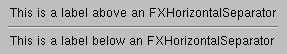
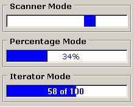

# 3.7 Miscellaneous widgets


This section describes a set of miscellaneous widgets in the Abaqus GUI Toolkit that you can use in your applications. The following topics are covered:
- ["Separators," Section 3.7.1](pt03ch03s07.md#cus-wgt-widget-misc-separators)
- ["Notes and warnings," Section 3.7.2](pt03ch03s07.md#cus-wgt-widget-misc-notes)
- ["Progress bar," Section 3.7.3](pt03ch03s07.md#cus-wgt-widget-misc-progress)

### 3.7.1 Separators

The `FXHorizontalSeparator` widget and the `FXVerticalSeparator` widget provide a visual separator to allow separating elements in a GUI. The Abaqus GUI Toolkit also includes a `FXMenuSeparator` widget that you can use to separate items in a menu pane. For example, 

```
FXLabel(parent, 'This is a label above an FXHorizontalSeparator') 
FXHorizontalSeparator(parent)
FXLabel(parent, 'This is a label below an FXHorizontalSeparator')
```

**Figure 3–34** An example of a horizontal separator from ` FXHorizontalSeparator`.



### 3.7.2 Notes and warnings

The `AFXNote` widget provides a convenient way to display notes or warnings in a dialog box. `AFXNote` displays either the word “Note” or the word “Warning” in a bold font. `AFXNote` also aligns messages that contain more than one line. For example, 

```
AFXNote(parent, 'This is an AFXNote information note\n'
    'that wraps on two lines.')
AFXNote(parent, 'This is an AFXNote warning note!', NOTE_WARNING)
```

**Figure 3–35** An example of a note and a warning from `AFXNote`.


### 3.7.3 Progress bar

The `AFXProgressBar` widget provides feedback during a process that takes a long time to complete. For example, 

```
pb = AFXProgressBar(parent, keyword, tgt,
    LAYOUT_FIX_HEIGHT|LAYOUT_FIX_WIDTH|
    FRAME_SUNKEN|FRAME_THICK|AFXPROGRESSBAR_SCANNER,
    0, 0, 200, 25)

```
If you want to control the display of the progress bar you can use the percentage or iterator mode and call `setProgress` with the appropriate value. 
```
from abaqusGui import *
class MyDB(AFXDataDialog):
    ID_START = AFXDataDialog.ID_LAST
    def __init__(self, form):
        AFXDataDialog.__init__(self, form, 'My Dialog',
            self.OK|self.CANCEL, DECOR_RESIZE|DIALOG_ACTIONS_SEPARATOR)
        FXButton(self, 'Start Something', None, self, self.ID_START)
        FXMAPFUNC(self, SEL_COMMAND, self.ID_START, MyDB.onDoSomething)
        self.scannerDB = ScannerDB(self)
    def onDoSomething(self, sender, sel, ptr):
        self.scannerDB.create()
        self.scannerDB.showModal(self)
        getAFXApp().repaint()
        files = [
            'file_1.txt',
            'file_2.txt',
            'file_3.txt',
            'file_4.txt',
        ]
        self.scannerDB.setTotal( len(files) )
        for i in range( 1, len(files)+1 ):
            self.scannerDB.setProgress(i)
            # Do something with files[i]
        self.scannerDB.hide()
class ScannerDB(AFXDialog):
    def __init__(self, owner):
        AFXDialog.__init__(self, owner, 'Work in Progress', 
            0, 0, DIALOG_ACTIONS_NONE)
        self.scanner = AFXProgressBar(self, None, 0, 
            LAYOUT_FIX_WIDTH|LAYOUT_FIX_HEIGHT|
            FRAME_SUNKEN|FRAME_THICK|AFXPROGRESSBAR_ITERATOR, 
            0, 0, 200, 22)
    def setTotal(self, total):
        self.scanner.setTotal(total)
    def setProgress(self, progress):
        self.scanner.setProgress(progress)

```

**Note:**The `setProgress` method has no effect on a progress bar that uses the scanner mode.

 The progress bar has several different modes, as shown in [Figure 3--36](pt03ch03s07.md#wgt-widget-progress).

**Figure 3–36** Three modes of the progress bar widget.




