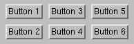

# 4.6 Row and column layout manager


The `FXMatrix` widget arranges its children in rows and columns. You can perform the layout row-wise using the default value of the *opts* argument (MATRIX_BY_ROWS) or column-wise by setting *opts*=MATRIX_BY_COLUMNS. If you specify *opts*=MATRIX_BY_ROWS, the matrix will create the specified number of rows and as many columns as are needed to accommodate all its children. Conversely, if you specify *opts*=MATRIX_BY_COLUMNS, the matrix will create the specified number of columns and as many rows as are needed to accommodate all its children. 

For example, using the default *opts*=MATRIX_BY_ROWS setting,

```
m = FXMatrix(parent, 2)
FXButton(m, 'Button 1')
FXButton(m, 'Button 2')
FXButton(m, 'Button 3')
FXButton(m, 'Button 4')
FXButton(m, 'Button 5')
FXButton(m, 'Button 6') 
```

**Figure 4–4** An example of a matrix with two rows from `FXMatrix`.




