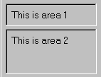

# 4.7 Resizable regions


The `FXSplitter` widget splits an area vertically or horizontally. The user can drag the cursor on the region between the areas and resize the areas. For example,

```
sp = FXSplitter(parent, 
    LAYOUT_FILL_X|LAYOUT_FIX_HEIGHT|SPLITTER_VERTICAL,
    0,0,0,100)
hf1 = FXHorizontalFrame(sp, FRAME_SUNKEN|FRAME_THICK)
FXLabel(hf1, 'This is area 1')
hf2 = FXHorizontalFrame(sp, FRAME_SUNKEN|FRAME_THICK)
FXLabel(hf2, 'This is area 2') 
```

**Figure 4–5** An example of resizable areas laid out vertically by `FXSplitter`.




