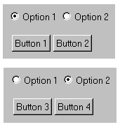

# 4.8 Rotating regions


The `FXSwitcher` widget manages children that are positioned on top of each other. `FXSwitcher` allows you to select which child should be shown by either sending it a message or calling its `setCurrent` method. When sending a message, you must set the message ID to `FXSwitcher.ID_OPEN_FIRST` for the first child. You must then increment the message ID from that value for the subsequent children, as shown in the following example. For more information on messages, see ["Targets and messages," Section 6.5.4](pt04ch06s05.md#cus-com-commands-targets). To use the `setCurrent` method, you should provide the zero-based index of the child that you want to display. For example, to display the first child, you should call the `setCurrent` method with an index value of zero. 

For example, 

```
sw = FXSwitcher(parent)
FXRadioButton(hf, 'Option 1', sw, FXSwitcher.ID_OPEN_FIRST)
FXRadioButton(hf, 'Option 2', sw, FXSwitcher.ID_OPEN_FIRST+1)
hf1 = FXHorizontalFrame(sw)     
FXButton(hf1, 'Button 1')
FXButton(hf1, 'Button 2')
hf2 = FXHorizontalFrame(sw)
FXButton(hf2, 'Button 3')
FXButton(hf2, 'Button 4') 
```

**Figure 4–6** An example of a rotating region from `FXSwitcher`.




