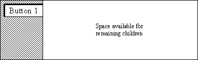
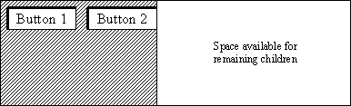
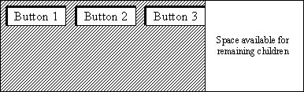
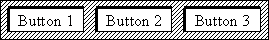
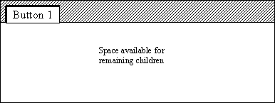
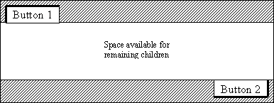
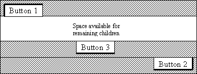
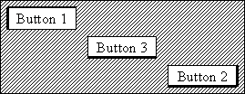

# 4.11 Layout examples


The following examples create three buttons, one at a time, using the default layout hints. As each button is created, the figures show the effect on the space remaining in the layout cavity. 

**Example 1**

The first example starts by creating a single button on the left side of the cavity. The default value for the vertical position is LAYOUT_TOP, so the example places the button on the left side and at the top of the available space. 

```
gb = FXGroupBox(parent, '')
FXButton(gb, 'Button 1', opts=LAYOUT_SIDE_LEFT|BUTTON_NORMAL)
```

**Figure 4–8** Creating a button on the left side and at the top of the layout cavity.



The following statement adds a second button on the left side at the top of the available space:
```
FXButton(gb, 'Button 2', opts=LAYOUT_SIDE_LEFT|BUTTON_NORMAL) 
```

**Figure 4–9** Adding a second button on the left side at the top of the layout cavity.



The following statement adds a third button on the left side at the top of the available space:
```
FXButton(gb, 'Button 3',
    opts=LAYOUT_SIDE_LEFT|BUTTON_NORMAL) 
```

**Figure 4–10** Adding a third button on the left side at the top of the layout cavity.



[Figure 4--11](pt03ch04s11.md#wgt-layout-hints-3button-nospace) shows the final configuration of the three buttons.

**Figure 4–11** The final configuration of the buttons.



**Example 2**

The second example illustrates how you can use nondefault layout hints. The example starts by using the default hints to position a button on top of the available space and on the left.

```
gb = FXGroupBox(p,'') 
FXButton(gb,'Button 1')
```

**Figure 4–12** Creating a button on the left side and at the top of the layout cavity.



The example then positions a second button on the right side on the bottom of the layout cavity.
```
FXButton(gb, 'Button 2',    
    opts=LAYOUT_SIDE_BOTTOM|LAYOUT_RIGHT|BUTTON_NORMAL) 
```

**Figure 4–13** Adding a second button on the right side at the bottom of the layout cavity.



Finally, the example places a third button on the bottom of the available space and centered in the *X*-direction.
```
FXButton(gb, 'Button 3',    
    opts=LAYOUT_SIDE_BOTTOM|LAYOUT_CENTER_X|BUTTON_NORMAL)
```

**Figure 4–14** Adding a third button in the center at the bottom of the layout cavity.



[Figure 4--15](pt03ch04s11.md#wgt-layout-hints-3button-above-nospace) shows the final configuration of the three buttons.

**Figure 4–15** The final configuration of the three buttons.




