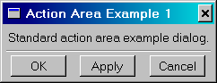
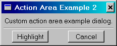

# 5.5 Custom dialog boxes


`AFXDialog` is the base class for the other dialog box classes in the toolkit. If none of the other dialog box classes suit your needs, you must derive your dialog box from `AFXDialog` and provide most of the dialog processing yourself. This section describes how you can use `AFXDialog` to create custom dialog boxes. The following topics are covered:
- ["An overview of custom dialog boxes," Section 5.5.1](pt03ch05s05.md#cus-dlg-dialogs-dialogs-overview)
- ["Constructors," Section 5.5.2](pt03ch05s05.md#cus-dlg-dialogs-dialogs-constructors)
- ["Sizing and location," Section 5.5.3](pt03ch05s05.md#cus-dlg-dialogs-sizing)
- ["Action area," Section 5.5.4](pt03ch05s05.md#cus-dlg-dialogs-dialogs-actionarea)
- ["Custom action area button names," Section 5.5.5](pt03ch05s05.md#cus-dlg-dialogs-dialogs-actionarea-names)
- ["Action button handling," Section 5.5.6](pt03ch05s05.md#cus-dlg-dialogs-dialogs-actionarea-handling)

### 5.5.1 An overview of custom dialog boxes

`AFXDialog` is the base class for the other dialog box classes in the toolkit. If none of the other dialog box classes suit your needs, you must derive your dialog box from `AFXDialog` and provide most of the dialog box processing yourself. 

The `AFXDialog` class extends the `FXDialog` class by providing the following features: 
- Button flags that allow the automatic construction of action area buttons.
- Option flags that control the placement of the action area. Option flags also determine whether to include a separator between the action area and the rest of the dialog box.
- Message IDs for the various action area commit semantics.
- Methods to add action area buttons manually.
- Automatic handling of the **No**, **Cancel**, and **Dismiss** buttons. Automatic handling is also provided for the **Close** (X) button on the right hand side of the dialog box's title bar.
- Automatic destruction of the dialog box after it is unposted.

See ["Action area," Section 5.5.4](pt03ch05s05.md#cus-dlg-dialogs-dialogs-actionarea), for more details.

### 5.5.2 Constructors

There are three prototypes of the `AFXDialog` constructor. The difference between the three prototypes is the occluding behavior of the dialog box, as illustrated in the following examples:
- The following statement creates a dialog box that always occludes the main window when overlapping with the main window: ``` AFXDialog(title, actionButtonIds=0, opts=DIALOG_NORMAL, x = 0, y = 0, w = 0, h = 0) ```
- The following statement creates a dialog box that always occludes its owner widget (usually a dialog box) when overlapping with the widget: ``` AFXDialog(owner, title, actionButtonIds=0, opts=DIALOG_NORMAL, x = 0, y = 0, w = 0, h = 0) ```
- The following statement creates a dialog box that can be occluded by any other windows in the application: ``` AFXDialog(app, title, actionButtonIds=0, opts = DIALOG_NORMAL, x = 0, y = 0, w = 0, h = 0) ```

When you construct a dialog box, you will start by deriving from the `AFXDialog` class. The first thing you should do in the constructor body is call the base class constructor to properly initialize the dialog. Then, you would build the contents of your dialog by adding widgets. For example:

```
class MyDB(AFXDialog):

    # My constructor
    def __init__(self):

        # Call base class constructor
        AFXDialog.__init__(self, 'My Dialog', self.DISMISS)

    # Add widgets next...
```

### 5.5.3 Sizing and location

By default, the user cannot resize a dialog box. However, if a dialog box contains text fields or lists that can be stretched to show more entries, the user should be allowed to resize the dialog box. Resizing can be allowed by specifying the DECOR_RESIZE flag in the dialog box constructor. 

**Note:**Dialog boxes created by `AFXDialog` do not support minimizing and maximizing; they ignore these flags if they are included in the dialog box constructor.

You should never specify the size and location of the dialog box in its constructor. The Abaqus GUI Toolkit will place the dialog box on the screen and determine its proper size. 

### 5.5.4 Action area

The action area of a dialog box contains buttons, such as **OK** and **Cancel**. These buttons allow the user to commit values from the dialog box, to close the dialog box, or to perform some other action.

`AFXDialog` supports the automatic creation of an action area and its buttons through the use of bit flags in the dialog box constructor. You can use the flags described in [Table 5--1](pt03ch05s05.md#cus-dlg-dialogs-table) to include standard action area buttons.

**Table 5–1** Action area flags.
| Button flag | Message ID | Label | Semantics |
| --- | --- | --- | --- |
| **AFXDialog.OK** | AFXDialog.ID_CLICKED_OK | OK | Commit the values in the dialog box, process them, and then hide the dialog box. |
| **AFXDialog.CONTINUE** | AFXDialog.ID_CLICKED_CONTINUE | Continue… | Commit the values in the dialog box, hide it, and continue collecting input from the user in another dialog box or prompt. |
| **AFXDialog.APPLY ** | AFXDialog.ID_CLICKED_APPLY | Apply | Same as OK, except the dialog box is not hidden. |
| **AFXDialog.DEFAULTS** | AFXDialog.ID_CLICKED_DEFAULTS | Defaults | Reset the values in the dialog box to their defaults. |
| **AFXDialog.YES ** | AFXDialog.ID_CLICKED_YES | Yes | Invoke the affirmative action in response to the question posed by the dialog box. |
| **AFXDialog.NO** | AFXDialog.ID_CLICKED_NO | No | Invoke the negative action in response to the question posed by the dialog box. |
| **AFXDialog.CANCEL** | AFXDialog.ID_CLICKED_CANCEL | Cancel | Do not commit the values in the dialog box; just hide the dialog box. Optionally, for the AFXDataDialog a bailout may be posted if the user has changed any values since the last commit. |
| **AFXDialog.DISMISS** | AFXDialog.ID_CLICKED_DISMISS | Dismiss | Hide the dialog box without taking any other action. |

`AFXDialog` also supports the following options that determine the location of the action area:

**DIALOG_ACTIONS_BOTTOM**

This option places the action area at the bottom of the dialog box and is the default option.

**DIALOG_ACTIONS_RIGHT**

This option places the action area on the right side of the dialog box.

**DIALOG_ACTIONS_NONE**

This option does not create an action area; for example, in a toolbox dialog box.

You can also specify whether a separator should be placed between the action area and the rest of the dialog box by including the following flag in the options:

**DIALOG_ACTIONS_SEPARATOR**

The style in Abaqus/CAE is to omit a separator if there is already delineation between the action area and the rest of the dialog box; for example, a frame that stretches across the entire width of the dialog box along the bottom of the dialog box. The following statements illustrate how you define an action area in a dialog box with a separator:

```
class ActionAreaDB(AFXDialog):

    def __init__(self):

        AFXDialog.__init__(self, 'Action Area Example1',
            self.OK|self.APPLY|self.CANCEL,
            DIALOG_ACTIONS_SEPARATOR)

        FXLabel(self, 'Standard action area example dialog.')
```

**Figure 5–4** An example of a standard action area.



### 5.5.5 Custom action area button names

The flags in [Table 5--1](pt03ch05s05.md#cus-dlg-dialogs-table) cover all the semantics you might need in a dialog box. As a result, there is no need for any additional custom flags; however, there may be cases where you want to use a different label for one of the standard actions. To use a different label for one of the standard actions, you do not specify any button flags in the constructor arguments; however, you use the `appendActionButton` method to add your own action area buttons. The `appendActionButton` method has two prototypes:

```
appendActionButton(buttonId) appendActionButton(text, tgt, sel)
```

The first version of the prototype creates a standard action area button as defined in [Table 5--1](pt03ch05s05.md#cus-dlg-dialogs-table). The second version of the prototype creates a button whose label is given as the text argument. In addition, the second version allows you to set the target and selector so that you can catch messages from this button and act accordingly. The following statements show how you can create custom action area buttons:

```
class ActionAreaDB(AFXDialog):
    def __init__(self):

        AFXDialog.__init__(self, 'Action Area Example 2',
            0, DIALOG_ACTIONS_SEPARATOR)
        FXLabel(self, 'Custom action area example dialog.')
        self.appendActionButton('Highlight', self, 
            self.ID_CLICKED_APPLY)
        self.appendActionButton(self.CANCEL)
```

**Figure 5–5** An example of a custom action area.



### 5.5.6 Action button handling

`AFXDialog` and `AFXDataDialog` provide some automatic handling of the messages that are sent when a button in the action area is clicked. If you want to perform some actions other than those provided by the dialog box, you must catch the messages sent by the action area buttons and write your own message handler. 

For example, if you want to take an action when the user clicks the **Apply** button in the dialog box, you must catch the (ID_CLICKED_APPLY | SEL_COMMAND) message and map it to a message handler in your dialog box. For more information, see ["Targets and messages," Section 6.5.4](pt04ch06s05.md#cus-com-commands-targets).


