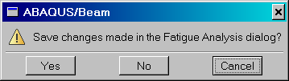
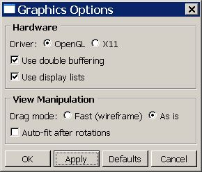
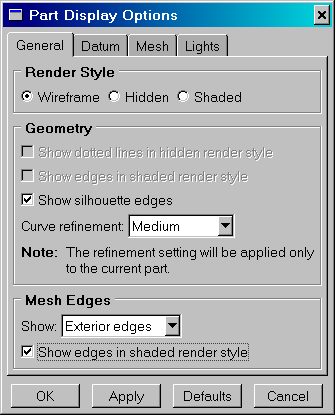

# 5.6 Data dialog boxes


A data dialog box is a dialog box in which data are collected from the user. In contrast, a message dialog box displays only a message and a toolbox just holds buttons. This section describes how you can create a data dialog box. The following topics are covered:
- ["An overview of data dialog boxes," Section 5.6.1](pt03ch05s06.md#cus-dlg-dialogs-datadialogs-overview)
- ["Constructors," Section 5.6.2](pt03ch05s06.md#cus-dlg-dialogs-datadialogs-constructor)
- ["Bailout," Section 5.6.3](pt03ch05s06.md#cus-dlg-dialogs-datadialogs-bailout)
- ["Constructor contents," Section 5.6.4](pt03ch05s06.md#cus-dlg-dialogs-datadialogs-keywords)
- ["Transitions," Section 5.6.5](pt03ch05s06.md#cus-dlg-dialogs-datadialogs-transitions)

### 5.6.1 An overview of data dialog boxes

A data dialog box is a dialog box in which data are collected from the user. In contrast, a message dialog box displays only a message, and a toolbox just holds buttons. `AFXDataDialog` is designed to be used in conjunction with a mode to gather data from the user. The data are then processed in a command. You should use `AFXDataDialog` if you need to issue a command. You should also use `AFXDataDialog` if the dialog box belongs to a module or nonpersistent toolset so that the GUI infrastructure can properly manage the dialog box when the user switches modules.

The `AFXDataDialog` class is derived from `AFXDialog` and provides the following additional features:
- A bailout mechanism.
- Standard action area button behavior designed to work with a form.
- Keyword usage.
- Transitions that define GUI state changes in the dialog box.

### 5.6.2 Constructors

There are two prototypes of the `AFXDataDialog` constructor. The difference between the two prototypes is the occluding behavior of the dialog box, as illustrated in the following examples: 
- The following statement creates a dialog box that always occludes the main window when overlapping with the main window: ``` AFXDataDialog(mode, title, actionButtonIds=0, opts=DIALOG_NORMAL, x = 0, y = 0, w = 0, h = 0 ) ```
- The following statement creates a dialog box that always occludes its owner widget (usually a dialog box) when overlapping with the widget. ``` AFXDataDialog(mode, owner, title, actionButtonIds=0, opts=DIALOG_NORMAL, x = 0, y = 0, w = 0, h = 0 ) ```

When you construct a dialog box, you will start by deriving from the `AFXDataDialog` class. The first thing you should do in the constructor body is call the base class constructor to properly initialize the dialog. Then, you would build the contents of your dialog by adding widgets. For example:

```
class MyDB(AFXDataDialog):

    # My constructor
    def __init__(self):

        # Call base class constructor
        AFXDataDialog.__init__(self, form,  'My Dialog',
            self.OK|self.CANCEL)

        # Add widgets next...
```

When a dialog box is unposted, it is removed from the screen. By default, a dialog box is deleted when it is unposted. Deleting a dialog box removes both the GUI resources associated with the dialog box and the dialog box's data structures. In contrast, you can choose to destroy a dialog box when it is unposted. Destroying a dialog box removes only the GUI resources and retains the dialog box's data structures.

If there is some dialog box GUI state that you want to retain between postings of the dialog box, you should specify that the dialog box is destroyed only when it is unposted. Therefore, when the dialog box is posted again, it retains its data structures and the old state is still intact. For example, assume that your dialog box contains a table and the user resizes one of the columns of the table. If you only destroy the dialog box when it is unposted, the table column sizes will be remembered the next time the dialog box is posted. To specify that a dialog box should be destroyed when unposted, add the  DIALOG_UNPOST_DESTROY flag to the dialog box constructor's *opts* argument.

### 5.6.3 Bailout

`AFXDataDialog` supports automatic bailout handling through the specification of a bit flag in the dialog box constructor. If you request bailout processing and the user changes some values in the dialog box and presses **Cancel**, the application posts a standard warning dialog box. The following statement requests bailout processing:

```
AFXDataDialog.__init__(self, form, 'Create Part',
    self.OK|self.CANCEL,
    DIALOG_ACTIONS_SEPARATOR|DATADIALOG_BAILOUT)
```

**Figure 5–6** An example of a bailout.



After the standard warning dialog box has been posted, the behavior is as follows:- If the user clicks **Yes** from the standard warning dialog box, the data dialog box will be processed as if the user had originally pressed **OK**.
- If the user clicks **No** from the standard warning dialog box, the data dialog box will be unposted without any processing.
- If the user clicks **Cancel** from the standard warning dialog box, the data dialog box will remain posted and no action will be taken.

### 5.6.4 Constructor contents

You use the constructor of the dialog box to create the widgets that will appear in the dialog box. To keep the GUI up-to-date with the application state and vice versa, you use keywords as targets of widgets. Keywords are defined as members of a form, and the form is passed to the dialog box as a dialog box constructor argument. For more information, see ["AFXKeywords," Section 6.5.8](pt04ch06s05.md#cus-app-commands-gui-keywords). The following script shows how you can use keywords to construct a dialog box. [Figure 5--7](pt03ch05s06.md#cus-dlg-datadialogs) shows the **Graphics Options** dialog box generated by the example script. 

**Figure 5–7** **Graphics Options** data dialog box.



```
class GraphicsOptionsDB(AFXDataDialog):

    #~~~~~~~~~~~~~~~~~~~~~~~~~~~~~~~~~~~~~~~~~~~~~~~~~~~~~~~~~~
    def __init__(self, form):

        AFXDataDialog.__init__(self, form, 'Graphics Options',
            self.OK|self.APPLY|self.DEFAULTS|self.CANCEL)

        # Hardware frame
        #
        gb = FXGroupBox(self, 'Hardware', 
            FRAME_GROOVE|LAYOUT_FILL_X)
        hardwareFrame = FXHorizontalFrame(gb, 
            0, 0,0,0,0, 0,0,0,0)
        FXLabel(hardwareFrame, 'Driver:')
        FXRadioButton(hardwareFrame, 'OpenGL',
            form.graphicsDriverKw, OPEN_GL.getId())
        FXRadioButton(hardwareFrame, 'X11',  
            form.graphicsDriverKw, X11.getId())
        FXCheckButton(gb, 'Use double buffering',
            form.doubleBufferingKw)
        displayListBtn = FXCheckButton(gb, 'Use display lists',
            form.displayListsKw)

        # View Manipulation frame
        #
        gb = FXGroupBox(self, 'View Manipulation',
            FRAME_GROOVE|LAYOUT_FILL_X)
        hf = FXHorizontalFrame(gb, 0, 0,0,0,0, 0,0,0,0)
        FXLabel(hf, 'Drag mode:')
        FXRadioButton(hf, 'Fast (wireframe)', form.dragModeKw,
            FAST.getId())
        FXRadioButton(hf, 'As is', form.dragModeKw, 
            AS_IS.getId())
        FXCheckButton(gb, 'Auto-fit after rotations', 
            form.autoFitKw)

```

### 5.6.5 Transitions

Transitions provide a convenient way to change the GUI state in a dialog box. Transitions are used to stipple widgets or to rotate regions when some other control in the dialog box is activated. If the behavior in your dialog box can be described in terms of simple transitions, you can use the `addTransition` method to produce the state changes.

Transitions compare the value of a keyword with a specified value. If the operator condition is met, a message is sent to the specified target object. Transitions have the following prototype:

```
addTransition(keyword,
operator, value, tgt, sel, ptr)
```

For example, when the user selects **Wireframe** as the render style in the **Part Display Options** dialog box, Abaqus/CAE does the following:
- Stipples the **Show dotted lines in hidden render style** button.
- Stipples the **Show edges in shaded render style** button.
- Checks the **Show silhouette edges** button.

 These transitions can be described as follows:- If the value of the render style keyword equals WIREFRAME, send the **Show dotted lines...** button an ID_DISABLE message.
- If the value of the render style keyword equals WIREFRAME, send the **Show edges in shaded...** button an ID_DISABLE message.
- If the value of the render style keyword equals WIREFRAME, send the **Show silhouette edges** button an ID_ENABLE message.

You can write these transitions with the Abaqus GUI Toolkit as follows:
```
self.addTransition(form.renderStyleKw, AFXTransition.EQ,
    WIREFRAME.getId(), showDottedBtn,
    MKUINT(FXWindow.ID_DISABLE, SEL_COMMAND), None)

self.addTransition(form.renderStyleKw, AFXTransition.EQ,
    WIREFRAME.getId(), showEdgesBtn,
    MKUINT(FXWindow.ID_DISABLE, SEL_COMMAND), None)

self.addTransition(form.renderStyleKw, AFXTransition.EQ,
    WIREFRAME.getId(), showSilhouetteBtn,
    MKUINT(FXWindow.ID_ENABLE, SEL_COMMAND), None) 
```
You can also pass additional user data to the object using the last argument of the `addTransition` method. [Figure 5--8](pt03ch05s06.md#dlg-dialogs-transition) shows an example that uses transitions to control how the application stipples widgets.

**Figure 5–8** An example of using transitions to control how the application stipples widgets.



### 5.6.6 Updating your GUI

If the GUI behavior of your dialog box cannot be described in terms of simple transitions (for example, if you need to stipple a button based on the setting of two other buttons), you can use the `processUpdates` method to update your GUI. The `processUpdates` method is called during each GUI update cycle, so you should not do anything that is time consuming in this method. Generally, you should perform tasks such as enabling and disabling, or showing and hiding widgets. For example:

```
def processUpdates(self):

    if self.form.kw1.getValue() == 1 and \
       self.form.kw2.getValue() == 2:

           self.btn1.disable()
    else:
           self.btn1.enable()
```

If the tasks you need to perform are time consuming, you should write your own message handler that is invoked only upon some specific user action. For example, if you need to scan an ODB for valid data, you could make the commit button of the dialog send a message to your dialog box. That message would invoke your message handler that does the scanning. That way, the scanning occurs only when the user commits the dialog, not during every GUI update cycle. For more information on message handlers, see ["Targets and messages," Section 6.5.4](pt04ch06s05.md#cus-com-commands-targets).

### 5.6.7 Action area

The `AFXDataDialog` class provides standard handling for all the buttons that can appear in the action area. [Table 5--2](pt03ch05s06.md#cus-dlg-dialgs-actionarea) shows the action that the application takes when each of these buttons is clicked.

**Table 5–2** Action area buttons.
| Button | Action |
| --- | --- |
| **OK** | Send the form an (ID_COMMIT, SEL_COMMAND) message and its button ID. |
| **Apply** | Send the form an (ID_COMMIT, SEL_COMMAND) message and its button ID. |
| **Continue** | Send the form an (ID_GET_NEXT, SEL_COMMAND) message. |
| **Defaults** | Send the form an (ID_SET_DEFAULTS, SEL_COMMAND) message. |
| **Cancel** | Check for bailout, send the form an (ID_DEACTIVATE, SEL_COMMAND) message. |
| "**x**" in title bar | Perform the **Cancel** button action. |

If your dialog has more than one “apply” button, you can handle this by routing messages from the button to the apply message handler in the form. In the form, you can use the `getPressedButtonId` method to determine which button was pressed and take the appropriate action. For example, in your dialog constructor:

```
self.appendActionButton('Plot', self, self.ID_PLOT)
FXMAPFUNC(self, SEL_COMMAND, self.ID_PLOT, 
    AFXDataDialog.onCmdApply
self.appendActionButton('Highlight', self, self.ID_HIGHLIGHT)
FXMAPFUNC(self, SEL_COMMAND, self.ID_HIGHLIGHT, 
    AFXDataDialog.onCmdApply)
```

and in your form code:

```
def doCustomChecks(self):

    if self.getPressedButtonId() == self.getCurrentDialog().ID_PLOT:
        # Enable plot commands, disable highlight commands
    else:
        # Enable highlight commands, disable plot commands
    return True
```


