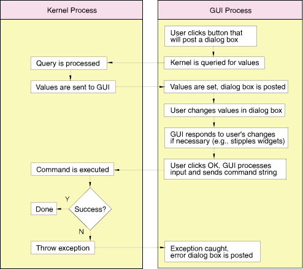

# 6.2 The kernel and GUI processes

Abaqus/CAE executes in two processes: a kernel process and a GUI process. 

**Kernel process**

The kernel process holds all the data and methods that Abaqus/CAE uses to perform modeling operations; for example, creating parts and meshing the assembly. The kernel process can run independently of the GUI process. 

** GUI process**

The GUI is a convenient way for the user to specify input to Abaqus/CAE. A kernel command string is sent from the GUI process to the kernel process via the inter-process communication (IPC) protocol. The kernel process interprets and executes the kernel command string. If the kernel command throws an exception, the exception is propagated back to the GUI process, where it should be caught and handled properly, typically by posting an error dialog box.

Abaqus/CAE uses an IPC protocol to achieve communication between the kernel and GUI processes. For example, the GUI often needs to query the kernel for a list of existing part names or for the values of a particular load that is about to be edited from a dialog box. Similarly, the GUI may need to be notified when some kernel value changes so that the GUI can update itself; for example, to post new job messages in the **Job Monitor** dialog box.

Abaqus/CAE uses targets and messages and the GUI updating process, built into the Abaqus GUI Toolkit, to achieve communication within the GUI process. For example, an options dialog box may need to update when the current viewport is changed or some widgets in a dialog box may need to be grayed out when the user clicks a particular button.

[Figure 6--1](pt04ch06s02.md#bas-basics-kernelgui) illustrates the communication between the kernel and the GUI processes when the user clicks on a button and then enters values in the dialog box that appears.

**Figure 6–1** Communication between the kernel and GUI processes.

