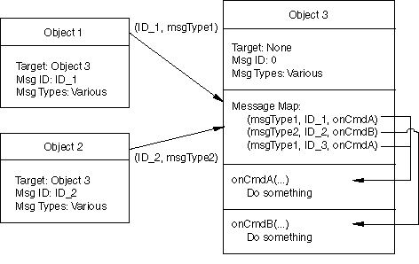
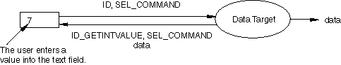
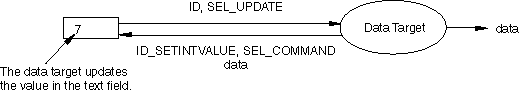
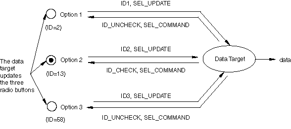

# 6.5 GUI commands


GUI commands are designed to work together with modes. Modes perform the command processing and send the command to the kernel. For more information, see [Chapter 7, "Modes](pt04ch07.md).” This section describes how to construct and use GUI commands. The following topics are covered:
- ["Constructing GUI commands," Section 6.5.1](pt04ch06s05.md#cus-app-commands-gui-construct)
- ["GUI commands and current objects," Section 6.5.2](pt04ch06s05.md#cus-app-commands-gui-current)
- ["Keeping the GUI and commands up-to-date," Section 6.5.3](pt04ch06s05.md#cus-app-commands-gui-uptodate)
- ["Targets and messages," Section 6.5.4](pt04ch06s05.md#cus-com-commands-targets)
- ["Automatic GUI updating," Section 6.5.5](pt04ch06s05.md#cus-com-commands-automatic)
- ["Data targets," Section 6.5.6](pt04ch06s05.md#cus-com-commands-datatargets)
- ["Option versus value mode," Section 6.5.7](pt04ch06s05.md#cus-com-commands-optionvmode)
- ["AFXKeywords," Section 6.5.8](pt04ch06s05.md#cus-app-commands-gui-keywords)
- ["Expression evaluation," Section 6.5.9](pt04ch06s05.md#cus-app-commands-gui-expressioneval)
- ["Connecting keywords to widgets," Section 6.5.10](pt04ch06s05.md#cus-app-commands-gui-connecting)
- ["Boolean, integer, float, and string keyword examples," Section 6.5.11](pt04ch06s05.md#cus-app-commands-gui-connect-bool)
- ["Symbolic constant keyword examples," Section 6.5.12](pt04ch06s05.md#cus-app-commands-gui-connect-symbol)
- ["Tuple keyword examples," Section 6.5.13](pt04ch06s05.md#cus-app-commands-gui-connect-tuple)
- ["Table keyword example," Section 6.5.14](pt04ch06s05.md#cus-app-commands-gui-connect-table)
- ["Object keyword example," Section 6.5.15](pt04ch06s05.md#cus-app-commands-gui-connect-object)
- ["Defaults objects," Section 6.5.16](pt04ch06s05.md#cus-app-commands-gui-defaults)

### 6.5.1 Constructing GUI commands

You use the `AFXGuiCommand` class to construct a GUI command. The `AFXGuiCommand` class takes the following arguments:

***mode***

Modes are activated through a control in the GUI, typically a menu button. Once a mode is activated, it is responsible for gathering user input, processing the input, sending a command, and performing any error handling associated with the mode or the commands it sends. For a detailed discussion of modes, see [Chapter 7, "Modes](pt04ch07.md).” The Abaqus GUI toolkit provides two modes:

**Form modes**

Form modes provide an interface to dialog boxes. Form modes gather input from the user using one or more dialog boxes.

** Procedure modes**

Procedure modes provide an interface that guides the user through a sequence of steps by prompting for input in the prompt area of the application.

*** method***

A String specifying the method of the kernel command.

*** objectName***

A String specifying the object of the kernel command.

*** registerQuery***

A Boolean specifying whether or not to register a query on the object.

For example, the following statement creates a command to edit graphics options:
```
 cmd = AFXGuiCommand(self, 'setValues', 
    'session.graphicsOptions', True)
```
If you have more than one GUI command in a mode, the commands are processed in the same order in which they are created in the mode. For more examples of creating GUI commands, see ["Form example," Section 7.3.1](pt04ch07s03.md#cus-mod-modes-form-example), and ["Procedure example," Section 7.4.1](pt04ch07s04.md#cus-mod-procedure-example).

### 6.5.2 GUI commands and current objects

Most commands in Abaqus/CAE operate on the current object; for example, the current viewport or the current part. As a convenience, modes recognize a special syntax when interpreting the object specified in a GUI command. If you place `%s` between square brackets following certain repositories, the mode replaces the `%s` with the current name. You should always use this `%s` syntax, as opposed to hard-coding a name, so that the current name will always be used in commands.

The following current objects are supported:

| Object Specification | Mode Interpretation |
| --- | --- |
| ` mdb.models[%s]` | Current model |
| ` mdb.models[%s].parts[%s]` | Current part |
| ` mdb.models[%s].sketches[%s]` | Current sketch |
| `session.odbs[%s]` | Current output database |
| ` session.viewports[%s]` | Current viewport |

### 6.5.3 Keeping the GUI and commands up-to-date

If a command edits an object, you should request that a query be registered on that object by specifying  True for the *registerQuery* argument in the GUI command constructor. Registering a query will cause the keywords associated with the AFXGuiCommand to be updated with the kernel values when the mode is started and any time the kernel values change. For example, 

```
 cmd = AFXGuiCommand(
     mode, 'PointSection', 'mdb.models[%s]', True)
```

In addition, modes recognize `session.viewports[%s]` as a special repository. The mode registers a query on the session automatically so that the command will be kept up-to-date if the user switches the current viewport. The following examples illustrate the special syntax:

```
cmd = AFXGuiCommand(
    mode,'setValues','session.viewports[%s]', True)

cmd = AFXGuiCommand(
    mode,'bringToFront','session.viewports[%s]', True)
```

### 6.5.4 Targets and messages

The Abaqus GUI Toolkit employs a target/message system to achieve communication within the GUI process. The target/message system is in contrast to, for example, Motif’s callback mechanism. All widgets can send and receive messages from any other widget. A message consists of two components:
- A message *type*
- A message *ID*

The message type indicates what kind of event occurred; for example, clicking a button. The message *ID* identifies the sender of the message.

Most widgets in the Abaqus GUI Toolkit take arguments that specify their target and their ID. Even if a widget does not take a target and ID as arguments, you can set these attributes using the `setTarget` and ` setSelector` methods. For example,

```
FXButton(parent, 'Label', tgt=self, sel=self.ID_1)

groupBox = FXGroupBox(parent)
groupBox.setTarget(self)
groupBox.setSelector(self.ID_2)
```

Widgets are capable of sending several types of messages. Two of the most common message types are SEL_COMMAND and SEL_UPDATE. The SEL_COMMAND message type generally indicates that a widget was “committed”; for example, the user clicked a push button. The SEL_UPDATE message is sent when a widget is requesting its target to update its state; for more information, see ["Automatic GUI updating," Section 6.5.5](pt04ch06s05.md#cus-com-commands-automatic).

A message is routed to a message handler using a map defined in the target class. You add an entry in the map by specifying which method to call when a message of a certain type and ID is received. These concepts are illustrated in [Figure 6--2](pt04ch06s05.md#bas-basics-targets).

**Figure 6–2** Targets and messages.



The message map is defined by using the `FXMAPFUNC` function (see example below). This macro takes four arguments: *self*, * message type*, *message ID*, and *method name*. The method name must be qualified by the class name: *className.methodName*. When a message is received whose type and ID match those defined in an ` FXMAPFUNC` entry, the corresponding method will be called. If you have a large range of IDs that you want to define in the message map, you can use the  `FXMAPFUNCS` function, which takes one additional argument: *self*, *message type*, *start message ID*, *end message ID*, and *method name*.

Objects react to messages using message handlers. All message handlers have the same prototype, which contains the following:
- The sender of the message
- The message selector
- Some "user data"

You can extract the type and ID of the message from the selector using the `SELTYPE` and ` SELID` functions.

The following code shows how message maps, message IDs, and message handlers work together:

```
class MyClass(BaseClass):

    [
        ID_1,
        ID_2,
        ID_LAST
    ] = range(BaseClass.ID_LAST, BaseClass.ID_LAST+3)

     def __init__(self):

         BaseClass.__init__(self) 
         FXMAPFUNC(self, SEL_COMMAND, self.ID_1,
             MyClass.onCmdPrintMsg)
         FXMAPFUNC(self, SEL_COMMAND, self.ID_2,
             MyClass.onCmdPrintMsg)

         FXButton(self, 'Button 1', None, self, self.ID_1)
         FXButton(self, 'Button 2', None, self, self.ID_2)

     def onCmdPrintMsg(self, sender, sel, ptr):

         if SELID(sel) == self.ID_1:
             print 'Button 1 was pressed.'
         elif SELID(sel) == self.ID_2:
             print 'Button 2 was pressed.'
         return 1
```

The previous example starts by generating a list of IDs for use in the derived class. Since a widget has a specific target, the ID of a widget does not have to be globally unique; it needs to be unique only within the target’s class and base classes. To handle this numbering automatically, the convention is to define ID_LAST in each class. A derived class should begin its numbering using the value of  ID_LAST defined in its base class. In addition, a derived class should define its own ID_LAST as the last ID in the derived class. A class that derives from the derived class will then be able to make use of that ID to begin its numbering. ID_LAST should not be used by any widget. The only purpose of ID_LAST is to provide an automatic numbering scheme between classes.

The example continues by constructing a message map by adding entries using the ` FXMAPFUNC` function. In this example, when a message of type ` SEL_COMMAND` and an ID of `ID_1` or ` ID_2` is received, the script calls the `onCmdPrintMsg` method. 

The two button widgets have their target set to self (`MyClass`). However, when each widget sends a message, the widget sends a different message ID and the message handler checks the ID to determine who sent the message. For example, if the user clicks the first button, the button sends a ` (ID_1, SEL_COMMAND)` message to `MyClass`. The class’s message map routes that message to the `onCmdPrintMsg` method. The `onCmdPrintMsg` method checks the ID of the incoming message and prints `Button 1 was pressed`.

It is important that your message handlers return the proper value to ensure that the GUI is kept up-to-date. Returning a `1` in a message handler tells the toolkit that the message was handled. In turn, if a message is handled, the toolkit assumes that something may have changed that requires an update, and the toolkit initiates a GUI update process. Returning a `0` in a message handler tells the toolkit that the message was not handled; therefore, the toolkit does not initiate a GUI update process. 

Messages are normally sent by the GUI infrastructure as the result of some interaction in the GUI. However, you can send a message directly to an object by calling its `handle` method. The ` handle` method takes three arguments: *sender*, * selector*, and *userData*. The sender is generally the object that is sending the message. The selector is made up of the message ID and the message type. You can use the `MKUINT` function to create a selector, for example, `MKUINT(ID_1, SEL_COMMAND)`. The user data must be *None* since this feature is not supported in the Abaqus GUI Toolkit.

### 6.5.5 Automatic GUI updating

GUI updating is initiated automatically by the Abaqus GUI Toolkit when there are no more events to be handled, usually when the GUI is idle and waiting for some user interaction. During the automatic GUI update process, each widget sends a SEL_UPDATE message to its target asking to be updated. In this way the GUI is constantly polling the application state to keep itself up-to-date.

For example, during automatic GUI updating, a check button sends an update message to its target. The target checks some application state and determines whether or not the check button should be checked. If the button should be checked, the target sends back an ID_CHECK message; otherwise, it sends an ID_UNCHECK message.

Widgets in the toolkit are bidirectional; that is, they can be in either a * push* state or a *pull* state. 

** push state**

In a *push* state the widgets are collecting and sending user input to the application. When a widget is in the *push* state, it does not participate in the automatic GUI updating process. Because the widget is not participating in the automatic GUI updating process, the user has control over the input, rather than the GUI attempting to update the widget.

** pull state**

In a *pull* state the widgets are interrogating the application to keep up-to-date. 

### 6.5.6 Data targets

In a typical GUI application you will want to do the following:

1. Initialize the values in a dialog box.
2. Post the dialog box to allow the user to make changes.
3. Collect the changes from the dialog box.

In addition, you may want the dialog box to update its state if some application state is updated while the dialog box is posted. Data targets are designed to make these tasks easier for the GUI programmer. This section describes how the data targets work. The following sections describe how the Abaqus GUI Toolkit has extended this concept to keywords that are used to construct commands sent to the kernel.

A data target acts as a bidirectional intermediary between some application state and GUI widgets. More than one widget can be connected to a data target, but a data target acts on only one piece of application state. When the user uses the GUI to change a value, the application state monitored by the data target is updated automatically. Conversely, when the application state is updated, the widget connected to the data target is updated automatically.

As described in ["Automatic GUI updating," Section 6.5.5](pt04ch06s05.md#cus-com-commands-automatic), widgets can be in a push state or a pull state. 

** Push state**

In a push state the widgets are collecting and sending user input to the application. [Figure 6--3](pt04ch06s05.md#bas-basics-datatargets1) illustrates how a data target works with a widget that is in a push state. The sequence is as follows:

1. First, the user enters a value of `7` in the text field and then presses ** Enter**.
2. This triggers the text field widget to send an `(ID, SEL_COMMAND)` message to its target---the data target.
3. The data target responds by sending the sender---the text field widget---a message requesting the value in the text field. The data target uses that value to update the value of its data.

**Figure 6–3** A data target with a text field widget in push state.



** Pull state**

In a pull state the widgets are interrogating the application to keep up-to-date. [Figure 6--4](pt04ch06s05.md#bas-basics-datatargets2) illustrates how a data target works with a widget that is in a pull state. The sequence is as follows:

1. When the GUI is idle, it initiates a GUI update.
2. The GUI update triggers each widget to send an `(ID, SEL_UPDATE)` message to its target.
3. In this case the data target responds by sending the sender---the text field widget---a message telling it to set its value to the value of the data target's data.

**Figure 6–4** A data target with a text field widget in a pull state.



### 6.5.7 Option versus value mode

A data target works in one of two modes: value or option. The examples in the previous section described the value mode. You use the value mode when the actual value of some data is of interest. In contrast, you use the option mode when you require a selection from many items and the value is not of particular importance.

For data targets operating in the option mode with a widget in the push state, the behavior is similar to the value mode described in the previous section. When the user clicks a button, the button sends an `(ID, SEL_COMMAND)` message to its target. In turn, the target responds by sending the sender a message requesting it to update the data target’s data to the value of the sender’s message ID. 

For data targets operating in the option mode with a widget in the pull state,  the behavior is slightly different from the value mode described in the previous section. During a GUI update the data target sends either a check or uncheck message back to the sender, depending on whether the sender’s ID matches the value of the data target’s data. 

For example, [Figure 6--5](pt04ch06s05.md#bas-basics-options) illustrates a data target operating in the option mode with three radio buttons in the pull state. Suppose that the value of the data being monitored by the data target is 13 and the message IDs of the radio buttons are 2, 13, and 58, respectively.  The sequence is as follows:

1. During a GUI update the first radio button sends a `(2, SEL_UPDATE)` message to the data target.
2. The data target compares the message ID (2) to the value of its data (13) and sends an uncheck message back to the radio button since the values do not match.
3. The second radio button then sends a `(13, SEL_UPDATE)` message to the data target.
4. The data target compares the values and sends a check message back to the radio button since the values do match.
5. Similarly, the third button receives an uncheck message from the data target since the values of the message ID and its data do not match.

In this way the Abaqus GUI Toolkit automatically maintains the radio button behavior (only one button at a time will ever be checked).

**Figure 6–5**  A data target operating on three radio buttons in option mode and a pull state.



### 6.5.8 AFXKeywords

Keywords generate the arguments to a GUI command. These keywords belong to the command, but the keywords are also stored as members of the mode. As a result, you can easily connect the keywords to widgets in a dialog box that updates the value of the keywords. For more information, see [Chapter 5, "Dialog boxes](pt03ch05.md).”

` AFXKeyword` is the base class for keywords in the toolkit. The ` AFXKeyword` class derives from a data target, so it automatically keeps the GUI and application data synchronized with each other. For more information, see ["Data targets," Section 6.5.6](pt04ch06s05.md#cus-com-commands-datatargets). 

The `AFXKeyword` class extends the functionality of the ` FXDataTarget` class by holding additional values, such as the name of the keyword, a default value, and a previous value. The keyword’s GUI command uses this information to construct a kernel command string.

You can designate a keyword as optional or required. A required keyword is always issued by the GUI command. An optional keyword, whose values have not changed since the last commit of the command, is not issued by the GUI command. If none of the keywords has changed since the last commit, no GUI command will be issued when the mode is committed.

The following types of keywords are supported:
- ``` AFXIntKeyword(cmd, name, isRequired, defaultValue) ```
- ``` AFXFloatKeyword(cmd, name, isRequired, defaultValue) ```
- ``` AFXStringKeyword(cmd, name, isRequired, defaultValue) ```
- ``` AFXBoolKeyword(cmd, name, booleanType, isRequired, defaultValue) ```
- ``` AFXSymConstKeyword(cmd, name, isRequired, defaultValue) ```
- ``` AFXTupleKeyword(cmd, name, isRequired, minLength, maxLength, opts) ```
- ``` AFXTableKeyword(cmd, name, isRequired, minLength, maxLength, opts) ```
- ``` AFXObjectKeyword(cmd, name, isRequired, defaultValue) ```

The type of data supported by each keyword is implied from the name of its constructor, except for AFXObjectKeyword. An object keyword is one that supports specifying a variable name as the keyword's value.

The prototypes for all the keywords are similar. The first two arguments of a keyword are:
- A GUI command object.
- A String specifying the name of the keyword.

All keywords also support an argument that determines whether the keyword is required or optional. If a keyword is required, it will always be sent with the command. If a keyword is optional, it will be sent only if its value changes. However, if the keyword is connected to a widget that is hidden, then the keyword will not be sent regardless of whether it is required or optional.

Most keywords support the specification of a default value. When you construct a keyword, its value is set to the default value. If you use the keyword's `setDefaultValue` method to change the default value, you will not affect the value of the keyword unless you also call the keyword's `setValueToDefault` method. In contrast, if you want to change only the value of the keyword, without changing its default value, you should use the keywords' `setValue` method. 

When the mode issues the command to the kernel, the keywords will be ordered in the same order in which they were created in the mode.

When storing keywords in the mode class, the convention is to name the keyword object using the same name as the keyword label plus `Kw`. For example,

```
self.rKw = AFXIntKeyword(self.cmd, 'r',  True)
self.tKw = AFXFloatKeyword(self.cmd, 't',  True)
self.nameKw = AFXStringKeyword(cmd, 'name', True, 'Part-1')
self.twistKw = AFXBoolKeyword(cmd, 'twist',
    AFXBoolKeyword.ON_OFF, 0) 
self.typeKw = AFXSymConstKeyword(cmd, 'type', True,
    SHADED.getId())
self.imageSizeKw = AFXTupleKeyword(cmd, 'imageSize', False,
    1, 2, AFXTUPLE_TYPE_FLOAT)
```

### 6.5.9 Expression evaluation

The `AFXFloatKeyword` and `AFXIntKeyword` both support expression evaluation. This means that you can type a numeric expression into a text field connected to an `AFXFloatKeyword` or `AFXIntKeyword` and that expression will get evaluated. For example, you could type any of the following expressions into a text field connected to an `AFXFloatKeyword`:

```
3 + (7 * 22)
2 * 3.1415 * 1.5
125/55.8

```

The expression will get sent in the command, so it will appear in the replay and journal files, but once the command is processed in the kernel, only the resultant value gets stored and the expression is lost.

Expression evaluation is always available with an `AFXFloatKeyword`, but it is optional for `AFXIntKeyword` (the default is to perform expression evaluation). If you connect an `AFXIntKeyword` to an `AFXList` or `AFXComboBox` and the choices shown in the list or combo box do not represent numeric values, you must disable expression evaluation. For example:

```
Form code snippet:

    self.orderKw = AFXIntKeyword(cmd=cmd, name='order', 
        isRequired=False, defaultValue=1, evalExpression=False)

Dialog code snippet:

    combo = AFXComboBox(self, 8, 3, 'Order:', form.orderKw, 0)
    combo.appendItem('First', 1)
    combo.appendItem('Second', 2)
    combo.appendItem('Third', 3)

```
The command snippet from this code will look like:       
```
someCommand(order=2, ...)
```

### 6.5.10 Connecting keywords to widgets

Keywords are used in the GUI by setting them as the targets of widgets. The ` AFXDataDialog` class takes a mode as one of its constructor arguments. The dialog box uses the mode provided in the constructor to access the keywords stored in the mode. In addition, the dialog box uses the keywords as targets of widgets in the dialog. 

In addition to a target, a widget also has a message ID. It is important that the appropriate ID be set for the keyword to operate in the proper mode: value or option. For more information, see ["Data targets," Section 6.5.6](pt04ch06s05.md#cus-com-commands-datatargets). In most cases a value of zero should be used for the message ID; a value of zero indicates that the keyword should operate in value mode. The table below summarizes the message ID usage with keywords, and the following sections give examples for each type of keyword. 

| Keyword | ID | Description |
| --- | --- | --- |
| `AFXIntKeyword` | 0 | Keyword operates in value mode. Use this when the keyword is connected to a text field, list, combo box, or spinner. |
|  | >0 | Keyword operates in option mode. Use this when the keyword is connected to a radio button. |
| ` AFXFloatKeyword` | 0 | Keyword operates in value mode. |
| ` AFXStringKeyword` | 0 | Keyword operates in value mode. |
| ` AFXBoolKeyword` | 0 | Keyword operates in value mode. This keyword should be used only with widgets that allow only Boolean values, such as `FXCheckButton`. |
| ` AFXSymConstKeyword` | 0 | Keyword operates in value mode. Use this value when the keyword is connected to a list or combo box. |
|  | > 0 | Keyword operates in option mode. Use the value of the Symbolic Constant's ID when the keyword is connected to a radio button. Do not use this keyword with ` FXCheckButton`. |
| ` AFXTupleKeyword` | 0 | Keyword operates in value mode. Use this value when the entire tuple is gathered from a single widget. |
|  | 1, 2, 3,. | Keyword operates in value mode for only the * n*th element of the tuple, where *n*=ID. Use this value when the input for each element is gathered from separate widgets. |
| ` AFXTableKeyword` | 0 | Keyword operates in value mode. |
| `AFXObjectKeyword` | 0 | Keyword operates in value mode. |

### 6.5.11 Boolean, integer, float, and string keyword examples

The following statements illustrate the use of Boolean, integer, float, and string keywords:

```
# Boolean keyword with a checkbox
#
FXCheckButton(self, 'Show node labels', mode.nodeLabelsKw, 0)

#Boolean keyword with option tree list
#
self.tree = AFXOptionTreeList(parent, 6)
self.treeitem.addItemLast('Item 1', mode.item1Kw)

# Integer keyword
#
AFXTextField(self, 8, 'Number of CPUs:', mode.cpusKw, 0)

combo = AFXComboBox(self, 8, 3, 'Number:', mode.numberKw, 0)
combo.appendItem('1', 1)
combo.appendItem('2', 2)     
combo.appendItem('3', 3)

# Float keyword
#
AFXTextField(self, 8, 'Radius:', mode.radiusKw, 0)

# String keyword
#
AFXTextField(self, 8, 'Name:', mode.nameKw, 0)
```

### 6.5.12 Symbolic constant keyword examples

Symbolic constants provide a way to specify choices for a command argument that make the command more readable. For example, there are three choices for the * renderStyle* argument in display options commands. We could number these choices using integer values from 1 to 3. However, using integer values would result in a command that is not very readable; for example, ` renderStyle=2`. Alternatively, if we define symbolic constants for each choice, the command becomes more readable; for example, ` renderStyle=HIDDEN`.  Internally, symbolic constants contain an integer ID that can be accessed via its `getId()` method. Symbolic constants can be used in both the GUI and kernel processes. Typically you should create a module that defines your symbolic constants and then import that module into both your kernel and GUI scripts.  

You can import the `SymbolicConstant` constructor from the symbolicConstants module. The constructor takes a single string argument. By convention, the string argument uses all capital letters, with an underscore between words, and the variable name is the same as the string argument. For example,     

```
from symbolicConstants import SymbolicConstant
AS_IS = SymbolicConstant('AS_IS')
```

In the case of symbolic constant keywords, you can use a value of zero or the value of the ID of a symbolic constant for the message ID. Symbolic constants have a unique integer ID that is used to set the value of symbolic constant keywords along with a string representation that is used in the generation of the command. To access the integer ID of a symbolic constant, use its `getId` method.

If the keyword is connected to a list or combo box widget, you should use a value of zero for the ID in the widget constructor. The `AFXList`, ` AFXComboBox`, and `AFXListBox` widgets have been designed to handle symbolic constant keywords as targets. When items are added to a list or combo box, a symbolic constant’s ID is passed in as user data. These widgets react by setting their value to the item whose user data matches the value of their target, as opposed to setting their value to the item whose index matches the target’s value. The following example illustrates how a combo box can be connected to a symbolic constant keyword:

```
combo = AFXComboBox(hwGb, 18, 4, 'Highlight method:',
    mode.highlightMethodHintKw, 0)
combo.appendItem('Hardware Overlay', HARDWARE_OVERLAY.getId())
combo.appendItem('Software Overlay', SOFTWARE_OVERLAY.getId())
combo.appendItem('XOR', XOR.getId())
combo.appendItem('Blend', BLEND.getId()) 
```

If the keyword is connected to a radio button, you should use the ID of the symbolic constant that corresponds to that radio button for the message ID. Since the ID of all symbolic constants is greater than zero, this tells the keyword to operate in option mode. The following example illustrates how symbolic constant keywords can be used with radio buttons:

```
from abaqusConstants import *
... 

# Modeling Space
#
gb = FXGroupBox(self, 'Modeling Space',
    FRAME_GROOVE|LAYOUT_FILL_X)
FXRadioButton(gb, '3D', mode.dimensionalityKw,
    THREE_D.getId(), LAYOUT_SIDE_LEFT)
FXRadioButton(gb, '2D Planar', mode.dimensionalityKw,
    TWO_D_PLANAR.getId(), LAYOUT_SIDE_LEFT) 
FXRadioButton(gb, 'Axisymmetric', 
    mode.dimensionalityKw, AXISYMMETRIC.getId(),
    LAYOUT_SIDE_LEFT)
```

### 6.5.13 Tuple keyword examples

In the case of tuple keywords, a value of zero for the message ID indicates that the entire tuple will be updated. For example, you can use a single text field to collect * X*-, *Y*-, and *Z*-inputs from the user. In this case the comma-separated string entered by the user is used to set the entire value of the tuple keyword. For example, if you define a tuple keyword as follows:

```
self.viewVectorKw = AFXTupleKeyword(cmd, 'viewVector', 
    True, 3, 3)
```
you can connect the tuple keyword to a single text field as follows:
```
AFXTextField(self, 12, 'View Vector (X,Y,Z)', 
    mode.viewVectorKw, 0)
```
Alternatively, you can use three separate text fields to collect *X*-, * Y*-, and *Z*-inputs. Each of the text field widgets uses a message ID equal to the element number (1-based) of the tuple to which they correspond. For example, 1 corresponds to the first element of the tuple; 2 corresponds to the second element in the tuple, etc. In this case we can connect the keyword to three text fields as follows:
```
AFXTextField(self, 4, 'X:', mode.viewVectorKw, 1)
AFXTextField(self, 4, 'Y:', mode.viewVectorKw, 2)
AFXTextField(self, 4, 'Z:', mode.viewVectorKw, 3)
```

### 6.5.14 Table keyword example

The `AFXTableKeyword` must be connected to a table widget. This type of keyword will result in a command argument that is a tuple of tuples. The values in a table keyword can be Ints, Floats, or Strings. 

The default minimum number of rows is 0, and the default maximum number rows is 1, indicating that the number of rows is unlimited. Tables can vary in size because the user can add or delete rows; as a result, you usually specify the defaults for the minimum and maximum number of rows. For example, to generate a command that creates XY data, you can define the following keywords in the form

```
self.cmd = AFXGuiCommand(self, 'XYData', 'session')
self.nameKw = AFXStringKeyword(self.cmd, 'name', True)
self.dataKw = AFXTableKeyword(
   self.cmd, 'data', True, 0, -1, AFXTABLE_TYPE_FLOAT)
```
In the dialog box you connect the table keyword to a table using a selector value of zero.
```
table = AFXTable(vf, 6, 3, 6, 3,
   form.dataKw, 0, AFXTABLE_NORMAL|AFXTABLE_EDITABLE)
```

If you have a table in which you are interested in the values of only a single column, you can make use of the `AFXColumnItems` object to track selections. For example, if a table contains Name and Description columns, you might only need the names in the selected rows for your command. In that case you could use `AFXColumnItems` to keep a tuple keyword up to date with the names in the selected rows of the table as shown in the following code: 

```
ci = AFXColumnItems(referenceColumn=0, tgt=form.tupleKw, sel=0)
table = AFXTable(self, 4, 2, 4, 2, ci, 0, 
   AFXTABLE_NORMAL|AFXTABLE_ROW_MODE|AFXTABLE_EXTENDED_SELECT

```

### 6.5.15 Object keyword example

The `AFXObjectKeyword` has a variable name for its value. In most cases you use an `AFXObjectKeyword` in a command that is preceded by some setup commands. For example,

```
p = mdb.models['Model-1'].parts['Part-1']
session.viewports['Viewport: 1'].setValues(displayedObject=p)
```
 In this example, in the form you would issue the first command “manually,” and use an object keyword as part of an `AFXGuiCommand` to have the second command issued using “p” as the variable name. For example,
```
self.cmd = AFXGuiCommand(self, 'setValues', 
    'session.viewports[%s]')
self.doKw = AFXObjectKeyword(self.cmd, 'displayedObject', 
    True, 'p')
```
You also use an `AFXObjectKeyword` in procedures that require picking. For more information, see ["Picking in procedure modes," Section 7.5](pt04ch07s05.md).

### 6.5.16 Defaults objects

A defaults object can be used to restore the values of the keywords in a command to their default values when the user presses the **Defaults** button in the dialog box. You can register a defaults object with a command as follows:

```
self.registerDefaultsObject(cmd, 
    'session.defaultGraphicsOptions')
```
 In addition, the `AFXGuiCommand` class has a ` setKeywordValuesToDefaults` method that you can use to initialize the state of all keywords in a command. In most cases you use the ` setKeywordValuesToDefaults` method to initialize the state of all keywords in the `getFirstDialog` method of the mode. As a result, the application will initialize the value of the keywords in a command each time the dialog box is posted.

If no defaults object is specified, the command uses the default values specified in the keyword's constructor when the user presses the ** Defaults** button in the dialog box.


