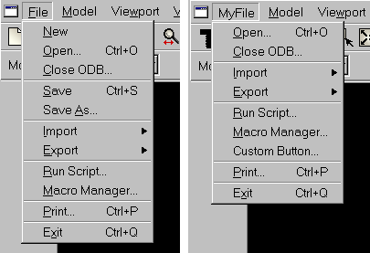

# 10.6 An example of customizing a toolset


To modify an existing toolset, you start by deriving a new class from it. To modify widgets in the toolset, you need to be able to access them. The following functions in the Abaqus GUI Toolkit allow you to access a widget:
- `getWidgetFromText(widget, text)`: The `getWidgetFromText` function returns a widget whose label or tip text matches the specified text and is also a child of the specified widget. For example, the following statement returns the widget that matches the **Save As...** item in the **File** menu: ``` saveAsWidget = getWidgetFromText(fileMenu, 'Save As...') ```
- `getSeparator(widget, index)`: The `getSeparator` function returns the *nth* separator of the specified widget, where *n* is specified by the one-based index. For example, the following statement returns the second separator in the **File** menu: ``` separatorWidget = getSeparator(fileMenu, 2) ```

The following example shows how you can modify the **File** toolset GUI. [Figure 10--1](pt05ch10s06.md#cus-wgt-access) shows the **File** menu before and after the script is executed. 

**Figure 10–1** The toolbar and the **File** menu before and after executing the example script.



```
from sessionGui import FileToolsetGui
from myIcons import boltToolboxIconData
from myForm import MyForm 

class MyFileToolsetGui(FileToolsetGui):

    #~~~~~~~~~~~~~~~~~~~~~~~~~~~~~~~~~~~~~~~~~~~~~~~~~~~~~~~
    def __init__(self):

        # Construct the base class.
        #
        FileToolsetGui.__init__(self)

        # Remove unwanted items from the File menu,
        # including the second separator.
        #
        menubar = getAFXApp().getAFXMainWindow().getMenubar()
        menu = getWidgetFromText(menubar, 'File').getMenu()
        getWidgetFromText(menu, 'New').hide()
        getWidgetFromText(menu, 'Save').hide()
        getWidgetFromText(menu, 'Save As...').hide()
        getSeparator(menu, 2).hide()

        # Remove unwanted items from the toolbar
        #
        toolbar = self.getToolbarGroup('File')
        getWidgetFromText(toolbar, 'New Model\nDatabase').hide()
        getWidgetFromText(toolbar, 'Save Model\nDatabase').hide()

        # Add an item to the File menu just above Exit
        #
        btn = AFXMenuCommand(self, menu, 'Custom Button...',
            None, MyForm(self), AFXMode.ID_ACTIVATE)
        sep = getSeparator(menu, 6)
        btn.linkBefore(sep)

        # Rename the File menu
        #
        fileMenu = getWidgetFromText(menubar, 'File')
        fileMenu.setText('MyFile')

        # Change a toolbar button icon
        #
        btn = getWidgetFromText(toolbar, 'Open')
        icon = FXXPMIcon(getAFXApp(), boltToolboxIconData)
        btn.setIcon(icon)    
```

This example script illustrates the following:

**Deriving a new toolset class**

To modify a toolset GUI, you begin by deriving a new class from it. Inside the new class constructor body, you must call the base class constructor and pass *self* as the first argument.

**Removing items from a menu or toolbar**

You can remove items from a menu by hiding them. You use the `getWidgetFromText` or the `getSeparator` functions to obtain the widgets and call the `hide` method to remove them.

**Adding items to a menu**

You can insert items into an existing menu by creating new menu commands and positioning them using the `linkBefore` or `linkAfter` methods.

**Renaming items and changing icons**

You can change the text or icon associated with a widget by calling the `setText` or `setIcon` methods.


