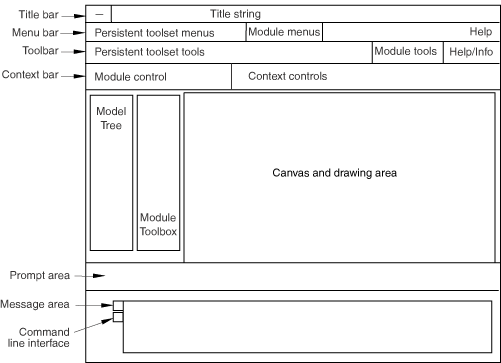

# 13.1 An overview of the main window


Interactive Abaqus products consist of a single main window that contains several GUI infrastructure components. The main window itself provides only GUI infrastructure support. You add specific functionality to the application by registering modules and toolsets with the main window. Registering modules and toolsets is discussed in detail in ["Modules and toolsets," Section 14.1](pt06ch14s01.md).

The main window is designed to work with the concept of GUI modules, which contain their own menu bar, toolbar, and toolbox entries. The main window shows only the components for one module at a time. The main window is responsible for swapping these components in and out as the user visits the various modules of the application. 

The following statement shows the constructor that you use to create the main window:

```
AFXMainWindow(app, title, icon=None, miniIcon=None, 
    opts=DECOR_ALL, x=0, y=0, w=0, h=0)
```
The following list describes the arguments to the `AFXMainWindow` constructor:

**app**

The application object.

**title**

A String that will be shown in the title bar of the main window.

**icon**

A 32  32 pixel icon used for the application on the desktop.

**miniIcon**

A 16  16 pixel used on Windows for the application in the title bar and system tray.

**opts**

Flags controlling various window behavior.

**x,y,w,h**

The *X-*, *Y-*location of the window, and the *width* and *height* of the window. The default value of zero indicates that the system should calculate these numbers automatically. The main window size and location are stored in `abaqus_v6.14.gpr` when the application exits so that when the application is started again it will appear in the same location with the same size. Therefore, it is recommended that you do not set *x, y, w, or h* in the main window constructor; however, if you do, those settings will override the settings in `abaqus_v6.14.gpr`.

The following statement shows how you can access the main window:

```
mainWindow = getAFXApp().getAFXMainWindow()
```
The layout of the main window is shown in [Figure 13--1](pt06ch13s01.md#bld-main-window). 

**Figure 13–1** The main window.




