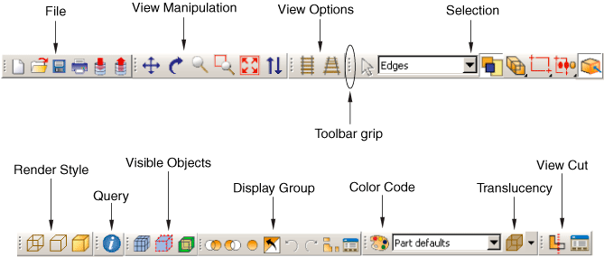

# 13.4 Toolbars


By default, Abaqus/CAE displays all of the toolbars in a row underneath the main menu bar, as shown in [Figure 13--2](pt06ch13s04.md#cus-top-toolbar): 

**Figure 13–2** The Abaqus/CAE toolbars.



You can use the following statement to access a toolbar group from the module or toolset that defines the toolbar group: 
```
toolbar = self.getToolbarGroup(toolbarName) 
```
 where *self* is the module or toolset, and *toolbarName* is the name given to the toolbar when Abaqus/CAE constructs it. You can determine the names of the toolbars by selecting ****Tools****Customize**** from the main menu bar and viewing the dialog box that appears.


