# 1.2.1 符号表示

### 1.2.1 符号表示

**产品：** Abaqus/Standard  Abaqus/Explicit

符号表示通常是一个严重的障碍，阻止工程师使用高级教科书；例如，一般曲线张量分析和泛函分析在Abaqus中使用的一些理论中都是必要的，但这些领域中不熟悉的符号通常会阻止用户进行深入研究。本指南中使用的大多数符号（直接矩阵表示）可能对一些读者来说不熟悉；但要获得足够的熟悉程度并使其有用并不困难，也不需要太多时间，而且绝对是值得的。这种符号在现代工程文献中常用——它是许多旧工程教科书中熟悉的矩阵表示的简写形式。一旦理解了，这种符号就很吸引人——因为它允许简洁地推导方程，并且物理概念可以不被最终用于将相同概念以分量形式表示的特定基系统选择的复杂性所分散注意力。因为这种符号在文献中已成为标准，希望或需要阅读与使用Abaqus相关的教科书和论文的用户会发现熟悉这种符号是可取的。

本指南中同时使用了直接矩阵表示和分量形式表示。本节描述了两种符号。尽可能使用直接矩阵表示。然而，向量、矩阵和使用理论中的高阶张量最终必须以分量形式写成分布在计算机上的一组数字。因此，指南中需要这两种书写方式。
### 基本量

制定理论所需的量为标量、向量、二阶张量（矩阵），偶尔还有四阶张量（例如，线性弹性的应力-应变变换）。在直接矩阵表示中，这些量写为：| 标量值 | a |
| --- | --- |
| 向量 | 或 |
| 转置 | 或 |
| 二阶张量或矩阵 | 或 |
| 转置 | 或 |
| 和 |
| 四阶张量 |  |

向量和二阶张量（矩阵）的书写方式相同：由上下文区分。在直接矩阵表示中，通常不需要标明向量必须被转置。上下文决定向量是作为"列"向量  还是作为"行"向量 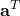 使用。在这种情况下，转置上标仅用于提高表达式的可读性。另一方面，对于二阶非对称张量，添加转置上标会改变表达式的含义。

这种向量和张量的表示对于推导理论非常通用和方便，因此可以容易地根据其物理含义理解方程。然而，在实际计算中我们必须处理单个数字，因此向量和张量必须以其分量表示。这些分量与一个基系统相关联，该基系统在空间中的每个点定义一组基向量。最简单的基系统是矩形笛卡尔系统，因为基向量是在所有点方向相同的正交单位向量。不幸的是，我们需要比这更多的通用性，因为我们将要处理壳和梁，其中应力、应变等最方便地根据壳表面的方向（或与梁轴线相关的方向）来描述，而这些通常随着我们在表面上移动而改变。为了保持这种必要的通用性并将向量和矩阵表示为分量形式，我们引入一组通用基向量 、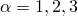，它们不一定正交或单位长度，但足以定义向量的分量（为此目的它们不能平行或长度为零）。然后向量  可以写成

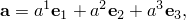其中数字 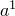、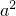 和 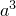 是与 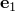、 和  相关的  的分量。

在实际案例中， 是为了方便而选择的（例如，参见Abaqus Analysis User's Guide第1.2.2节"约定"中关于Abaqus中如何为表面单元选择基向量的描述），然后获得 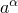。

为了节省书写，我们采用通常的求和约定：重复索引被求和——在这种情况下范围是1到3——所以上面的方程写成

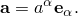同样，矩阵的分量形式为

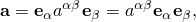或者，写出来是

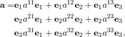 类似地，四阶张量可以写成分量形式为

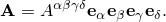

虽然对于描述壳和梁上的应力和应变我们需要这样完全通用的基向量，但在许多情况下使用矩形笛卡尔分量很方便，这样  是正交单位向量。为了区分这个特殊情况，我们使用拉丁索引而不是希腊索引。因此， 是一组通用基向量；而  是矩形笛卡尔基向量； 是向量  沿通用基向量的分量，而 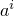、 是沿第 *i* 个笛卡尔方向的  的分量。

向量和张量概念及其表示在许多教科书中都有讨论——例如，参见 [Flugge (1972)](07s01a01-References.md)。
### 基本运算

本指南中指示的通常矩阵和向量运算符如下：

两个向量的点积：

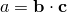

（点符号完全定义此操作，无论 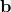 或 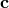 是否被转置——即 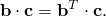）

两个向量的叉积：

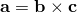

矩阵乘法：

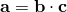

（隐含假设  和  维数正确，正如使操作有意义所需的那样；此外，如果  是非对称张量，则 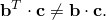）

两个矩阵的标量积：

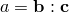

此操作意味着两个矩阵的相应共轭分量作为对相乘，然后将乘积求和。因此，例如，如果  是应力矩阵 ，而  是共轭应变率矩阵 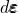，那么 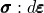 将给出每体积的内功率率 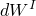。

还需要定义两个向量的并矢积：

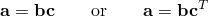

此操作从两个向量创建一个二阶张量（或并矢）。在分量表示法中，这个表示等价于 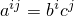。

导数矩阵，

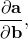意思是

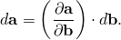在整个本指南中，我们将隐式假设，当对时间取导数时，我们指的是物质时间导数；也就是说，当观察一个特定的材料粒子时，变量相对于时间的变化。当某个特定方程不是这种情况时，在方程出现时会明确说明。

只要我们按照上面的图示小心解释 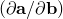，初等微积分的标准概念显然成立；例如，如果  是向量值函数  的向量值函数，而  又是  的向量值函数，即 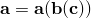，那么

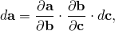或者，如果 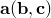：

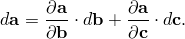

由于这些特性，许多有用的结果可以快速获得并以紧凑、易懂的形式表示。
### 坐标系中向量或矩阵的分量

在上一节中，我们引入了向量  或矩阵  可以相对于一些方便选择的一组基向量  以分量表示的思想。我们现在展示如何获得分量 （或 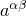）。我们可以使用点积来做到这一点。对于三个基向量中的每一个，，我们定义一个共轭基向量 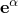，如下所示。选择 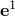 垂直于  和 ，使得点积 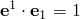。类似地，选择 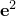 垂直于  和 ，使得 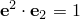；以及 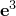 垂直于  和 ，使得 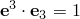。因此，

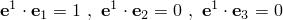

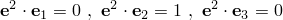

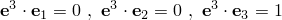我们可以简洁地写成

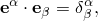其中如果 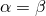，则 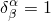，否则 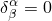。（ 称为"克罗内克符号"。）在矩阵表示中  是单位矩阵 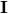：我们也可以将定义 、 和  的上述方程以矩阵形式写成

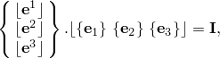因此，如果知道一组基向量——比如说 ——就可以很容易地获得其他基向量。

有了这组额外的基向量，我们就可以立即获得向量或矩阵的分量，如下所示。

考虑向量 。然后 （使用基向量  以分量形式写出 ），并且由于 ，仅当  时，

完全相同的方式，我们可以写出

 通过将  表示为与  基向量相关的分量 。

同样，对于矩阵，

和

这些分量定义对于计算两个向量的点积特别方便，因为我们可以写成

即

类似地，两个矩阵的标量积是

也就是说，我们简单地将  和  数组中的相应条目（排列为矩阵）相乘，然后求乘积之和。

最后，在计算机上我们只需要存储一种形式的分量：、 或 、。我们可以随时使用"度量张量"  及其逆  从一种形式转到另一种形式，定义为

和

对于

 因此，；类似地 ，并且，通过扩展，对于矩阵，

和

度量张量及其逆是对称的：

与它们关联的两组基向量和向量或矩阵的分量命名如下：|  | 是协变基向量， |
| --- | --- |
|  | 是逆变基向量， |
|  | 是向量（或矩阵）的协变分量， |
|  | 是向量（或矩阵）的逆变分量。 | 因此，逆变分量是与协变基向量  关联的分量，反之亦然。最简单的情况是当基是一组正交单位向量（矩形笛卡尔系统）时，因为从定义  我们看到 ，所以 ，我们不需要区分分量的类型。尽可能选择矩形笛卡尔系统，因此不需要区分分量类型。系统在梁单元和壳单元的章节中更详细地讨论。
### 导数的分量

考虑向量值函数 ，它在基系统  上以分量形式表示。设向量值函数  依赖于 ：。然后

 所以与变化  相关的  的分量是

为了方便，我们写成

意思是

现在假设  写在不同的基上——比如说 ——所以我们将  存储为分量

然后

通常我们会写成

其中

熟悉一般曲线张量分析的读者会认识到  是  相对于  的协变导数，通常写为 。直接矩阵表示的优势很明显：因为我们可以将  和  想象为空间中的向量，我们就能物理理解  的含义；它是向量值函数  作为另一个向量值函数  的函数的变化。对于计算，我们必须将  和  表示成分量形式。然后

一旦我们选择了方便的基系统，就提供了必要的分量： 用于 ， 用于 。通常  和  都将是简单的矩形笛卡尔基

处处适用。但有时我们必须使用更复杂的基系统——例如，当我们需要与一般壳表面相关的量时，以及当几何形状和可能的变形对称性使在轴对称系统中工作很方便时。将以直接矩阵表示写的通用结果仔细投影到选定的基系统上，使我们能够实现理论进行计算。

例如，考虑应变率的通常表达式，

需要计算矩阵 ，其中  是当前流经空间点  的材料的速度。让我们现在推导当  和  的基系统都是我们通常为轴对称问题选择的圆柱系统时的  的分量，基向量为

（在Abaqus中对于轴对称情况，我们总是按此顺序取分量——径向、轴向、周向）。这些基向量是正交和单位长度的，所以 

我们认为位置由坐标  定义，其中

所以

因此，

其中

所以

我们知道

所以

因此，

应变率的分量为

和

对于纯轴对称变形的情况， 和 ，所以这些结果简化为熟悉的表达式

总之，直接矩阵表示允许我们在不参考任何特定坐标系的情况下获得所有基本结果。仔细应用协变导数的概念，然后允许将这些通用结果投影到分量形式进行计算。
### 虚量

虚位移和虚功的概念是推导的基本原理。虚量是物理测量的无限小变化，如位移、应变、速度等。标量 *a* 的虚变化用  表示；向量或矩阵  的虚变化用  表示。

我们将此符号扩展到诸如下面的表达式

这是虚向量场  的空间梯度的对称部分。如果  是虚速度场，则此符号对应于虚变形率（应变率的一种度量）。
### 初始位置和当前位置

大多数结构问题涉及描述结构在加载时的行为方式及其从参考配置开始的变形历史。最初位于空间中某位置  的材料粒子将移动到新位置 ：由于我们假设材料不能出现或消失， 和  之间将存在一对一对应关系，因此我们始终可以将粒子位置的历史写成

并且这个关系可以反转——当我们知道  和 *t* 时，我们知道 。现在考虑两个相邻粒子，位于初始配置中的  和  处。在当前配置中我们必须有

使用"映射" [方程 1.4.1-1](01s04a04-Deformation.md)。

矩阵

称为变形梯度矩阵，[方程 1.4.1-2](01s04a04-Deformation.md) 写成

### 节点变量

到目前为止，我们已经讨论了被认为与模型中所有点相关的量。有限元近似基于假设插值，通过它，位移、位置以及通常其他变量在任何材料点由有限数量的节点变量定义。在本指南中，我们使用大写上标来指代单个节点变量或节点向量，并对这些索引采用求和约定。

因此，插值可以相当普遍地写成

其中  是结构中任何点处的某个向量值函数；、 一直到问题中的变量总数，是一组 *N* 个向量插值函数（这些是材料坐标  的函数）；而 、 是一组节点变量。

在本指南的某些章节中，我们需要描述整个有限元方程系统的节点变量操作。在这些章节中，我们使用经典矩阵-向量表示法。在这种表示法中， 表示包含节点变量的列向量， 表示行向量，矩阵写为 。常见操作是两个向量之间的标量积，

（在指标表示法中等价于 （在指标表示法中等价于 ）。