# 1.4.1 变形

### 1.4.1 变形

**产品：** Abaqus/Standard  Abaqus/Explicit

在任何结构问题中，分析员描述结构的初始配置，并关注其在整个加载历史过程中的变形。最初位于空间中某位置  的材料粒子将移动到新位置 ：由于我们假设材料不能出现或消失， 和  之间将存在一对一对应关系，因此我们始终可以将粒子位置的历史写成

并且这个关系可以反转——当我们知道  和 *t* 时，我们知道 。现在考虑两个相邻粒子，位于初始配置中的  和  处。在当前配置中我们必须有

使用"映射" [方程 1.4.1-1](01s04a04-Deformation.md)。

矩阵

称为变形梯度矩阵，[方程 1.4.1-2](01s04a04-Deformation.md) 写成

由于材料行为取决于材料的应变而非其刚体运动，因此必须区分材料点邻域中的运动部分。观察从初始位于  的粒子发出的无限小标距长度 ，我们可以测量其初始长度和当前长度

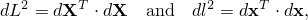所以这个标距长度的"拉伸比"是

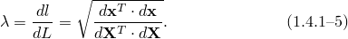

如果 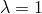，则这个无限小标距长度没有应变——它仅经历了刚体运动。现在使用 [方程 1.4.1-4](01s04a04-Deformation.md)，

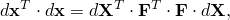所以，从 [方程 1.4.1-5](01s04a04-Deformation.md)，

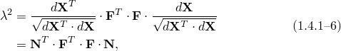其中  是标距长度  方向的单位向量。

[方程 1.4.1-6](01s04a04-Deformation.md) 显示了如何测量与任何材料点上任何方向  相关的拉伸比。当我们在特定材料点上改变由  定义的方向并寻找拉伸比  的驻值时，会获得有用的结果。由于  必须始终是单位向量，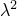 的驻值通过求解约束变分方程获得

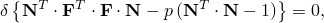其中  是引入的拉格朗日乘子，以保留约束

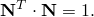

取变分得到约束（与  共轭），并且与 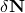 共轭得到

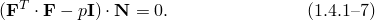

将这个方程左边与  取点积并与 [方程 1.4.1-6](01s04a04-Deformation.md) 比较，识别出 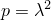，所以 [方程 1.4.1-7](01s04a04-Deformation.md) 是

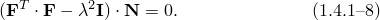这个问题是一个特征值问题，可以求解  的三个极值。由于  始终是实数且为正（且非零），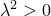，因此 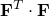 必须是正定的。[方程 1.4.1-8](01s04a04-Deformation.md) 因此给出三个实、正特征值 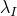、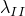、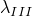，即"主拉伸"，以及三个对应的特征向量 、、，如果对应的特征值不同，它们将是正交的，否则可以正交化。 是应变的主方向。

现在设 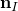、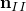、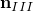 是对应于 、、 的单位向量，但在当前配置中，这样，使用 [方程 1.4.1-4](01s04a04-Deformation.md)，

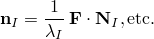然后

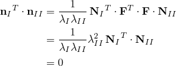根据刚才提到的正交性结果。因此，、 和  也是正交组。由于每个都是单位向量，

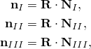其中  在每个方程中是相同的纯刚体旋转矩阵。纯刚体运动矩阵具有其逆是其转置的性质：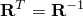。比较当前配置和原始配置中的主拉伸方向，因此分离了刚体旋转和拉伸。找到主拉伸比及其方向从而提供了解决在材料点邻域中分离应变运动和刚体运动问题的方案。

现在考虑参考配置中沿  方向的标距长度 d 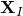。当前配置中相同的无限小材料线将沿  方向并被拉伸 ，所以

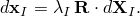类似地，沿其他主方向，

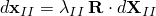和

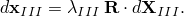由于（、、）是参考配置中的一组标准正交基向量， 处的任何无限小材料线（标距长度） 可以写成其在此基中的分量：

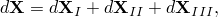其中

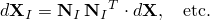每个向量 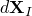 移动并拉伸到对应的 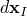，如上所定义。因此，当前标距长度 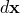 是

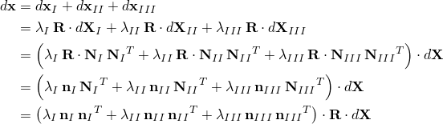我们写成

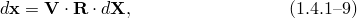其中

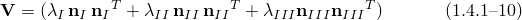是"左拉伸"矩阵，它是三个并矢积的和。

与变形梯度的定义 [方程 1.4.1-4](01s04a04-Deformation.md) 比较，

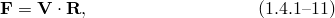这就是极分解定理——任何运动都可以表示为纯刚体旋转，然后是三个正交方向的纯拉伸。极分解定理很重要，因为它允许我们区分运动的应变部分和刚体旋转。具体来说， 完全定义了初始位于参考配置中  的材料粒子邻域中材料粒子的相对运动；左拉伸矩阵  完全定义了  处材料粒子的变形。旋转矩阵  定义了应变主方向（参考配置中的 ）的刚体旋转。 仅以某种平均意义表示该点处材料的刚体旋转：在一般运动中，从材料粒子发出的每个无限小标距长度具有不同的旋转量。当我们必须讨论各向异性材料的大变形时，应变主方向的旋转  与材料中个别方向的旋转之间的区别变得很重要。然而，我们已经建立了一个重要结果：如果仅 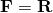，我们知道在初始位于  且当前位于  的点附近材料没有变形，因为此时 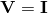 因此 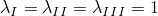。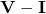 必须非零才能使该点处材料有任何变形：从这个意义上说，（因此  本身）足以定义运动中除点的纯刚体旋转外的变形部分（它包含除纯刚体旋转外的所有信息的完整内容）。出于这个原因——这样，在以后的推导中，我们将能够将运动学与材料应力联系起来——我们需要能够从  中分离出 。很容易获得 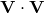，因为

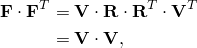因为  且  是对称的。

由于我们最初从当前配置中的主拉伸及其主方向定义  为

然后

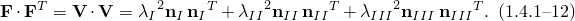我们看到 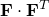 的特征值是 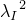、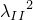 和 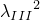，对应的特征向量是 、 和 。然后我们可以构建 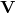。因此，该点的变形很容易通过将  矩阵与其转置相乘（）并求解所得（对称）矩阵的实特征值问题获得。然后我们可以获得旋转  为

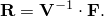由于  已从其特征值和特征向量构建，其逆立即可得：

到目前为止，我们相当普遍地写出了结果，没有参考任何特定坐标系。为了执行计算，我们必须选择一个基系统将这些结果表示为单个数字的数组。我们现在以对基系统选择的一定通用性来做这件事。在现阶段保持通用性的理由有两方面：作为练习，提供对我们在本指南中选择的符号系统更多的熟悉感，而且因为当我们必须处理壳单元时，我们确实需要一些——但事实证明不是全部——的通用性，因为在壳单元中，不希望使用全局空间笛卡尔基向量的矩形系统，因为壳参考表面的自然方向使我们倾向于选择两个基向量与壳的参考表面相切，另一个垂直于该表面。这种偏好使我们需要两个基系统：一个与当前配置中的物体相关联，当 рассматриваемой 点在  处；另一个与参考配置中的物体相关联，当同一点在  处，因为壳参考表面的方向——决定我们选择的基向量——在这两种配置中会有很大不同。我们将写出 、 作为选择用于编写与当前配置相关分量的基向量（使得与当前配置相关的任何向量  写成 ），而 、 作为同一材料点但处于参考配置中的基。（由于我们假设这两个基系统都足以通过其在基系统中的分量表示任何向量值函数——也就是说，基向量不是线性相关的——实际上任一个都可以为两种配置服务。我们通过偏好引入两个不同的系统，因为每一个都是为特定配置特别选择的。）由于我们尚未对  或  施加任何特定限制（除了向量不能线性相关的要求），我们不能假设它们将是正交或单位长度的：因此，我们需要使用由

定义的相关逆变向量

和逆变度量张量

我们可以通过将变形梯度  投影到基上来数值表示它：

回忆  的定义：

由于  沿  的分量是  且我们可以写成 ，

因此，写成  定义

我们必须继续记住， 的第一个索引与当前配置中沿基向量的分量相关联（在本例中为 ），而其第二个索引与参考配置中沿基向量的分量相关联（ 我们可以写出

其中  是我们在参考配置中选择的基系统的逆变度量。

主拉伸比平方及其方向的特征值问题通过求解矩阵  的特征值来求解。特征向量将作为当前配置中沿  基向量的分量  出现。由于我们已将左拉伸定义为

我们将其分量写在当前配置的基上为

并且，由于

极分解给出

所以

其中  是我们在当前配置中选择的基系统的逆变度量张量，并且——与  一样——我们看到  的第一个索引与当前配置中的逆变基向量  相关联，而第二个索引与参考配置中的逆变基向量  相关联。

我们应该注意区分直接矩阵表示中材料应变主方向刚体旋转的  与在特定基上表达的  分量之间的区别。例如，假设某点的刚体旋转为零（即 ），但我们仍然选择了不同的基系统  和 。在这种情况下 。这意味着，即使  是一个单位矩阵（在这个意义上，用这个矩阵作用在任何向量上都不会改变该向量），我们选择存储矩阵的数值——即 ——除非  和  重合且正交，否则不构成单位矩阵。因此，我们选择的相当通用的基系统，在当前和参考配置中不相同（作为对壳结果"自然"书写而引入），使我们对存储的数字的解释变得有些复杂。

在前几段中，我们选择探索相当通用的基系统  和  中总运动运动学的_basic results 表达。在Abaqus中，我们希望尽可能简单直接地表达结果，我们可以通过选择为我们目的提供最大便利的特定基向量集来实现。首先，我们取 （以及扩展的 ，因为这些只是运动开始时的 ）作为每点的局部正交系统。虽然不可能在一般壳表面上构造具有正交基向量的笛卡尔系统，但当我们专门在需要做出投影的每点选择该系统时——通常在元素的积分点——我们总是可以将一般结果投影到这样的系统上。在Abaqus中，选择作为这个局部正交基的系统是在两个层次上做出的：我们将连续体（实体）单元与结构（壳和梁）单元区分开来，我们将默认方向选择与用户指定的特定方向选择（方向）区分开来。对于连续体单元，默认的  是为问题选择的全局笛卡尔系统轴线上的单位向量。在定义方向由用户指定的点，使用指定的 。对于壳（和膜），我们取  和  与壳的参考表面相切， 垂直于所考虑点处的表面。默认情况下， 是全局 *x* 轴在参考表面上的投影，或者如果全局 *x* 轴几乎垂直于该点处的表面， 是全局 *z* 轴在表面上的投影。如果方向由用户指定， 和  是两个指定轴在该点参考表面上的投影。在所有情况下， 垂直于壳的参考表面。对于梁， 沿梁轴线， 和  根据梁截面定义选项和作为节点坐标定义一部分给出的梁法线定义。对于连续体单元，默认情况下应用相同的方案来定义当前配置中的基系统。对于用户指定方向的连续体单元以及对于壳、梁和膜的所有情况， 由

定义

这些方案都具有相同的性质：在任何时刻， 都是正交向量：，所以  因此 ，特别是  因此 。这简化了我们写的所有量的理解，因为任何张量  的分量始终是该张量值量在局部正交基系统  上的物理投影，我们不需要像在上面的一般推导中那样区分协变和逆变分量。实际上，在壳中当我们必须对研究的每点使用单独的基系统时，我们必须为这种简单性付出的唯一代价是，因为我们不能在一般曲面上构造具有正交性质的单个系统。（在轴对称系统中，我们还必须使用  来确保  基向量是单位向量，但这是一个小问题。）这些简化是宝贵的，从我们研究有限元公式的角度来看，它们是以适度的代价获得的，因为我们通常一次只考虑一个积分点。在本指南的其余部分，每当我们需要写下张量的特定分量时，我们将假设它们所基于的基具有正交性质 。

材料也经历刚体平移，但这在推导中并不重要，因为我们只需要考虑相邻点的相对运动，因为我们感兴趣的是将运动学与材料的本构行为联系起来。数值上，刚体平移仅因两个原因而重要。一方面是空间离散化必须允许刚体平移而不产生应变，这在选择有限元的插值函数时很重要。另一方面是必须注意确保当刚体运动很大时应变和旋转的计算是准确的，因为那时应变和旋转取决于两个非常大的运动之间的差异。
### 参考

### 参考

"Abaqus Analysis User's Guide" 第1.2.2节"约定"