# 1.4.2 应变度量

### 1.4.2 应变度量

**产品：** Abaqus/Standard  Abaqus/Explicit

一般运动中使用的应变度量最简单地通过首先考虑一维应变的概念，然后使用刚刚推导的极分解定理将其推广到任意运动来理解。
### 一维应变

我们已经有了变形的度量——拉伸比 。事实上， 本身对于许多问题来说是一个适当的"应变"度量。要了解它在哪些情况下有用和哪些情况下无用，首先注意  的无应变值是1.0。典型的软橡胶部件（如橡皮筋）在加载时可以改变很大的长度倍数，因此拉伸比  通常会有2或更大的值。相比之下，典型的结构钢部件将被设计为对其工作载荷做出弹性响应。这种材料的弹性模量在室温下约为200×10³ MPa（30×10⁶ lb/in²），屈服应力约为200 MPa（30×10³ lb/in²），所以屈服时的拉伸约为拉伸的1.001，压缩时的0.999。拉伸比是测量这种情况下变形的令人不满意的方式，因为感兴趣的数值从第四位有效数字开始。为了避免这种不便，引入了应变的概念，基本思想是当  时应变（材料"无应变"）为零。在一维中，沿某个"标距长度" ，我们将应变定义为该标距长度拉伸比  的函数：

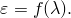

引入"应变"概念的目的是函数 *f* 是为了方便而选择的。要了解这意味着什么，假设  在无应变状态附近展开为泰勒级数：

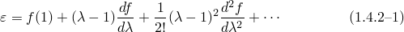

我们必须有 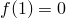，所以在 （这是引入"应变"概念而不是仅使用拉伸比的主要原因）。此外，我们选择在  时 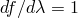，这样对于小应变，我们得到通常的应变定义——"每单位长度的变化"。这确保了在一维中，以这种方式定义的所有应变度量在小应变时将给出相同的数值（因为那时泰勒级数中的高阶项都可以忽略），与任何刚体旋转的大小无关。最后，我们要求对于所有物理上合理的  值（即对于所有 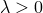）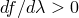，以便应变随拉伸单调增加；因此，每个拉伸值对应于唯一的应变值。（ 的选择是任意的：我们同样可以选择 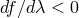，意味着当 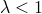 时应变在压缩中为正。这个替代选择通常在地质力学教科书中做出，因为岩土工程问题通常涉及压应力和应变。都是为了方便。在Abaqus中，我们始终使用正应变在拉伸中为正的约定当 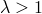。这个选择在Abaqus中一直保持一致，包括在岩土工程选项中。）

有了这些合理的限制（ 和  在 ，且对于所有  ），许多应变度量是可能的，其中一些是常用的。一些例子是

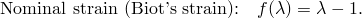在均匀应变的单轴试样中，其中 *l* 是当前标距长度，*L* 是原始标距长度，应变测量为 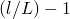。这个定义是工程师进行 stiff 试样单轴测试时最熟悉的定义。

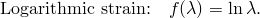这种应变度量常用于金属塑性。这样选择的一个动机是，当"真"应力（当前面积上的力）相对于对数应变绘制时，拉伸、压缩和扭转测试结果紧密吻合。稍后我们将看到，这种应变度量在数学上适合这类材料，因为对于这些材料，可以假设应变的弹性部分很小。

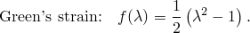这种应变度量对于涉及大运动但小应变的问题计算方便，因为正如我们稍后将展示的，它在任意三维运动中推广到应变张量可以直接从变形梯度计算，而不需要求解主拉伸比及其方向。

所有这些应变都满足基本限制。显然许多应变函数是可能的：选择纯粹是为了方便。由于应变通常是运动学和本构理论之间的联系，因此有限元中这种选择的方便性基于两个考虑：从位移计算应变的容易程度，因为后者通常是有限元模型中的基本变量；以及应变度量相对于特定本构模型的适当性。例如，如上所述，对数应变似乎特别适合塑性，而大应变弹性分析（用于橡胶和类似材料）可以相当满意地完成，而从不使用除拉伸比  以外的任何"应变"度量。
### 一般三维运动中的应变

在定义了一维中"应变"的基本概念之后，我们现在将这个想法推广到三维。在"变形"第1.4.1节中，我们已经确定材料点邻域中运动的变形部分完全由六个变量表征：三个主拉伸比 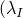、 和 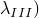 以及三个主拉伸方向在当前（或参考）配置中的方向。这立即给出了一维应变函数推广。[^1]

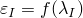 将是沿第一主方向  的应变；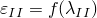 将是沿  的应变；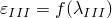 将是沿  的应变。

矩阵

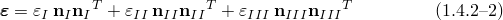完全表征了材料点的应变状态。注意这与拉伸矩阵定义的相似性 [方程 1.4.1-10](01s04a04-Deformation.md)：我们可以认为  由矩阵函数定义

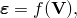其中我们理解矩阵函数意味着两个矩阵具有相同的主方向，其主值通过 *f* 的定义相关，这是指示两个矩阵之间关系的一种方便的简写方式。

在 [方程 1.4.2-2](01s04a05.md) 中，我们通过使用当前配置中的主应变方向写了矩阵 。我们同样可以首先从极分解开始，分解为拉伸然后是主拉伸方向的旋转： 将以类似的方式定义，然后与其在参考配置中的主方向相关联。Abaqus通常报告相对于当前配置中方向的应变。没有明显理由选择这个：两种方法都可以，只要用户知道正在使用哪一种。Abaqus报告的应变度量在"Abaqus Analysis User's Guide"第1.2.2节"约定"中列出。

在有限元代码中，变形梯度  通常从每个单元节点的位移解和为单元选择的插值函数在每个材料计算点计算。我们现在需要一个算法来获得 ，给定应变度量的选择。这个算法可以从 [方程 1.4.1-12](01s04a04-Deformation.md) 立即获得： 矩阵  的特征值和特征向量是 ； 和 ；以及 、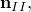 和 。然后我们可以计算  等，对于选择为应变度量的函数 *f*，从而构建

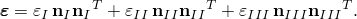

这个算法还给出主应变和拉伸值——通常是很有用的输出，因为它们给出了某点变形状态的简明描述。然而，该算法需要在模型中许多点的每一个上在许多迭代的每一个中计算  矩阵的特征值和特征向量，这涉及一些计算成本。因此，如果  可以从  以更便宜的方式计算，那将是有用的，而这仅对应变度量 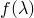 的某些选择是可能的。我们现在考虑这样一个可能性。

单位矩阵  可以写成

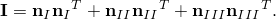使用 [方程 1.4.1-12](01s04a04-Deformation.md)，

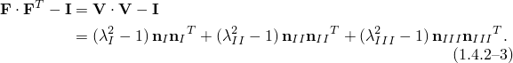

Green应变在一维中定义为

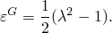

将这个一维定义与 [方程 1.4.2-2](01s04a05.md) 和 [方程 1.4.2-3](01s04a05.md) 比较，我们看到

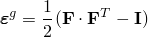然后是Green应变在一维中的推广。（Green应变矩阵更标准的定义是通过使用  而不是  获得，所以应变矩阵以参考配置而不是当前配置为基：

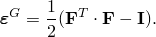我们采用的定义与以当前配置取应变矩阵是一致的。两种定义之间的唯一区别是定义矩阵的配置——无论我们将运动视为刚体旋转主拉伸轴 ，然后沿这些轴拉伸 ，还是沿主轴拉伸 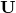，然后旋转这些轴 。选择是任意的。）

Green应变矩阵因此可以直接从变形梯度获得，而无需首先求解主方向。这个优势使Green应变在计算上具有吸引力。回想一下，应变是运动学和本构理论之间的联系，因此应变选择应根据方便性和适当性两个考虑是最佳的。我们已经建议，对于弹性-塑性或弹性-黏塑性材料（其中弹性应变始终很小，因为屈服应力与弹性模量相比较小），对数应变是最适当的，所以Green应变的计算方便性似乎不能被利用。然而，应变函数  的选择受到限制，使得对于小应变但任意旋转，所有应变度量在近似的阶数上是相同的。因此，对于这种情况，Green应变是计算应变的非常方便的选择。小应变、大旋转近似通常很有用——特别是在结构问题（壳和梁）中，因为成员的薄或细长通常允许发生大旋转而应变相当小——Green应变常用于此类问题的大旋转、小应变公式，如壳屈曲。

最后，值得指出的是，大多数初等弹性教科书中使用的熟悉的"小应变"度量，

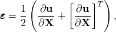仅对小位移梯度有用——也就是说，应变和旋转都必须很小，这种应变度量才是适当的。这可以通过考虑试样的纯旋转来证明：即使材料没有被拉伸，这种应变度量的分量也会随着旋转的增加而变为非零。
### 参考

### 参考

"Abaqus Analysis User's Guide" 第1.2.2节"约定"