# 1.4.3 变形率与应变增量

### 1.4.3 变形率与应变增量

**产品：** Abaqus/Standard  Abaqus/Explicit

我们需要建模的许多材料是路径相关的，因此通常以率形式定义本构关系，这需要应变率的定义。材料粒子的速度为

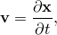其中对时间（*t*）的偏导数是指固定材料粒子的空间位置  的变化率。这里，我们再次采用拉格朗日观点：我们观察一个材料粒子并跟随它通过运动，而不是在空间中的固定点观察材料流过该点。拉格朗日观点用于Abaqus中的力学建模功能，因为我们是处理历史相关材料，拉格朗日观点使得记录和更新材料点的状态很容易，因为网格粘附在材料上。

当前配置中两个相邻粒子之间的速度差为

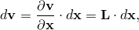其中

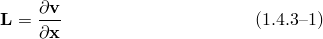是当前配置中的速度梯度。

在"变形"第1.4.1节中，我们引入了变形梯度矩阵  的定义：

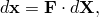所以

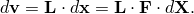

我们也可以直接通过以下方式获得速度差

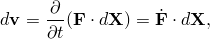其中

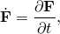因为 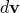 被定义为两个相邻材料粒子之间的速度差，并且，既然已经选择了这些粒子，它们之间的参考配置标距长度 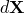 在整个运动中是相同的，因此没有时间导数。

比较以参考配置标距长度  表示的  的两个表达式，我们看到

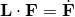或

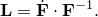

现在 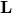 将由变形率和旋转率或自旋组成。由于这些是率量，自旋可以当作向量处理；因此，我们可以将  分解为对称应变率矩阵和反对称旋转率矩阵，就像在小运动理论中我们将无限小位移梯度分解为无限小应变和无限小旋转一样。分解的对称部分是应变率（它在许多教科书中称为变形率张量，也通常表示为 ）：

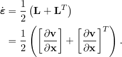分解的反对称部分是自旋矩阵，

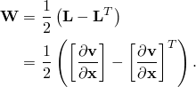

这些是特别简单和熟悉的形式；例如，如果我们用位移  替换粒子速度 ， 与"小应变"的初等定义相同。在一维中  是

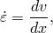这识别 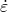 为对数应变率，

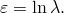

如果应变的主方向与刚体运动一起旋转（因为可以对数应变矩阵的每个主值应用识别），这个解释也是正确的。在一般情况下，当应变主方向独立于材料旋转时， 不能积分成总应变度量。然而，在非旋转主方向的特殊情况下将对数应变识别为  提供了对对数应变度量作为"自然"应变的有用解释，正如我们将  理解为我们上面定义的那样——作为相对于当前空间位置的 velocity gradient 的对称部分——作为应变率的"自然"度量。

典型的非弹性本构模型需要输入一个小的但有限的应变增量 ，以及向量和张量值状态变量（如应力），这些写在当前配置上。在Abaqus/Explicit和对于Abaqus/Standard中的壳和膜单元，使用稍微不同的算法计算 。对于Abaqus/Standard中的大多数单元类型，我们通过首先在增量中使用极分解定义增量中的平均材料旋转变化  来处理这个问题，从增量的总变形 ：

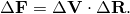与材料关联的所有向量和张量（其值从先前的计算在增量开始时可用）现在可以旋转到增量结束时的配置，仅考虑增量中的刚体旋转：

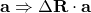对于向量，以及

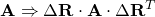对于张量。

这些旋转的变量现在被传递给本构例程，它们可能因本构效应而提供进一步的更新。这些本构效应将与变形相关联，必须以应变增量  的形式提供。为此，我们如下进行。

由于我们假设  旋转变形基——在这个意义上，它旋转变形的主轴，因此提供了平均材料旋转的度量——我们可以在增量期间任何时候定义速度梯度 ，参照  处的固定基为

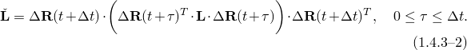那么我们对  的积分是在增量结束时的基上的矩阵 ，定义为

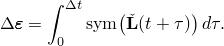使用 [方程 1.4.3-2](01s04a06-Rate-of-deformation-and-strain-increment.md)，这是

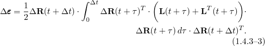由于

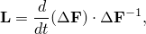我们可以利用增量的变形极分解为增量开始时的轴上的拉伸然后是旋转（，

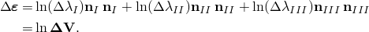因此，只要我们假设在增量期间任何时候的拉伸与增量总拉伸（写在增量开始的固定基上）具有相同的主方向，对数应变增量的定义提供了变形率表示的应变率的所需积分。这个假设可能在大增量时值得商榷，但它与在本构积分中使用的近似水平是一致的。因此，我们有一种简单的方法来计算用于此类本构模型的应变增量，而与本构积分本身已经接受的准确性相比，没有额外的准确性损失。
### 参考

### 参考

"Abaqus Analysis User's Guide" 第1.2.2节"约定"