# 1.5.3 应力率

### 1.5.3 应力率

**产品：** Abaqus/Standard  Abaqus/Explicit

我们希望用Abaqus建模的许多材料是历史相关的，本构方程通常以率形式出现。在"应力度量"第1.5.2节中，建议对像屈服材料这样的应力敏感材料，适当的应力度量是Kirchhoff应力。因此，我们需要在本构方程中使用定义Kirchhoff应力率。这个定义不是简单地取Kirchhoff应力的物质时间率，因为Kirchhoff应力分量与当前配置中的空间方向相关（回想Kirchhoff应力是 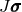，其中 *J* 是从参考配置的体积变化， 是Cauchy应力，定义为 ，其中  和  是当前配置中的向量）。

为了说明这个问题，考虑一个在恒定轴向力 *P* 下的单轴拉伸试样，在时间  沿 *x* 轴放置，并在时间 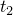（在保持恒定轴向力的情况下）旋转到沿 *y* 轴（参见 [图 1.5.3-1](01s05a10.md)）。

图 1.5.3-1 旋转试样。

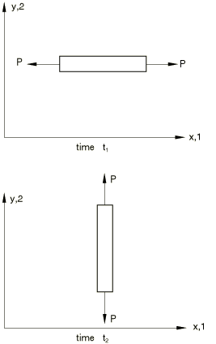在全局 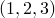 矩形笛卡尔基上写出应力分量。在时间 ，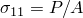，所有其他 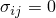，而在时间 ，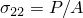，所有其他 。显然在 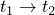 期间，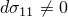 和 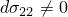，但同样明显的是，这种应力变化率与组成棒的材料的本构响应无关。（一种基于材料的应力，如第二Piola-Kirchhoff应力，在上述旋转过程中将保持不变，因为它的分量与材料基相关。）那么，问题是  或  的分量与当前空间方向相关，因此如果有纯刚体旋转， 和  将不为零，即使从本构角度材料没有变化。因此，我们必须将  或  的增量分为两部分——一部分仅归因于刚体运动，另一部分是剩余的，然后假定与应力-应变规律的率形式相关联。

对于任何其分量与空间方向相关的矩阵，我们可以为此推导一个简单结果。在某个时间 *t*，想象附加到材料点一组基向量 、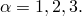 这些向量不能拉伸，但被定义为与材料以相同的自旋旋转。回想材料粒子速度在一点处的空间梯度 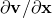 被分解为变形率和自旋，

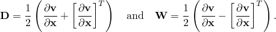

在Abaqus中基向量  运动的概念之一是

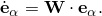

在Aba婆中使用的基向量  运动的另一个概念是

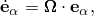其中 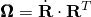。这里  是变形梯度极分解中的刚体旋转 。这两种概念之间的差异仅在材料点的有限旋转伴随有限剪切时才显著。

现在考虑任何基于当前配置的矩阵 ：我们可以用  方向上的分量表示：

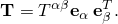然后对时间取导数给出

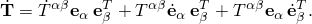

第二和第三项是由刚体自旋引起的  的变化率，所以第一项是由其他效应（对应力而言，是由本构响应相关的率）引起的  的变化率，称为  的共旋转率。根据将  定义为可以随 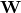 或  旋转的刚性基向量，我们可以写出  的两个共旋转率为

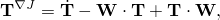和

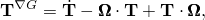其中 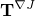 和 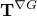 分别称为Jaumann率和Green-Naghdi率。

因此，我们有当前配置中与空间方向相关的任何矩阵的总率，作为该矩阵的共旋转率与纯粹由局部自旋或刚体旋转引起的率之和。例如，Kirchhoff应力的Jaumann变化率可以写成

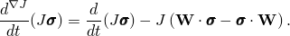

我们假设本构理论将定义 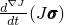，即每参考体积的共旋转应力率，作为变形率和过去历史的函数，因此这个方程提供了该材料模型与"真实"（Cauchy）应力（这是直接从平衡方程定义的应力度量）整体变化之间的方便链接。在第4章"机械本构理论"中讨论Abaqus中的本构模型时，"每参考体积的应力率"将意味着 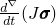，即Kirchhoff应力的共旋转率，这是与变形率功共轭的应力度量。
### Abaqus中使用的应力率

[表 1.5.3-1](01s05a10.md) 总结了Abaqus中使用的客观应力率。客观率仅与率形式本构方程相关（例如，弹塑性）。对于超弹性材料，使用总公式；因此，客观率的概念对本构定律不相关。但是，当定义材料方向时，客观率控制方向的演变，输出将受到影响。

表 1.5.3-1 客观应力率。| 求解器 | 单元类型 | 本构模型 | 客观率 |
| --- | --- | --- | --- |
| Abaqus/Standard | 实体（连续体） | 所有内置和用户定义材料 | Jaumann |
| 结构（壳、膜、梁、桁架） | 所有内置和用户定义材料 | Green-Naghdi |
| Abaqus/Explicit | 实体（连续体） | 除黏弹性、脆性开裂和VUMAT外的所有 | Jaumann |
| 实体（连续体） | 黏弹性、脆性开裂和VUMAT | Green-Naghdi |
| 结构（壳、膜、梁、桁架） | 所有内置和用户定义材料 | Green-Naghdi |
### 参考

### 参考

"Abaqus Analysis User's Guide" 第1.2.2节"约定"