# 1.5.4 状态存储

### 1.5.4 状态存储

**产品：** Abaqus/Standard  Abaqus/Explicit

Abaqus中的许多本构模型需要存储张量来定义材料计算点的状态。这种"材料状态张量"存储在材料计算点处的局部正交系统中。该系统相对于全局 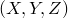 空间系统的方向存储为相对于全局轴系统的旋转。本节的目的是定义这些张量存储和更新的方式。

在Abaqus中用于材料计算的基系统有三种。对于连续体单元中的各向同性材料，使用全局空间  系统——材料基在时间上是固定的。对于结构表面单元（壳和膜）中的各向同性材料，局部系统由Abaqus Analysis User's Guide第1.2.2节"约定"中描述的标准Abaqus约定定义；对于梁和桁架，它定义为1方向沿构件轴线，2和3方向在横截面中的材料方向。因此，对于各向同性材料，材料基始终与单元基相同，尽管对于结构单元，材料基随时间变化。对于各向异性材料，材料基必须由用户定义，并随材料的平均刚体自旋旋转。在这种情况下，材料基和单元基不相同。

我们将时间 *t* 处的这个局部材料基称为 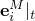，其中上标  表示基与材料计算相关，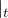 表示基在时间 *t* 处取得。在本节中，拉丁下标（如上面的 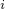）取范围1–3，而希腊下标取范围1–2。

与材料状态相关的任何张量，比如说 （如应力张量 ），根据其沿材料基的分量存储：

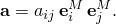

从时间 *t* 到时间  的材料计算点局部运动的增量由增量变形梯度定义，

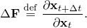该矩阵由有限元的梯度插值器和元素节点在时间 *t* 和  处的坐标计算。

 的极分解为

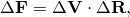其中  是材料点的平均刚体旋转， 是纯拉伸矩阵：

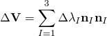（这里  是主拉伸比， 是主拉伸方向）。

在任何增量期间，材料状态张量根据以下规律变化

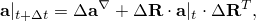其中 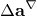 是由本构行为引起的  的变化， 是材料的平均增量刚体旋转。由于材料张量是根据其在材料基系统中的分量写出的，因此更新计算为

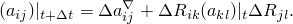因此，有必要将  投影到增量开始和结束时的材料基系统上，以定义材料张量分量的更新：

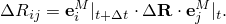

对于各向同性材料，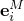 仅为几何方便而选择，因此 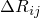 是相当通用的。

对于各向异性材料，材料基系统  随材料的平均刚体旋转  旋转，因此通过以下方式更新

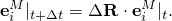在这种情况下，我们看到

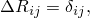因此，材料张量分量的更新简化为

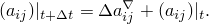然而，由于在这种情况下材料基系统与单元基系统不相同，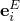（为单元计算的几何方便而选择），必须进行基系统变换。具体而言，在材料计算例程开始时，应变增量从单元基旋转到材料基：

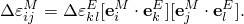类似地，在材料计算例程结束时，应力增量旋转回单元基以集成到平衡方程的离散近似中：

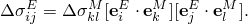此外，材料刚度矩阵，

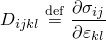也必须从材料基旋转到单元基：

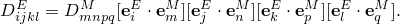对于壳或膜，只需要二维旋转——例如，

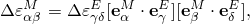因为 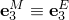 因为两者都是沿表面法线的单位向量。
### 参考

### 参考

"Abaqus Analysis User's Guide" 第1.2.2节"约定"