# 2.1.1 过程：概述与基本方程

### 2.1.1 过程：概述与基本方程

Abaqus被设计为一个灵活的有限元建模工具。这种灵活性的一个重要方面是Abaqus允许用户逐步完成要分析的历史的方式。这是通过定义*分析过程*来实现的。

Abaqus中的一个基本概念是将问题历史分为*步骤*。步骤是历史中任何方便的阶段——热瞬态、蠕变保持、动力瞬态等。在其最简单的Abaqus/Standard形式中，"步骤"只是荷载从一种幅度到另一种幅度的静态分析。

在每个"步骤"中，用户选择一个*过程*，从而定义在该步骤期间执行的分析类型：动力应力分析、特征值屈曲、瞬态热传递分析等。过程选择可以以任何有意义的方式从步骤到步骤改变。由于模型的状态（应力、应变、温度等）在所有分析步骤中更新，前一个历史的影响始终包含在每个新步骤的响应中。因此，例如，如果在几何非线性静力分析步骤之后执行固有频率提取，将包含预加载刚度。

Abaqus/Standard提供线性和非线性响应选项。该程序是真正集成的，因此线性分析始终被认为是引入线性分析过程时状态的线性扰动分析。这种线性扰动方法允许在线性响应依赖于预加载或模型的非线性响应历史的情况下普遍应用线性分析技术。

在非线性问题中，目标是以最小成本获得收敛解。Abaqus/Standard中的非线性过程为此提供了两种方法。直接用户控制增量大小是一种选择，用户指定增量方案。自动控制是替代方法：用户定义步骤并指定某些容差或误差度量。然后Abaqus/Standard在开发步骤响应时自动选择增量。这种方法通常更有效，因为用户无法提前预测响应。自动控制在步骤中时间或荷载增量变化很大的情况下特别有价值，这在扩散类型问题（如蠕变、热传递和固结）中经常出现。

在Abaqus/Explicit中，时间增量由中心差分算子的稳定性极限控制。因此，时间增量方案是全自动的，不需要用户干预。用户指定的时间增量不可用，因为它总是不最优的。

Abaqus/Standard和Abaqus/Explicit是具有不同数据结构的单独程序模块；因此，显式动力学过程不能与Abaqus/Standard中的任何过程在同一分析中使用。但是，Abaqus提供了一种从Abaqus/Explicit向Abaqus/Standard导入变形网格和相关材料状态的能力，反之亦然。此过程在"Abaqus Analysis User's Guide"第9.2.2节"在Abaqus/Explicit和Abaqus/Standard之间传输结果"中描述。

在本章中，描述了Abaqus/Standard和Abaqus/Explicit中最重要的分析过程的基本方程。在某些章节中，讨论了分析过程的具体方面（即阻尼、空腔辐射等）。
### 基本有限元方程

本节描述了标准基于位移的有限元分析的基本方程。我们从平衡陈述开始，写成虚功原理的形式，[方程 1.5.1-6](01s05a08-Equilibrium-and-virtual-work.md)：

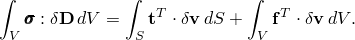

按照"平衡与虚功"第1.5.1节中的讨论，这个方程的左边（内虚功功率项）被替换为每参考体积虚功功率率对参考体积的积分，由任何共轭应力-应变配对定义：

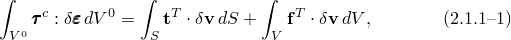其中 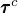 和  是材料应力和应变度量的任何共轭配对。 的特定选择取决于单个单元——见第3章"单元"。

有限元插值函数可以一般地写成

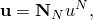其中 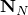 是依赖于某个材料坐标系的插值函数， 是节点变量，并采用约定表示上标和下标表示节点变量的求和约定。

虚场 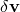 必须与所有运动约束兼容。引入上述插值约束位移具有特定的空间变化，因此  也必须具有相同的空间形式：

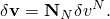

因此，连续体变分陈述 [方程 2.1.1-1](02s01a13-Procedures-overview-and-basic-equations.md) 被有限集  上的变分近似。

现在 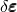 是与  相关的材料应变的虚率，并且因为它是率形式，所以它必须在  中是线性的。因此，插值假设给出

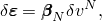其中 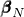 是通常依赖于所考虑材料点当前位置  的矩阵。定义从运动变量变化到应变变化的矩阵  一旦定义了要使用的特定应变度量，就可以从插值函数直接推导。

不失一般性，我们可以写 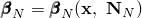，并且——使用这个表示法——平衡方程被近似为

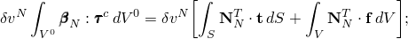因为  是独立变量，我们可以依次选择每个非零而其他为零，来获得非线性平衡方程组：

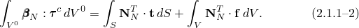

这个方程组构成了（标准）假设位移有限元分析过程的基础，形式为上面讨论的

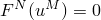如果假设体力包含惯性贡献，则上述方程对静态和动态分析都有效。然而，在动态分析中，惯性贡献更通常被单独考虑，导致方程

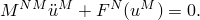

对于Abaqus/Standard中使用的Newton算法（或线性扰动过程），我们需要有限元平衡方程的Jacobian矩阵。为了推导Jacobian，我们从取 [方程 2.1.1-1](02s01a13-Procedures-overview-and-basic-equations.md) 的变分开始，给出

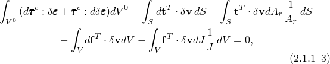其中 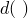 表示量  相对于基本变量（有限元模型的自由度）的线性变化。在上述表达式中，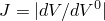 是参考体积与结构某部分在当前配置中占据的体积之间的体积变化，同样，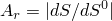 是参考配置与当前配置之间的表面积比。Jacobian矩阵通过限制上述变化获得，仅允许节点变量  的变化。设这种限制的变化由 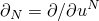 指示。本着这个意思，逐项检查 [方程 2.1.1-3](02s01a13-Procedures-overview-and-basic-equations.md)，我们如下进行。第一项包含 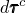。我们现在假设本构理论允许我们写

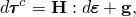其中  和  根据当前状态、应变方向等定义，并取决于用于形成广义应变的运动学假设。见第4章"机械本构理论"，了解关于为Abaqus中当前可用的材料模型形成  和  的详细讨论。从广义应变度量和插值函数的选择，

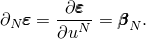从上述本构假设，

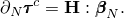现在，由于  是  相对于节点变量的一阶变分，

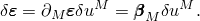因此，Jacobian矩阵的第一项是

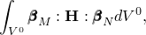通常的"小位移刚度矩阵"，只是因为应变度量  在位移中总是非线性的，所以这项中的  将是位移的函数。

[方程 2.1.1-3](02s01a13-Procedures-overview-and-basic-equations.md) 中的第二项是

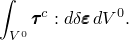这被重写为

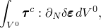即

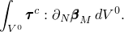这项对Jacobian有贡献，是"初始应力矩阵"。

接下来考虑 [方程 2.1.1-3](02s01a13-Procedures-overview-and-basic-equations.md) 中的外部荷载率项。一般来说，这些荷载向量可以写成

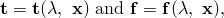其中  表示外部规定的荷载参数。荷载是否依赖于位置取决于特定的荷载类型，但常见荷载类型（压力、离心荷载）确实依赖于位置——例如，如果表面上是由压力引起的 ， 取决于压力大小、表面法线方向和当前表面积：后两者是表面上点当前位置的函数。荷载向量相对于节点变量的变分然后可以符号写成

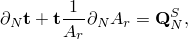

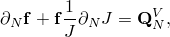然后写成

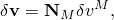其中 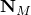 直接从插值函数获得，我们可以将 [方程 2.1.1-3](02s01a13-Procedures-overview-and-basic-equations.md) 最后四项的Jacobian项写成

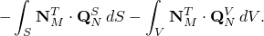

这些通常被称为"荷载刚度矩阵"。荷载刚度的实际形式很大程度上取决于所考虑的荷载类型——见第3章"单元"和 [Hibbitt (1979)](07s01a01-References.md) 中的示例。

完整的Jacobian矩阵然后是

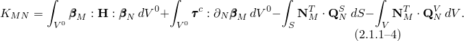

因此，给定插值函数和要使用的本构理论，[方程 2.1.1-2](02s01a13-Procedures-overview-and-basic-equations.md) 和 [方程 2.1.1-4](02s01a13-Procedures-overview-and-basic-equations.md) 为Newton增量求解提供了基础。
### 参考

### 参考

"Abaqus Analysis User's Guide" 第6.1.2节"定义分析"