# 2.2.2 拟Newton求解技术

### 2.2.2 拟Newton求解技术

**产品：** Abaqus/Standard

非线性分析中计算工作的一个主要贡献是求解非线性方程（[方程 2.2.1-1](02s02a14-Nonlinear-solution-methods-in-AbaqusStan.md)）。在大多数情况下，Abaqus/Standard使用Newton方法求解这些方程，如"在Abaqus/Standard中的非线性求解方法"第2.2.1节中所述。Newton方法的主要优点是当迭代 *i* 处的近似在"收敛半径"内时（即当由 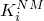 定义的梯度提供对解的改进时），其二次收敛速率。该方法有两个主要缺点：必须计算Jacobian矩阵，而且必须求解同一个矩阵。Jacobian矩阵的计算是一个问题，因为在许多重要情况下，很难从代数上推导矩阵的形式。Jacobian的求解是一个问题，因为涉及计算工作：随着问题规模增加，线性方程的直接求解可能主导整个计算工作。

有许多重要的非线性应用，其中Jacobian是对称的，条件相当好，并且在从一次迭代到下一次迭代中变化不大。例子包括相对于参与响应的固有振型的周期而言具有小时间增量的隐式动力时间积分，或者小位移弹塑性分析，其中屈服是受限的（如在许多实际断裂力学应用中发生的那样）。在这种情况下，特别是当问题很大时，使用Newton方法的替代方法来求解非线性方程可能更便宜。"拟Newton"方法就是这样一种方法；[Matthies and Strang (1979)](07s01a01-References.md) 已经表明，对于具有对称Jacobian矩阵的方程组，BFGS（Broyden、Fletcher、Goldfarb、Shanno）方法可以写成一种特别在计算机上有效的简单形式，并在此类应用中取得成功。该方法在Abaqus/Standard中实现并在本节中描述。用户必须明确选择此方法：默认情况下，Abaqus/Standard使用标准Newton方法。

拟Newton方法的基础是获得一系列改进的Jacobian矩阵近似 ，满足割线条件：

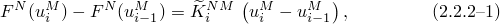使得随着迭代进行，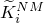 接近 。[方程 2.2.2-1](02s02a15-Quasi-Newton-solution-technique.md) 是基本的拟Newton方程。

为方便起见，我们将残差从一次迭代到下一次迭代的变化定义为

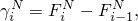以便 [方程 2.2.2-1](02s02a15-Quasi-Newton-solution-technique.md) 可以写成

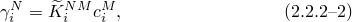其中 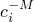 是在"在Abaqus/Standard中的非线性求解方法"第2.2.1节中定义的从前一次迭代到解的修正。

Matthies和Strang的BFGS方法实现是一种计算成本低廉的创建系列近似于 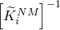 的方法，满足 [方程 2.2.2-1](02s02a15-Quasi-Newton-solution-technique.md) 并保持  的对称性和正定性。它们通过使用"乘积加增量"形式更新 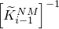 到  来实现：

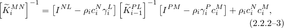其中

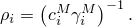

在BFGS方法的这个版本的实现中，每个 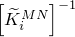 都不存储：而是使用一个"核"矩阵 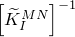（作为 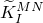 的分解），并且通过前置乘以项

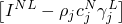和后置乘以项

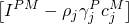来完成更新，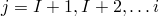。由于这些项的形式，前置和后置乘积操作导致向量的内积和向量与常数的缩放：正是这种组织方式使该方法在计算上具有吸引力。然而，太多的这种乘积（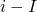 大于比如说5-10）就没有吸引力了，所以通常在几次迭代后形成并存储一个新的核矩阵。在Abaqus/Standard实现中，核是实际的Jacobian矩阵 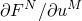。它在对问题形成收敛解之前执行了指定次数的迭代后形成；默认迭代次数为8。除非超过此值，否则Abaqus/Standard不会重新形成核，因此如果BFGS更新成功，相同的核可以用于多个增量。

一般来说，拟Newton方法的收敛速率比Newton方法的二次收敛速率慢，但比修正Newton方法的一次收敛速率快。
### 参考

### 参考

"Abaqus Analysis User's Guide" 第7.2.3节"非线性问题的收敛准则"