# 2.3.1 特征值屈曲预测

### 2.3.1 特征值屈曲预测

**产品：** Abaqus/Standard

Abaqus/Standard包含通过特征值提取估计弹性屈曲的能力。这种估计通常对"刚性"结构有用，其中预屈曲响应几乎是线性的。屈曲荷载估计获得为扰动荷载模式的乘子，扰动荷载被添加到一组基态荷载。结构的基态可能来自任何类型的响应历史，包括非线性效应。它代表扰动荷载被添加到的初始状态。扰动荷载的响应必须是弹性的，直到估计的屈曲荷载值对于特征值估计才是合理的。

在特征值屈曲分析中处理了以下物理问题：从与表面牵引  和体力  平衡的应力 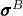 的任意实现的基配置开始，我们考虑在附加表面牵引 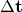、体力 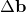 和边界位移  下的"小"位移梯度的弹性变形，其中附加牵引力和位移施加在边界的相互补充部分上。这样的变形是预变形状态上的线性扰动。对来自初始应力状态的运动学和本构方程一致地应用小位移梯度假设导致作为对附加加载响应的线性问题的求解。由于问题是线性的，如果  是对荷载 、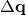 和  的应力响应，则对于荷载 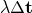、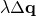 和 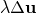，应力响应将是 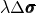。

每个不同的  值对应于基态的线性扰动。在这些扰动状态中，我们寻找允许具有任意大小的非平凡增量位移场存在作为问题有效解的  的特殊值。这样的非平凡增量位移场被称为屈曲模态。在Abaqus的屈曲分析过程中，我们不区分基态几何形状和线性扰动配置。因此，由于这个假设，我们可以将屈曲模态寻求为从具有应力 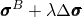、施加牵引 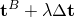 和施加体力 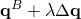 的基态几何的增量位移。

在屈曲期间任意选择的配置的平衡方程（称为当前配置）以基态中的名义应力  写出。如果  表示材料点在基态中的位置，平衡方程可以表示为

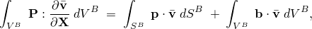其中  是任意的虚速度场， 是基态中身体边界 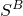 上的名义牵引， 表示基态中每单位体积的体力，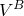 是身体在基态中占据的体积。相应的率形式由下式给出

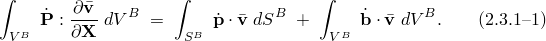

由于我们假设基态和当前状态是不可区分的，我们现在继续用Kirchhoff应力率 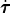、速度梯度 、虚速度梯度 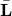 和变形梯度  表示左边。使用关系 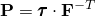，其中  是以基态为参考配置的Kirchhoff应力，以及 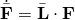，[方程 2.3.1-1](02s03a17.md) 取形式

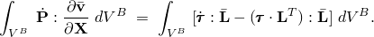我们现在使用Kirchhoff应力率 、材料自旋 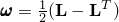 和Kirchhoff应力的Jaumann率 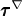 之间的关系将此表达式转换为

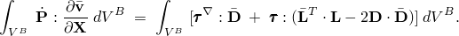此外，我们可以将Kirchhoff应力  替换为Cauchy应力 ，因为假设当前配置和参考配置是不可区分的。

对于 [方程 2.3.1-1](02s03a17.md) 的右边，我们注意到名义牵引  和体力  由 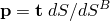 和 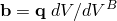 给出，其中 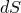 和  是当前配置中的表面积和体积元素。对于任何材料点， 和  在屈曲期间的变化完全由该点变形梯度的变化表征；粗略地说，施加力的大小在任何材料点保持固定，施加牵引力和体力强度的变化源于几何的变化。例如，对于压力荷载，压力大小保持不变但表面法线改变——这种变化完全由变形梯度的变化表征。由于参考配置和当前配置之间的表面积和体积度量的比值可以被视为仅是变形梯度  的函数，因此  和  在任何给定材料点也仅通过它们对变形梯度的依赖而变化；因此，它们的变化率可以写成

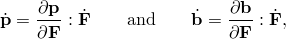或者当当前配置和参考配置不可区分时，

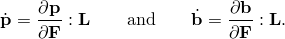假设 hypoelastic 本构定律，

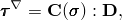其中 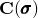 是可以依赖于当前应力的四阶张量，屈曲分析的控制方程变为

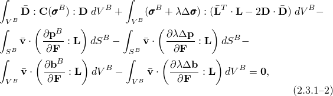其中 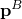 和 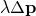 分别是在屈曲期间产生的对应于基态牵引  和线性扰动牵引  的名义牵引；类似地适用于名义体力项。本构关系可以表示弹性、 hypoelastic 和超弹性；率效应和塑性被忽略。有效模量根据基态中的应力和变形值进行评估。

为了推导上述表达式的有限元离散化，我们引入插值速度场

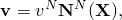其中  表示基态中的位置。使用标准有限元方法，屈曲的控制方程然后以标准特征值问题的形式出现：

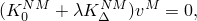其中 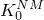 是基态刚度， 是微分刚度。基态刚度是 hypoelastic 切线刚度、初始应力刚度和荷载刚度之和：

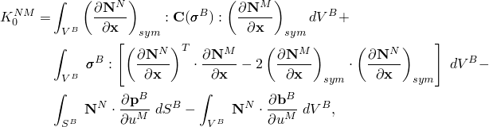其中 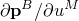 和 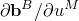 是名义表面牵引和体力相对于节点位移的导数。由于我们不区分当前配置和参考配置，荷载刚度项中出现的偏导数都在 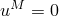 处评估，对应于 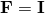。例如，出现在 [方程 2.3.1-2](02s03a17.md) 中的表面牵引的荷载刚度项，

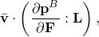转换为有限元表达式

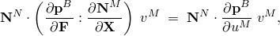

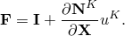

微分刚度由扰动应力引起的初始应力刚度和由扰动荷载引起的荷载刚度之和组成：

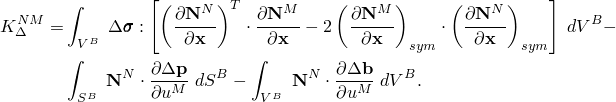此表达式中源于应力的贡献是对称的；然而，源于施加荷载（荷载刚度）的贡献仅在施加的荷载是保守的情况下是对称的——也就是说，如果荷载可以从能量势推导出来。如果荷载刚度是非对称的，贡献将被对称化，因为Abaqus只能求解具有对称矩阵的特征值问题。

如果由施加的力 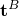 和 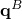 以及规定的位移 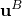 产生的广义节点"荷载"由  表示，而由 、 和 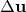 产生的由  表示，则特征值  表示提供估计的广义屈曲荷载为  的乘子，而相应的特征向量  给出相关的屈曲模态。虽然在大多数分析中最低模态是唯一感兴趣的，但Abaqus能够同时提取多个模态。还值得注意，在对称基态和屈曲荷载上反对称屈曲模态的常见情况很容易用Abaqus完成。

如果切线刚度被 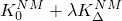 预测得很差（即结构在响应在屈曲前是非线性的意义上不是"刚性"），则需要使用Riks方法进行非线性分析以获得对结构承载能力的可靠估计。
### 参考

### 参考

"Abaqus Analysis User's Guide" 第6.2.3节"特征值屈曲预测"