# 2.3.2 修正Riks算法

### 2.3.2 修正Riks算法

**产品：** Abaqus/Standard

对于不稳定问题，通常需要获得非线性静态平衡解，其中荷载-位移响应可以展示如图 2.3.2-1 所示的那种行为——也就是说，在响应期间，随着解的发展，荷载和/或位移可能减小。修正Riks方法是一种允许有效求解此类情况的算法。

图 2.3.2-1 典型不稳定静态响应。

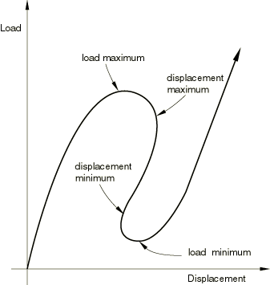

假设荷载是成比例的——也就是说，所有荷载幅度随单个标量参数变化。此外，我们假设响应相当平滑——不会发生突然的分岔。已经为此类问题提出了几种方法并加以应用。其中，最成功的似乎是修正Riks方法——参见例如 [Crisfield (1981)](07s01a01-References.md)、[Ramm (1981)](07s01a01-References.md) 和 [Powell and Simons (1981)](07s01a01-References.md)——并且该方法的版本已在Abaqus中实现。该方法的本质是，解被视为在由节点变量和加载参数定义的空间中发现单一平衡路径。解的开发需要我们尽可能远地遍历此路径。基本算法保持为Newton方法；因此，在任何时候都会有有限的收敛半径。此外，许多感兴趣的材料的（以及可能的荷载的）响应是路径相关的。由于这些原因，必须限制增量大小。在Abaqus中实现的修正Riks算法中，增量大小通过沿当前解点的切线移动给定距离（在Abaqus/Standard中由静态情况的标准、收敛速率依赖的自动增量算法确定），然后在与同一切线正交且经过所获得点的平面中搜索平衡来限制。这里，几何指的是上述位移、旋转和加载参数的空间。
### 基本变量定义

设 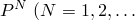 = 模型的自由度）是用Abaqus中的一个或多个荷载选项定义的荷载模式。设  是荷载幅度参数，因此在任何时候实际荷载状态为 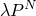，设  是那时 的位移。

解空间被缩放以使每个轴上的大小大致相同。在Abaqus中，这是通过测量所有位移变量的最大绝对值 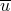（在初始（线性）迭代中）来完成的。我们还定义 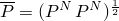。然后缩放空间由

荷载 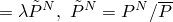,

位移 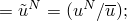跨越，解路径然后是此缩放空间中由向量 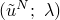 描述的连续平衡点集。所有这些向量的分量都将是一阶的。算法如图 2.3.2-2 所示并在下面描述。

图 2.3.2-2 修正Riks算法。

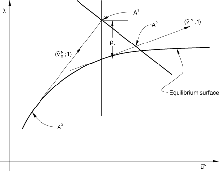

假设解已开发到点 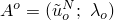。形成切线刚度 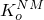，我们求解

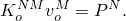[图 2.3.2-2](02s03a18-Modified-Riks-algorithm.md) 中的增量大小 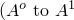 从解空间中的指定路径长度  中选择，所以

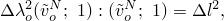因此，

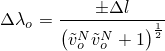（这里 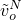 是由  缩放的 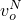）。值  最初由用户建议，并根据收敛速率由Abaqus/Standard自动荷载增量算法进行调整。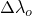 的符号——沿切线的响应方向——选择为使得点积 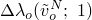 在前一次增量时的解上为正：

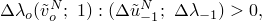也就是

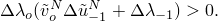

在某些情况下，当响应在 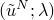 空间中显示非常高的曲率时，这个标准可能会导致选择错误的符号——例如参见 [图 2.3.2-3](02s03a18-Modified-Riks-algorithm.md)。

图 2.3.2-3  符号错误选择的示例。

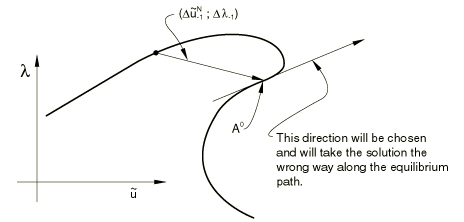 在实际案例中很少选择错误的符号，除非增量大小太大或解急剧分岔。检查此类情况在计算上是昂贵的：一种方法是找到 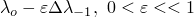 处的解，这样我们获得一个给出 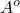 处定向切线近似值的向量。因为这种情况很少见，所以不包括此类检查，仅使用上面给出的简单点积来确定 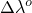 的符号。因此，我们现在找到了 [图 2.3.2-2](02s03a18-Modified-Riks-algorithm.md) 中的点 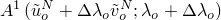。现在通过以下迭代算法将解校正到平衡路径上，位于经过 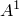 并与 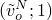 正交的平面中。

初始化：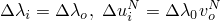

对于迭代  的 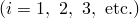：

形成 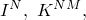 在节点处的内（应力）力，

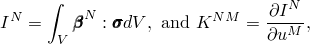在状态 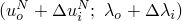 处——即在 [图 2.3.2-2](02s03a18-Modified-Riks-algorithm.md) 中的 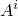 处。

检查平衡：

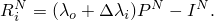如果 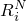 中的所有条目都足够小，则增量已收敛。如果没有，我们继续。

求解：

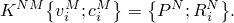也就是说，我们同时求解两个荷载向量  和 ，并获得两个位移向量 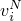 和 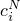。

现在缩放向量 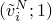，并将其添加到 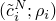 处，其中 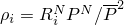 是缩放残差在 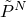 上的投影，这样我们从  移动到在与  正交的平面中的 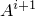——参见 [图 2.3.2-2](02s03a18-Modified-Riks-algorithm.md)。这给出方程

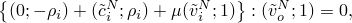简化为给出

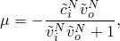解点现在是 ：

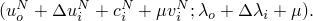

为下一次迭代更新，

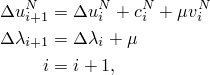并返回上面的 (a) 进行下一次迭代。

Abaqus/Standard中的实现包括每次迭代后的额外更新：

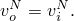这导致平衡搜索与最后一个切线正交，而不是与增量开始时的切线正交。这种额外修改的主要动机来自在塑性问题中使用该方法，因为每个增量的第一次迭代使用弹性材料刚度来建立应变方向，因此如果正在发生主动塑性，则提供的刚度不代表平衡路径的切线。

穿越的总路径长度由用户在荷载选项上提供的荷载幅度决定；而增量数由用户指定的时间增量数据决定，如果有选择的话，由Abaqus/Standard的自动增量方案辅助。
### 参考

### 参考

"Abaqus Analysis User's Guide" 第6.2.4节"不稳定坍塌和后屈曲分析"