# 2.4.4 等效刚体动力运动

### 2.4.4 等效刚体动力运动

**产品：** Abaqus/Standard

获取模型一部分（或整个模型）的等效刚体运动通常很有用：部件质心的位置和平移速度，以及关于同一质心的角旋转和速度。Abaqus/Standard基于等效动量提供此类输出。本节定义如何计算这些值。

设 *V* 是请求等效刚体运动值的部件体积。部件在其初始配置中的密度为 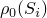，其中 、 是部件中的材料坐标。材料粒子在其初始配置中的空间位置为 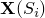，在当前配置中为 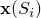，导致位移为 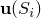。我们希望计算部件质心的当前空间位置 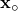；等效刚体的平移速度  是单位矩阵。

调用关系 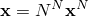 是方便的（假设求和约定），其中 是与每个自由度相关的有限元插值函数， 是当前节点位置向量。我们现在可以写

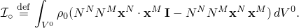

认识到原始质量矩阵是

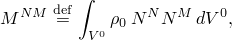我们得到

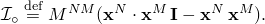我们可以立即获得

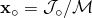并且，通过将等效和实际身体的平移动量相等，

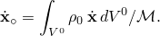

部件的角速度通过将部件和关于质心的等效刚体的角动量相等来定义：

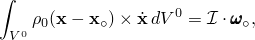其中

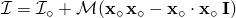是部件关于其质心的二阶质量矩。

Abaqus 对低阶单元使用集中质量公式。因此，惯性二阶质量矩可能偏离理论值，特别是对于粗网格。某些Abaqus单元对这个二阶质量矩（转动惯量）产生集中或结构贡献，不显示在这些方程中。

这提供

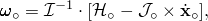其中

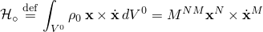是部件关于原点的角动量。

等效刚体运动中质心感知到的平移运动计算为

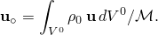

部件相对于其质心的等效刚体旋转需要一些概念近似，如下所示。表示材料粒子相对于未变形配置和变形配置中质心的相对位置分别为  和 。考虑配置是已知的，身体的旋转轴由单位向量  表示。材料粒子看到相对于质心这样的旋转为

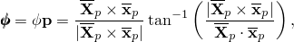其中下标 *p* 表示向量投影到垂直于  的平面上。我们现在通过积分组成部分来推广这个概念。定义

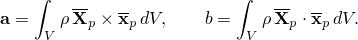平均 Euler 旋转然后遵循方程

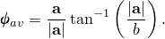

这些积分不容易计算，但通过以下修改，它们可以展开，使得（最初未知的）当前质心  是未知的。为了确定 ，我们考虑刚体旋转位移场的特征。对于这样的场，1）粒子的位移垂直于旋转向量，2）位移垂直于运动一半时的位置向量。在变形体上下文中，我们试图通过强制这两个陈述在平均意义上成立来确定  分量的齐次方程组，系数由已知量积分组成，可以从中求解 。然后我们可以使用

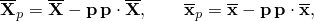计算旧位置和新位置到垂直于  平面的投影，并通过简单代入得到

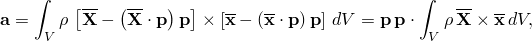其中向量 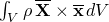 可以从可用量容易地计算。有了已知的 ，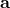 就被确定可以使用相同表达式计算量 *b*，得到

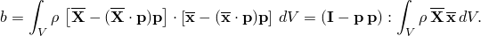一旦  和 *b* 已知，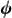 就容易确定了。

等效刚体旋转的确定基于平均粒子平移。转动自由度在计算此变量时被忽略；假设这样的旋转将产生点的运动，这些运动将明显地有助于计算。但是，可能找到病理情况并非如此；例如，如果考虑的模型部分仅由转动惯量单元组成，计算的平均刚体旋转将被计算为零，即使单元确实已经旋转。
### 参考

### 参考

"Abaqus Analysis User's Guide" 第6.3.2节"使用直接积分的隐式动力学分析"