# 2.4.5 显式动力学分析

### 2.4.5 显式动力学分析

**产品：** Abaqus/Explicit

Abaqus/Explicit中的显式动力学分析过程基于显式积分规则的实现以及对角或"集中"单元质量矩阵的使用。身体的运动方程使用显式中心差分积分规则积分

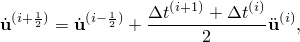

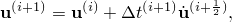其中  是速度， 是加速度。上标 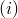 指增量号，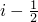 和 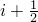 指增量中点的值。中心差分积分算子是显式的，因为运动状态可以使用从前一个增量中已知的 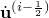 和 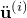 的值推进。显式积分规则相当简单，但仅凭自身并不提供与显式动力学过程相关的计算效率。显式过程计算效率的关键是使用对角元素质量矩阵，因为在计算增量开始时的加速度时所用质量矩阵的求逆是三轴的：

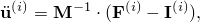其中 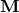 是对角集中质量矩阵， 是施加的荷载向量， 是内力向量。显式过程不需要迭代，也不需要切线刚度矩阵。

平均速度 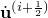、 等对于初始条件、某些约束和结果呈现需要特殊处理。对于结果呈现，状态速度存储为平均速度的线性插值：

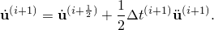

中心差分算子不是自启动的，因为需要定义平均速度 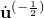 的值。速度和加速度的初始值（在时间 ）设置为零，除非用户指定。我们断言以下条件：

将此表达式代入  的更新表达式会产生  的以下定义：

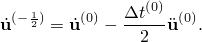
### 稳定性

显式过程通过使用许多小时间增量通过时间积分。中心差分算子条件稳定，算子的稳定性极限（无阻尼）以系统中最高特征值的形式给出

在 Abaqus/Explicit 中引入了少量阻尼来控制高频振荡。有了阻尼，稳定时间增量由下式给出

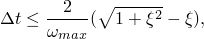其中  是最高模态中临界阻尼的分数。与我们通常的工程直觉相反，向解中引入阻尼会减少稳定时间增量。

Abaqus/Explicit 中的时间增量方案是全自动的，不需要用户干预。Abaqus/Explicit 使用自适应算法来确定最高单元频率的保守界限。系统中最高特征值的估计可以通过确定网格的最大单元膨胀模态获得。基于此最高单元频率的稳定性极限是保守的，因为它将给出比基于整个模型最大频率的真实稳定性极限更小的稳定时间增量。一般来说，边界条件和接触等约束具有压缩特征值谱的效果，而逐单元估计没有考虑到这一点。Abaqus/Explicit 包含一个全局估计算法，用于确定整个模型的最大频率。该算法持续更新最大频率的估计。Abaqus/Explicit 最初使用逐单元估计。随着步骤的进行，一旦算法确定全局估计的精度可接受，稳定性极限将从全局估计器确定。当模型中包含以下能力时，不使用全局估计算法：流体单元、JWL 状态方程、无限单元、材料阻尼、阻尼器、厚壳（厚度与特征长度比大于 0.92）或厚梁（厚度与长度比大于 1.0），以及具有温度和场变量依赖性的非各向同性弹性材料。

使用以下表达式为网格中的每个单元计算试验稳定时间增量：

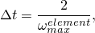其中 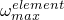 是单元最大特征值。稳定时间增量的保守估计由所有单元上的最小值给出。上述稳定性极限可以重写为

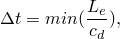其中  是特征单元尺寸， 是材料当前的有效膨胀波速。特征单元尺寸从单元最大特征值的解析上限表达式推导。考虑 4 节点均匀应变四边形（CPE4R），特征单元尺寸为

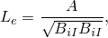其中  是单元面积，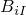 是单元梯度算子（参见"实体等参四边形和六面体"第 3.2.4 节）。为 Abaqus/Explicit 中的所有单元类型推导了类似的特征单元尺寸。

当前膨胀波速通过从材料的本构响应计算有效的 hypoelastic 材料模量在 Abaqus/Explicit 中确定。有效的 Lam 常数 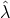 和  通过以下方式确定。我们将等效压力应力的增量定义为 ，将偏应力增量定义为 ，将体积应变增量定义为 ，将偏应变增量定义为 。我们假设形式为的 hypoelastic 应力-应变规则

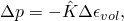

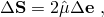其中 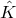 是有效体积模量。然后可以计算有效模量为

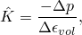

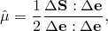

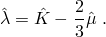如果应变增量很小，这些关系将不会产生有意义的数值结果。在这种情况下，Abaqus/Explicit 将有效的 Lam 常数设置为材料的初始值 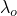 和 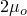。在体积应变增量显著但偏应力增量不显著的情况下，有效剪切模量估计为

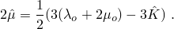这些有效模量代表单元刚度，并按以下方式确定单元中的当前膨胀波速

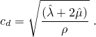
### 体积黏性

体积黏性引入与体积应变相关的阻尼。其目的是改善高速动力学事件的建模。

Abaqus/Explicit 中有两种形式的体积黏性。第一种在所有单元中都存在，用于阻尼最高单元频率的"振铃"。这种阻尼有时称为截断频率阻尼。它产生体积黏性压力，该压力在体积应变上是线性的：

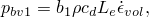其中  是阻尼系数（默认值=.06）， 是当前材料密度， 是当前膨胀波速， 是单元特征长度，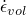 是体积应变率。

第二种形式的体积黏性压力仅在实体连续体单元中找到（CPS4R 除外）。这种形式在体积应变率上是二次的：

其中  是阻尼系数（默认值=1.2），所有其他量与线性体积黏性的定义相同。二次体积黏性压力仅在体积应变率为压缩时应用。

二次体积黏性压力将把冲击波前模糊到多个单元上，并被引入以防止单元在极高的速度梯度下坍塌。考虑一个简单的一单元问题，其中单元一侧的节点是固定的，另一侧的节点具有朝向固定节点方向的初始速度。如果初始速度等于材料的膨胀波速，则没有二次体积黏性的单元将在一分钟内坍塌到零体积（因为稳定时间增量大小正好是膨胀波穿越单元的传输时间）。二次体积黏性压力将引入一个阻力压力，防止单元坍塌。

体积黏性压力不包含在材料点应力中，因为它仅作为一种数值效应——不被视为材料本构响应的一部分。体积黏性压力基于每个单元的膨胀模态。每个单元膨胀模态中临界阻尼的分数由下式给出

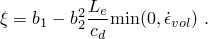

线性体积黏性始终包含在 Abaqus/Explicit 中。用户可以重新定义参数  和 。默认值为 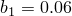 和 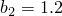。体积黏性参数可以从步骤到步骤更改。如果在步骤中更改了默认值，则新值将用于任何后续步骤，除非重新定义。
### 壳单元的旋转体积黏性

对于位移自由度，体积黏性引入与体积应变相关的阻尼。线性体积黏性或截断频率阻尼用于阻尼导致解中不良噪声或响应幅度中虚假超调的高频振铃。出于同样原因，在壳中，旋转自由度中的高频振铃通过作用于平均曲率应变率的线性体积黏性来阻尼。这种阻尼产生体积黏性"压力矩" *m*，它在平均曲率应变率上是线性的：

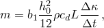其中  是阻尼系数（默认值 = 0.06）， 是原始厚度， 是质量密度， 是当前膨胀波速，*L* 是用于转动惯量和横向剪切刚度缩放的特征长度， 是平均曲率增量的两倍。膨胀波速根据有效的 Lam 常数表示为

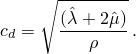合成压力矩 ，其中 *h* 是当前厚度，被添加到力矩结果的直接分量中。
### 参考

### 参考

"Abaqus Analysis User's Guide" 第6.3.3节"显式动力学分析"