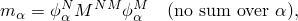
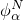
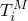
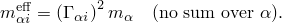
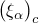
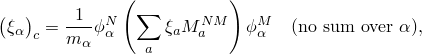
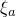
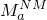

# 2.5.2 与模型固有模态相关的变量

### 2.5.2 与模型固有模态相关的变量

在特征频率步骤用于查找模型的特征值后，Abaqus/Standard 自动计算每个模态的参与因子、有效质量和复合模态阻尼，以便这些变量可用于后续线性动力学分析。
### 广义质量

与模态  相关的"广义质量"为

其中  是结构的质量矩阵， 是模态  的特征向量。上标 *N* 和 *M* 指有限元模型的自由度。

Abaqus/Standard 允许用户在两种特征向量归一化类型之间选择：特征向量可以缩放使得每个向量中的最大条目为1，或者可以归一化使得每个向量的广义质量为1（ 在方向 *i* 中的参与因子  是一个变量，指示在全局 *x*-、*y*- 或 *z*- 方向或绕其中一个轴的旋转（由 *i*、*i = 1*、*2*、…、*6* 指示）中运动在该模态特征向量中的表示程度。它定义为

其中  定义模型中自由度 (*M*) 对施加的刚体运动（位移或无限小旋转）在 *i* 方向上的刚体响应的大小。例如，在具有通常三个位移和三个旋转分量的节点处， 是

其中  是单位；所有其他  为零，*x*、*y* 和 *z* 是节点的坐标；、 和  表示旋转中心坐标。因此，参与因子是为平移自由度和围绕旋转中心的旋转定义的。

对于耦合声学-结构特征频率分析，为每个模态计算附加声学参与因子，如"耦合声学-结构介质分析"第2.9.1节中所述。
### 模态有效质量

与运动方向 *i*（*i = 1*、*2*、…、*6*）相关的模态  的有效质量定义为

如果将所有模态的有效质量在任何特定方向上相加，总和应给出模型的总质量，但运动学约束自由度上的质量除外。因此，如果分析中使用的模态的有效质量总和远小于模型的总质量，这表明在该方向的激发中具有重要参与但尚未被提取的模态。

对于耦合声学-结构特征频率分析，为每个模态计算附加声学有效质量，如"耦合声学-结构介质分析"第2.9.1节中所述。
### 复合模态阻尼

Abaqus/Standard 提供选项为每种材料定义复合阻尼因子。这些被组装成每个模态临界阻尼值的分数，，根据

其中  是为材料 *a* 给出的临界阻尼分数， 是由材料 *a* 组成的结构质量矩阵的部分。
### 参考文献

### 参考文献

"Abaqus Analysis User's Guide" 第6.3.5节"固有频率提取"

"Abaqus Analysis User's Guide" 第26.1.1节"材料阻尼"