# 2.5.5 模态动力学分析

### 2.5.5 模态动力学分析

**产品：** Abaqus/Standard

模态动力学过程提供线性系统的时间历史分析。激发给定为时间的函数：假设振幅曲线被指定使得激发幅度在每个增量内线性变化。当模型被投影到用于其动力学表示的特征模态上时，我们在时间 *t* 获得以下方程组：

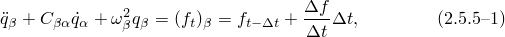其中索引  和  跨越特征空间；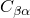 是投影的黏性阻尼矩阵；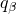 是模态  的"广义坐标"（该模态中响应的振幅）；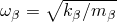 是无阻尼模态  的固有频率（作为在模态动力学时间历史分析之前的特征频率步骤中特征值的平方根获得）；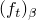 是投影到该模态上的荷载大小（模态的"广义荷载"）； 是 *f* 在时间增量期间的变化，即 。

如果投影阻尼矩阵是对角的，[方程 2.5.5-1](02s05a28.md) 变为以下解耦方程组：

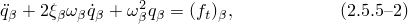其中 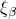 是由关系给出的临界阻尼比

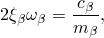其中 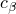 是模态黏性阻尼系数，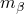 是模态  中的模态质量。
### 解耦系统的求解

解耦方程的求解可以容易地获得，作为荷载的特定积分和齐次方程（无右边）的解。这些解可以组合并写成一般形式

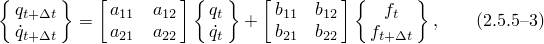其中 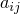 和 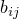、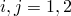 是常数，因为我们假设荷载在时间增量上仅线性变化（即 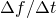 是常数）。

对于非刚体运动（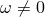），此解有三种情况，取决于模态平衡方程中的阻尼是大于、等于还是小于临界阻尼（即取决于 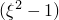 是正、零还是负）。
### 耦合系统的求解

[方程 2.5.5-3](02s05a28.md) 可以推广以处理投影阻尼矩阵中的完全耦合。设矩阵  分裂为其对角和非对角部分，所以

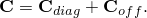然后，附加假设非对角阻尼力在时间增量上线性变化，解耦系统的方程可以重写为

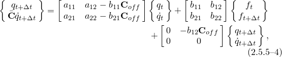其中 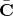 由下式给出

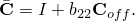 是完全填充的，但仅是  的函数，因此对于给定分析只需分解一次。
### 积分系数

对于非刚体运动（），此解有三种情况，取决于模态平衡方程中的阻尼是大于、等于还是小于临界阻尼（即取决于  是正、零还是负）。阻尼小于临界

这是最常见的情况。伴随

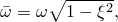我们得到

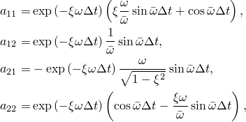

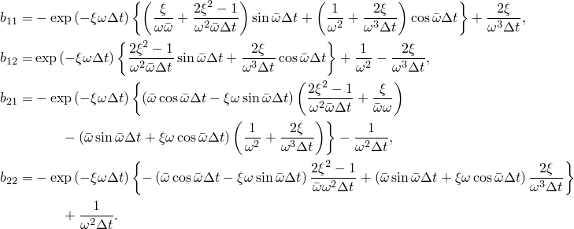 阻尼等于临界

在这种情况下

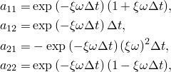

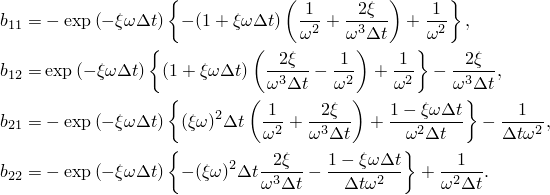阻尼高于临界

在这种情况下，伴随

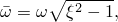我们得到

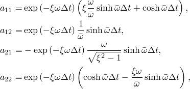

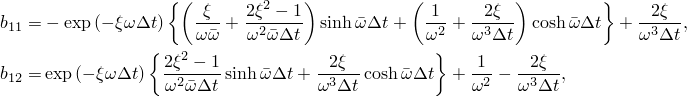

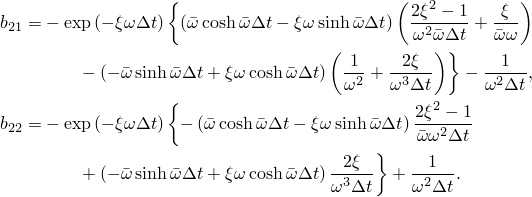带阻尼的刚体模态

如果有限元模型中有刚体模态，将有一个或几个为零的特征值。运动方程（[方程 2.5.5-1](02s05a28.md)）简化为

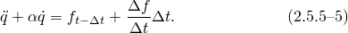

对于刚体模态只能指定 Rayleigh 阻尼，因为临界阻尼为零。此外，由于它是刚体模态，只出现质量阻尼因子 （刚度阻尼需要身体有应变）。对于这种情况

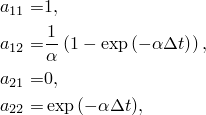

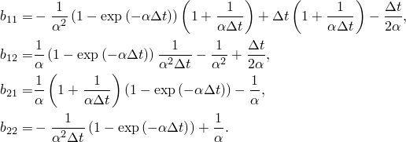无阻尼的刚体模态

对于无阻尼刚体模态的特殊情况，运动方程（[方程 2.5.5-1](02s05a28.md)）简化为

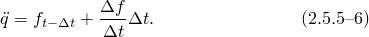对于这种情况

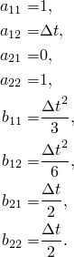
### 模态动力学分析中的结构阻尼

结构阻尼是一种常用的阻尼模型，将阻尼表示为复刚度。这种表示对频域分析（如稳态动力学，其解已经是复数）没有困难。然而，在时域中，解必须保持为实值。为了允许用户在时域中应用他们的结构阻尼模型，开发了一种将结构阻尼转换为等效黏性阻尼的方法。该技术设计成这样：在频域中，如果投影阻尼矩阵是对角的，则施加的黏性阻尼与结构阻尼相同。

我们从单自由度振子方程开始，

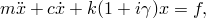其中 *m* 是质量，*c* 是黏性阻尼因子，*k* 是刚度，*x* 是响应，*f* 是力， 是结构阻尼因子。如果我们用质量归一化并假设谐波输入，我们得到关系

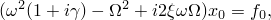其中  是固有频率， 是激励频率， 是谐波响应的系数， 是谐波输入的系数。黏性阻尼因子 *c* 和临界阻尼因子  之间的关系是 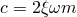。

基于以上两个方程，如果我们希望黏性阻尼因子与结构阻尼因子具有相同的效果，我们必须

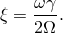如果我们进一步假设 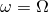，关系简化为

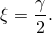现在我们考虑有限元系统方程，

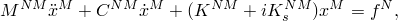其中  是有限元黏性阻尼矩阵， 是有限元结构阻尼矩阵。如果我们将这些方程投影到特征模态上，阻尼矩阵变为

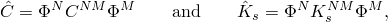可能是完全填充的。如果我们取  和  是对角的情况，它们的对角元素可以写成

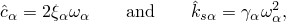其中  是特定模态。保持为单自由度系统开发的关系 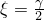 对于这个对角情况需要

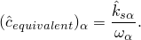对于非对角矩阵，等效黏性阻尼的表达式变为

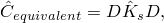其中 D 是对角矩阵，其条目由下式给出

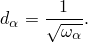
### 节点和单元变量的响应

时间积分以广义坐标进行，然后物理变量的响应通过求和立即可得：

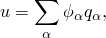

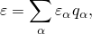

其中  是模态， 是模态应变振幅， 是模态应力振幅， 是与每个特征向量  对应的模态反力振幅。
### 初始条件

在步骤开始时，初始位移和初始速度必须转换为广义坐标的等效值，这仅在特征向量数等于自由度数时才能精确完成。由于通常不是这种情况，广义坐标位移和速度的初始值计算为

其中  是特征向量  的广义质量， 是特征向量， 是质量矩阵， 是初始位移。

类似地，对于初始速度

对于由先前模态动力学分析给出初始条件的情况，广义位移、速度和加速度简单地从前一个分析中获取。
### 基础运动定义

许多线性动力学问题涉及求解结构对"基础运动"的响应：作为结构位移被规定点的位移、速度或加速度的时间历史。在所有情况下，这些基础运动都转换为加速度历史。如果位移或速度历史在时间  0 时有非零值，则在时间  0 和  时对加速度历史进行修正。如果给出速度，在  0 时的加速度为

如果给出位移，在  0 和  时的加速度为

在上述表达式以及随后的表达式中，上标 * 表示用户定义的振幅数据。

如果为表格或等间距振幅曲线定义给出速度，加速度由中心差分规则定义

如果给出位移，加速度由中心差分规则定义

响应是相对于基础计算的。如果需要节点变量的总值，则将基础的运动添加到相对值：

其中

### 参考

### 参考

"Abaqus Analysis User's Guide" 第6.3.7节"瞬态模态动力学分析"