# 2.5.6 响应谱分析

### 2.5.6 响应谱分析

**产品：** Abaqus/Standard

响应谱分析旨在提供一种经济的方法来估计模型（通常是结构模型）对"基础运动"的峰值响应：所有节点相对于边界条件同时运动。该方法假设系统响应是线性的，因此可以使用最低特征模态——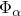——和特征频率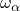——在先前的特征频率步骤中提取——在频域中进行分析。该方法通常用于估计建筑物或建筑物中管道系统对地震的响应。如果激励非常剧烈以至于系统中的非线性效应很重要，则该方法不适用。在这种情况下，必须已知基础激励的时间历史，并将其与动力学分析步骤结合使用以获得系统的响应。

即使对于线性系统，响应谱方法也只能提供峰值响应的估计。如果需要更精确的值，可以使用模态动力学分析步骤通过时间对系统进行积分，从而获得其对给定基础激励的响应。

在响应谱分析中，峰值估计是通过组合对应于用户指定谱定义的参与模态的峰值响应获得的。响应谱分析引入了几种近似。从激励的时间历史到等效频域谱的转换基于单自由度系统的行为。不同的谱通常应用于不同的激励方向。一旦谱已知，就可以计算峰值模态响应。这些峰值模态响应如何组合以估计峰值物理响应，以及多向激励如何组合的方式，都会引入近似值。由于没有任何一种方法能对所有情况都给出良好的近似，因此提供了多种方法。这些方法在美国核管理委员会的[监管指南1.92（1976年）](07s01a01-References.md)、[Anagnastopoulos（1981）](07s01a01-References.md)、[Der Kiureghian（1981）](07s01a01-References.md)和[Smeby（1984）](07s01a01-References.md)的论文中，以及[A. K. Gupta（1990）](07s01a01-References.md)的著作中进行了讨论。求和规则的选择取决于具体情况，是用户判断的问题。

由于响应谱分析通常用作基本设计工具，因此在许多设计规范中为此类应用（如建筑物的地震分析）定义了谱。在这种情况下，用户根据给定的谱进行操作。在其他情况下，已知基础激励的时间历史必须首先通过考虑已知基础运动激励的单自由度系统的响应来转换为响应谱。为此，单自由度系统以其无阻尼固有频率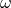和系统中的临界阻尼分数为特征。系统的运动方程通过时间积分，以找到相对位移、相对速度和绝对加速度的峰值。"模态动力学分析"第2.5.5节中描述的积分可用于此目的，因为当基础运动记录随时间线性变化时，它是精确的。因此，对于线性单自由度系统，找到位移、速度和加速度的最大值。对于感兴趣频率和阻尼值范围内的所有值重复此过程，以构建位移、速度 和加速度谱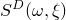、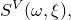和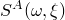。从加速度记录以这种方式构建谱的FORTRAN程序在"Abaqus基准指南"第1.4.13节"承受地震运动的悬臂梁分析"中给出（文件[cantilever_spectradata.f](cantilever_spectradata.md)）。

如果没有阻尼，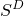、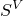和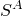之间的关系由下式给出

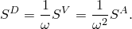在Abaqus/Standard中，假设阻尼始终很小，因此每当需要转换时都使用这些关系。

响应谱通过给出在阻尼值递增下的频率递增值处的谱值*S*的表格来定义。使用对数刻度上的线性插值来计算任何所需频率和阻尼因子的响应。可以定义任意数量的谱。

响应谱过程允许最多三个谱，我们用*k*、表示，通过其方向余弦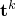定义的正交物理方向应用于模型。这些谱可以来自不同的激励（它们之间具有一定的相关性），也可以是沿任意方向作用的单个基础激励的分量。

当使用模态方法来定义模型的响应时，任何物理变量的值都从模态响应的振幅（"广义坐标"）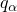中定义。响应谱过程的第一阶段是估计这些模态响应的峰值。对于模态和谱*k*，这是

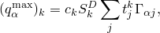其中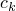是用户定义的缩放参数，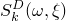是第*k*个位移谱，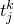是第*k*个谱的第*j*个方向余弦，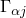是模态在方向*j*中的参与因子（参见"与模型固有模态相关的变量"第2.5.2节中的定义）。通过在上述公式中使用速度或加速度谱，可以获得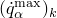和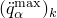的类似表达式。

现在我们有了"广义坐标"的峰值响应估计——系统在每个方向激励中固有模态响应的振幅。如果不同方向上的输入谱是沿任意方向作用的单个基础激励的分量，对于每个模态，我们可以通过指定不同空间方向值的代数求和将这些峰值响应组合为单个值：

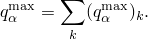在这种情况下，下面讨论的模态组合仍然适用，但下标*k*不再相关，应忽略。

让我们用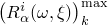表示由响应谱在频率下以阻尼在激励方向*k*中激励的固有模态引起的某个物理变量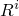（位移分量、应力、截面力、反作用力等）的峰值响应。用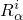表示与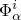相关的特征向量的分量。则

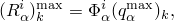

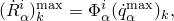和

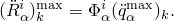

我们需要将这些单独模态中峰值物理响应的估计组合成对给定谱的特定物理变量的总峰值响应的估计，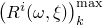。由于不同模态中的峰值响应通常不会同时发生，因此这种组合只是一个估计，因此提供了几种公式，如下所示：

模态峰值响应绝对值的求和估计

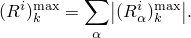这提供了峰值响应最保守的估计，因为它假设所有模态同时提供同相位的峰值响应。

平方和平方根（SRSS）估计

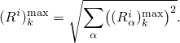如果模态的固有频率分离良好，这种求和通常提供合理的估计。

海军研究实验室方法区分了物理变量具有最大响应的模态，并将所有其他模态峰值响应的平方和平方根添加到该模态峰值响应的绝对值中。这给出了估计

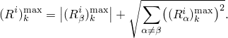同样，模态必须在频率域中合理分离，以使用该方法获得准确的估计。

有多种方法可用于改进对频率接近的结构的估计。Abaqus/Standard提供了两种方法：美国核管理委员会[监管指南1.92（1976年）](07s01a01-References.md)推荐的"百分之十方法"，以及由[Der Kiureghian（1981）](07s01a01-References.md)首次引入并由[Smeby和Der Kiureghian（1984）](07s01a01-References.md)开发的"完全二次组合方法"。如果模态分离良好且相互之间没有耦合，这两种方法都简化为SRSS方法。

还提供了两种额外的方法——分组方法和双重求和组合方法——以满足[监管指南1.92](07s01a01-References.md)的要求。
### 百分之十方法

[监管指南1.92](07s01a01-References.md)中描述的百分之十方法通过添加来自所有频率相互之间在10%以内的模态对和的贡献来修改SRSS方法，给出估计

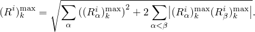只要满足以下条件，就认为模态和的频率在10%以内

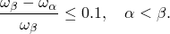
### 完全二次组合方法

完全二次组合方法（CQC）使用以下公式组合模态响应

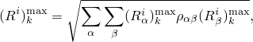其中是模态和之间的交叉相关系数，它们取决于两个模态之间的频率比和模态阻尼：

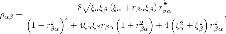其中

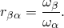如果具有相同阻尼系数发生双重特征值，其相关系数将为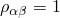。如果模态分离良好，其交叉相关系数将很小（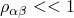），并且该方法将给出与SRSS方法相同的结果。该方法通常推荐用于非对称建筑系统，因为在这种情况下，其他方法可能会低估运动方向的响应，高估横向方向的响应（参见"Abaqus例题指南"第2.2.3节"三维框架建筑的响应谱"）。

对于沿正交方向作用的 不同基础激励的情况，我们仍然需要按方向下标*k*指示的方向求和。[监管指南1.92](07s01a01-References.md)指定此方向求和基于平方和平方根求和规则：

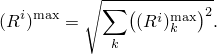当不同方向的基础运动在统计上独立（不相关）时——当它们沿"主方向"作用时——此规则是合适的。关于可以认为地面运动不相关的一组方向的存在，由[Penzien和Watabe（1975）](07s01a01-References.md)讨论。当使用CQC模态组合方法时，这种考虑尤其重要。在Abaqus的CQC方法实现中，假设水平分量沿主方向作用且强度相等。有关应用于更一般情况的CQC方法的详细信息，请参见[Smeby和Der Kiureghian（1984）](07s01a01-References.md)。
### 分组方法

分组方法，也称为NRC分组方法，改进了对具有接近特征值的结构的响应估计。模态响应被分组，使得组中最低和最高频率模态在10%以内，并且没有模态属于多个组。模态响应在组内绝对求和，然后对组进行SRSS组合。组内响应求和为

对于任何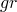组内频率在10%以内的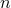，然后执行：

上述表达式包含所有组，如果频率没有另一个在10%限制内的成员，则该组可以仅由一个频率响应组成。相比之下，百分之十方法产生的结果始终比分组方法的值高。
### 双重求和组合方法

双重求和组合方法，也称为Rosenblueth的双重求和组合，是基于随机振动理论评估模态相关性的首次尝试。该方法利用强地震运动的持续时间。模态相关系数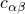也取决于频率和阻尼系数，导致以下模态组合：

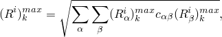其中

其中

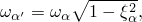

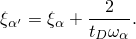
### 参考

### 参考

"Abaqus Analysis User's Guide"第6.3.10节"响应谱分析"
