# 2.5.7 稳态线性动力学分析

### 2.5.7 稳态线性动力学分析

**产品：** Abaqus/Standard

稳态线性动力学分析预测结构在连续谐波激励下的线性响应。在许多情况下，Abaqus/Standard中的稳态线性动力学分析使用在先前的特征频率步骤中提取的特征模态集来计算作为施加激励频率函数的稳态解。Abaqus/Standard还具有"直接"稳态线性动力学分析过程，其中系统稳态谐波运动的方程直接求解而无需使用特征模态，以及"子空间"稳态线性动力学分析过程，其中方程投影到无阻尼系统选定的特征模态子空间上。这些选项适用于行为随频率变化的系统、包含阻尼的系统或控制方程非对称的系统。

本节描述基于特征模态的线性稳态响应过程。

将系统运动方程投影到第个模态上给出

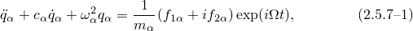其中是模态的振幅（第个"广义坐标"），是与该模态相关的阻尼（见下文），是模态的无阻尼频率，是与该模态相关的广义质量，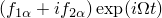是与该模态相关的激励。激励由频率和节点等效力的实部和虚部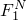和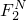定义，投影到特征模态上：

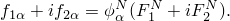在此方程中，上标的重复表示模型中的自由度，因此暗示求和；但在整个本节中，我们仅使用单个模态方程，因此模态下标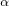的重复不暗示求和。荷载向量以其实部和虚部和编写，因为这是Abaqus/Standard中定义荷载的方式。也可以用其幅值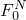和相位来编写荷载，即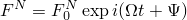，其中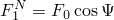和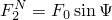。

提供了几种模态阻尼表示。模态阻尼定义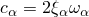，其中是模态中临界阻尼的分数。结构阻尼给出与模态振幅成正比的阻尼力：

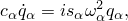其中是模态的结构阻尼系数。Rayleigh阻尼由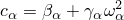定义；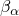和分别是阻尼低频和高频模态的Rayleigh系数。Rayleigh阻尼可以精确地由模态阻尼重现为

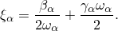将所有这些阻尼定义引入[方程2.5.7-1](02s05a30.md)给出

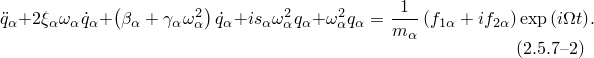该方程的解为

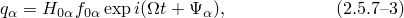其中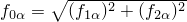是投影荷载向量的振幅，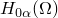是模态的复"传递函数"的振幅。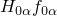定义从力投影到该模态的模态中的响应，并以其实部和虚部定义为

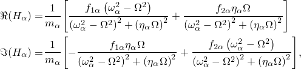其中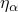表示

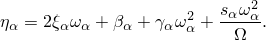响应的振幅为

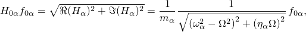响应的相位角为

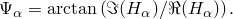

如果施加了谐波基础运动，模态荷载的实部和虚部给出为

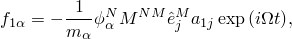

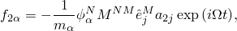其中是结构的质量矩阵，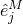是一个向量，在任何接地节点的基础加速度方向上具有单位幅值，否则为零；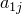和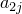是基础加速度的实部和虚部。如果基础运动以速度或位移给出，相应的加速度为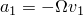和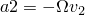，其中和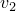是速度的实部和虚部，或者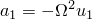和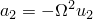，其中和是位移的实部和虚部。

任何物理变量的峰值振幅可以从模态振幅获得为

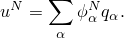

稳态响应作为用户指定频率范围内的频率扫描给出。由于结构响应在固有频率附近达到峰值，因此使用偏置函数将响应点聚集在频率周围。偏置在"Abaqus Analysis User's Guide"第6.3.8节"基于模态的稳态动力学分析"中描述。
### 参考

### 参考

"Abaqus Analysis User's Guide"第6.3.8节"基于模态的稳态动力学分析"
