# 2.5.8 随机响应分析

### 2.5.8 随机响应分析

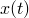**产品：** Abaqus/Standard

随机响应分析用于预测结构对随机激励（如结构基础运动或声学载荷）的稳态统计响应。随机响应分析基于功率谱密度函数（PSD）描述激励，这些函数是激励的统计描述。响应的结果以统计量给出，如均值、均方根值（RMS）和标准差。

响应谱分析（第2.5.6节）提供了系统对输入谱的峰值响应的近似上限，而随机响应分析计算稳态响应的统计值。在这两种方法中，系统都被假定为线性的。

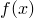对于线性系统，随机激励下的稳态响应也是随机的，其特性可以从激励的特性推导出来。在随机响应分析中，系统响应假定为高斯（正态）过程，响应变量是具有零均值的高斯随机变量（如果基础激励具有零均值）。如果需要更精确的响应估计，可以计算响应变量的协方差矩阵。对于高斯过程，协方差矩阵完全描述了响应的概率分布。

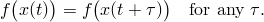协方差矩阵的行和列对应于分析中请求的响应变量。响应变量可以包括节点自由度（如位移、速度或加速度）以及单元变量（如应力或应变）的分量。

协方差矩阵的定义涉及激励的自功率谱密度函数以及系统不同点之间激励的相关性。如果激励是完全不相关的白噪声，则所有频率下的功率谱密度都是恒定的。然而，对于实际的激励（如地震或声学载荷），功率谱密度随频率变化，不同位置处的激励值可能是相关的。这种激励空间相关性由互谱密度函数描述。

### 自功率谱密度函数

对于平稳随机过程，功率谱密度函数*S*（*ω*）是自相关函数*R*（*τ*）的傅里叶变换：

*S*（*ω*）= ∫ *R*（*τ*）*e*^（*iωτ*） *dτ*
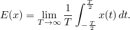
其中*ω*是圆频率，*i*是虚数单位。功率谱密度函数描述了激励在频域中的能量分布。
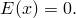
### 互功率谱密度函数

对于两个随机过程*x*（*t*）和*y*（*t*），互功率谱密度函数*Sxy*（*ω*）定义为
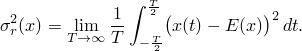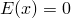
*Sxy*（*ω*）= ∫ *Rxy*（*τ*）*e*^（*iωτ*） *dτ*
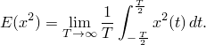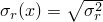
其中*Rxy*（*τ*）是互相关函数。互谱密度函数描述了两个过程之间的相关性随频率的变化关系。

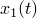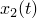### 响应计算

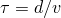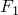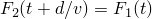对于线性系统，响应*y*（*t*）与激励*x*（*t*）通过传递函数*h*（*t*）关联：

*y*（*t*）= ∫ *h*（*τ*）*x*（*t-τ*） *dτ*

在频域中，这种关系变为

*Y*（*ω*）= *H*（*ω*）*X*（*ω*）

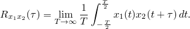其中*Y*（*ω*）和*X*（*ω*）分别是响应和激励的傅里叶变换，*H*（*ω*）是频率响应函数（传递函数的傅里叶变换）。

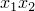响应的功率谱密度函数为

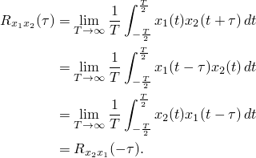*Sy*（*ω*）= |*H*（*ω*）|^2 *Sx*（*ω*）

其中*Sx*（*ω*）是激励的功率谱密度函数。

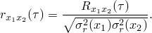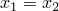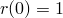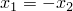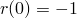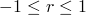### 均方根响应

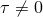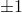均方根（RMS）响应是响应的方均根值，定义为

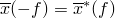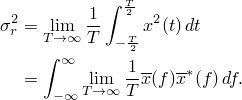*RMS* = √（∫ *Sy*（*ω*） *dω* / 2π）

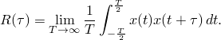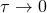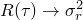### 协方差矩阵

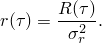对于多个响应变量，协方差矩阵*C*定义为

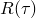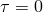*Cij* = *E*[*xi* *xj*]

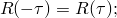其中*E*表示期望值，*xi*和*xj*是响应变量。

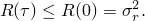### 参考

### 参考

"Abaqus Analysis User's Guide" 第6.3.11节"随机响应分析"
