# 2.5.8 随机响应分析

### 2.5.8 随机响应分析

**产品：** Abaqus/Standard

随机响应线性动力学分析用于预测结构对非确定性连续激励的响应，该激励通过互谱密度（CSD）矩阵以统计方式表达。随机响应过程使用在前一个特征频率步骤中提取的特征模态集来计算响应变量（应力、应变、位移等）的相应功率谱密度（PSD），从而在需要时计算这些变量的方差和均方根值。本节提供了此类分析中使用的术语的简要定义和解释。随机响应分析理论的详细讨论见 [Clough and Penzien (1975)](07s01a01-References.md)、[Hurty and Rubinstein (1964)](07s01a01-References.md) 和 [Thompson (1988)](07s01a01-References.md) 的著作。

随机响应分析的示例包括：飞机对湍流的响应；汽车对路面不平度的响应；结构对噪声（如喷气发动机发出的"喷气噪声"）的响应；以及建筑物对地震的响应。

由于载荷是非确定性的，只能以统计方式表征。我们需要一些假设来使这种表征成为可能。虽然激励随时间变化，但在某种意义上它必须是*平稳的*——它的统计特性不随时间变化。因此，如果  是被考虑的变量（如汽车在粗糙道路上行驶时路面的高度），那么 *x* 的任何统计函数  必须具有相同的值，无论我们使用什么时间原点来计算 *f*：

我们还需要激励是*遍历的*。这个术语意味着，如果我们取激励的几个样本，每个样本的时间平均值是相同的。

这些限制确保了激励在统计上是恒定的。在下面的讨论中，我们还假设随机变量是实数的，这是我们需要考虑的变量的情况。

### 统计度量

我们定义变量的某些度量，以统计方式表征它。

随机变量  的*均值*为

由于动态响应是相对于静态平衡构型计算的，任何动态输入或响应变量的均值将始终为零：

随机变量的*方差*衡量的是变量值与均值之间平方差异的平均值：

由于在我们应用中 ，方差与*均方值*相同：

方差的单位是（幅值）2，因此——例如——力的方差单位是（力）2。通常我们更喜欢使用与变量本身相同的单位。因此，Abaqus/Standard 中的输出变量以*均方根*（"RMS"）值给出，。

### 相关性

相关性衡量两个变量之间的相似性。因此，两个随机时间函数  和  之间的*互相关*是这两个变量的乘积的积分，其中一个变量在时间上平移了某个固定值 ，以考虑它们相似但可能存在时间延迟的可能性。

（这种情况的一个例子是研究汽车在粗糙道路上的行驶。如果轴的间距为 *d*，汽车以恒定速度 *v* 行驶，后轴看到的前轴的道路轮廓相同，但延迟了时间 。假设道路轮廓通过每个车轮传递，然后通过悬架将力施加到车架上。如果  是施加到后轴的力（在 Abaqus 中作为集中载荷）， 是施加到前轴的力，。）

图 2.5.8–1 两个要相关的随机记录。

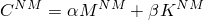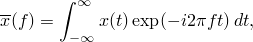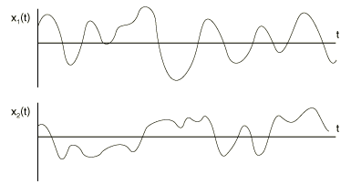

因此，互相关函数定义为

由于任何变量的均值都为零，平均而言每个变量具有相等的正内容和负内容。如果变量非常相似，它们的互相关（对于某些  值）将很大；如果它们不相似，乘积  有时为负有时为正，因此对所有时间的积分将提供小得多的值，与  的选择无关。一个简单的结果是

为方便起见，互相关可以归一化以定义无量纲的*归一化互相关*：

因此，如果 ，；如果 ，。如果  和  完全不相似，。（当  时，称变量为*正交*。）显然 ，*r* 的小值表示  和  具有相当不同的时间历史。

现在考虑变量与其自身的互相关：*自相关*。直观上我们可以看到，如果变量"非常随机"，当  时它的自相关将非常小：没有时间平移允许变量与自身相关。然而，如果变量不是那么随机——如果它只是固定频率的振动——自相关将接近 ，每当  被选择为振动半周期的某个整数倍时。因此，自相关提供了变量真正随机程度的度量。

变量  的自相关为

显然，当  时，：自相关等于方差（均方值）。因此，我们也可以使用*归一化自相关*：

显然  关于  对称：

并且  的值从不超过其在  处的值：

振幅在宽频率范围内非常相似的记录的自相关函数随  增加而迅速衰减。这种函数称为"宽带"随机函数。

图 2.5.8–2 宽带噪声记录及其自相关。

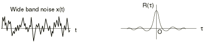

最极端的宽带随机函数的自相关只是一个 delta 函数：

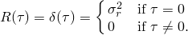这种函数称为*白噪声*。白噪声在所有频率下具有相同的振幅，其自相关在  除外处为零。

图 2.5.8–3 白噪声的自相关。

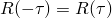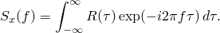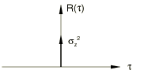

现在让我们考虑相反的情况，称为"窄带"函数。这种函数最极端的情况是在单一频率的简单正弦振动：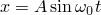。那么  也必须是周期性的，因为  必须每次在平移  对应于振动周期时达到相同的值 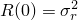。通过对时间进行积分，

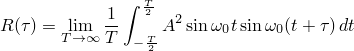

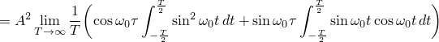

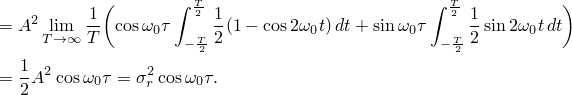

图 2.5.8–4 正弦波及其自相关。

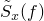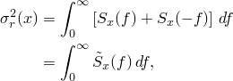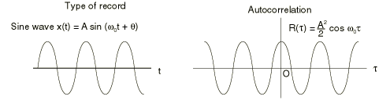

因此，自相关  告诉我们随机变量的性质。如果当时间平移  远离  时  迅速衰减，则变量具有宽频率内容；如果衰减较慢并呈现余弦轮廓，则变量具有以  的周期性对应的频率为中心的窄频率内容。

图 2.5.8–5 窄带记录及其自相关。

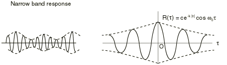

我们可以通过将变量与正弦波互相关来将此概念扩展到检测随机变量的频率内容：扫描一系列频率的波并检查互相关告诉我们随机变量是否由特定频率的振荡主导。我们开始看到，平稳、遍历随机过程的性质最好通过在频域中检查来理解。

作为说明，考虑一个包含许多离散频率的变量 。我们可以将其写为以基本频率 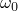 的 *N* 步展开的傅里叶级数：

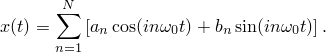级数从  项开始，因为变量的均值必须为零。我们可以更紧凑地将其写为复数傅里叶级数（记住我们只对实部感兴趣）：

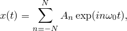其中 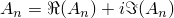 是第 *n* 项的复振幅，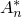 是  的复共轭：

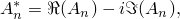和

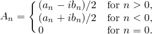

 的方差为

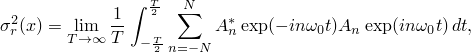利用傅里叶项的正交性。继续，

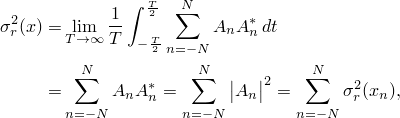其中

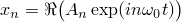是傅里叶级数的第 *n* 项。

因此，由于傅里叶项的正交性，级数的方差（均方值）是其分量方差（均方值）的和。特别是，我们看到 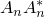 是在频率 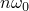 处变量的方差或均方值。

因此，在频率 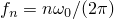 处对 *x* 方差的贡献，每单位频率为

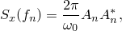因为我们以 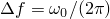 的步长增加频率范围。方差因此可以写为

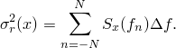

当我们将 *x* 作为频率函数检查时，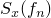 告诉我们每单位频率在频率 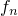 处 *x* 中包含的"功率"（在均方值意义上）的量。当我们考虑越来越小的区间时，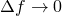，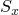 是变量 *x* 的*功率谱密度（PSD）*：

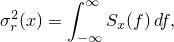其中 *f* 是每单位时间的频率（通常为 Hz）。

注意  的单位为（变量）2/频率，其中（变量）是变量的单位（位移、力、应力等）。在这种情况下，"频率"几乎总是以 Hz 给出，尽管——由于 Abaqus 没有内置单位——频率也可以用每单位时间的任何其他周期单位表示。然而， 不应该以圆频率（弧度/时间）给出：Abaqus 假设 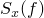，而不是 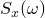。

### 傅里叶变换

由于随机响应分析中感兴趣的变量被表征为频率函数，傅里叶变换在从时域到频域的转换中起着重要作用，反之亦然。 的傅里叶变换（我们记为 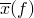）定义为

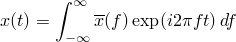或者，用圆频率  表示，

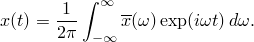

简单操作提供

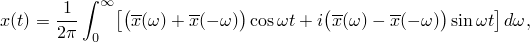所以 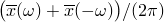 是  在圆频率  处余弦项的振幅，而 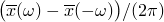 是正弦项的振幅。因此，我们看到了傅里叶变换的物理意义——它提供了  在特定频率处内容的复大小（振幅和相位）。

如果  仅为实数（这是我们需要考虑的变量的情况），这个表达式表明我们必须有

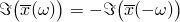和

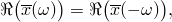这意味着

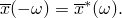

为完整起见，我们还注意到逆变换，

这表明时域和频域之间的变换是相当对称的。

现在我们需要 Parseval 定理：

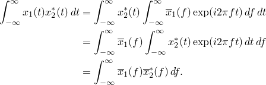

将此定理应用于方差（均方值）：

由于  是实数，我们知道 ，因此

我们已经表明，我们可以将方差写为功率谱密度的形式

通过比较，

我们还看到

为避免对负频率积分，我们将方差写为

其中  是*单边 PSD*，定义为

由于 ，我们看到

现在考虑自相关函数：

（使用上面的结果）。因此，功率谱密度是自相关函数的傅里叶变换。逆变换为

由于  关于  对称（），我们也可以将此方程写为

所以

### 互谱密度

遵循与上述发展功率谱密度概念相似的论证，我们可以定义*互谱密度（CSD）函数* ，它给出两个变量  之间的互相关为

逆变换为

将  的原始定义转换到频域提供

通过比较，

我们也可以写为

### 随机响应分析

随机响应分析的一般概念现在很清楚。系统受到一些随机载荷或规定的基座运动的激励，这些在频域中通过互谱密度函数矩阵  表征。这里我们认为 *N* 和 *M* 是有限元模型中暴露于随机载荷或规定基座运动的两个自由度。

在典型应用中，频率范围将限制在我们知道结构将响应的范围内——我们不需要考虑高于我们期望结构响应的模态的频率。

 的值可能通过时间记录的互相关或单个时间记录的自相关的傅里叶变换以及已知几何数据来提供，如汽车在粗糙凹槽道路上行驶的情况，其中道路表面轮廓的自相关连同汽车的速度和轴间距允许为前（1）和后（2）轴定义 ，如上所示。（如果这种情况下，车轮左侧看到的道路轮廓与右侧看到的道路轮廓不相似，则还需要左侧和右侧道路表面轮廓的互相关来定义激励。）

系统将响应此激励。我们通常感兴趣的是查看通常响应变量（应力、位移等）的功率谱密度。特定变量的 PSD 历史将告诉我们系统最容易被随机载荷激励的频率。

我们也可以计算变量之间的互谱密度。这些通常不引起兴趣，Abaqus/Standard 不提供它们。（如果分析涉及获取将继而定义其他系统载荷的结果，则可能需要它们。例如，建筑物对地震载荷的响应可用于获取建筑物中管道系统连接点的运动，以便可以分析管道系统。唯一的选项是将整个系统一起建模。）

通过查看任何变量的方差（均方值）可以提供总体情况；为此目的提供 RMS 值。使用 RMS 值而不是方差是因为它具有与变量本身相同的单位。Abaqus/Standard 通过对变量在指定频率范围内的单边功率谱密度进行积分来计算它，因为

此积分使用梯形法则在为随机响应步骤指定的频率范围内数值执行：

其中  是频率  处的 ，*N* 是计算响应的点数。*N* 将取决于叠加中使用的特征模态数量和用户在特征频率之间指定的点数。

用户必须确保指定足够的频率点，以便此近似积分足够准确。

问题的转换到频域固有地假设正在研究系统正在线性响应：随机响应过程被视为线性扰动分析步骤。

那么，剩下的是我们考虑 Abaqus/Standard 如何找到对随机激励的线性响应。

### 频率响应函数

随机响应在频域中研究。因此，我们需要作为频率函数的从载荷到响应的转换。由于随机响应被视为一系列正弦振动的积分，此转换基于稳态动力学分析使用的相同稳态响应函数，如"稳态线性动力学分析"第 2.5.7 节所述。

离散（有限元）线性动力学系统的平衡方程为

其中  是质量矩阵， 是阻尼矩阵， 是刚度矩阵， 是外部载荷， 是有限元模型自由度 *N* 的值（通常是位移或旋转分量，或声压）， 是任意的虚位移。

我们将问题投影到系统的特征模态上。为此，首先从无阻尼系统中提取模态：

（这里，在本节的其余部分，重复的下标和上标假定在适当范围内求和，除非它们被加杠，如上面的 。罗马上标和下标表示物理自由度；希腊上标和下标表示模态变量。）

通常，结构动力学响应很好地由模型的少量较低模态表示，因此模态数量通常为 –，而物理自由度的数量可能为 –。

特征模态在质量和刚度矩阵上正交：

特征模态可以是位移归一化或质量归一化。对于位移归一化， 中的最大条目为 1.0；对于质量归一化，最大条目为 。在 SIM 架构中，我们仅使用质量归一化。

我们假设任何阻尼都采用"瑞利阻尼"的一般形式：

以便  也将投影到对角阻尼矩阵  中。

因此，问题投影到一组解耦的模态响应方程，

其中

是模态  的广义载荷， 是模态  的"广义坐标"（模态振幅）。

稳态激励的形式为

并产生类似形式的响应，我们写为

其中  是*复频率响应函数*，定义于"稳态线性动力学分析"第 2.5.7 节。

### 响应展开

随机载荷由互谱密度矩阵  定义，它链接所有加载的自由度（*N* 和 *M*）。将此矩阵投影到模态上提供了广义（模态）载荷的互谱密度函数：

复频率响应函数然后将广义坐标的响应定义为

其中  是  的复共轭。

最后，物理变量的响应从模态响应中恢复为

因此，自由度  的功率谱密度为

同一变量的速度和加速度的 PSD 为

和

回想一下，我们通常可能有 – 个特征模态，但有更多（–）个物理自由度。因此，如果许多物理自由度被加载（如壳结构暴露于随机声噪声的情况），执行诸如

这样涉及所有加载物理自由度乘积的操作可能计算昂贵，并且必须在所考虑频率范围内的每个频率处完成。

相比之下，操作诸如

相对便宜，因为它们独立地为每种模态组合完成。

形成

如果我们选择为大量物理变量（位移、速度、加速度、应力等）计算结果，可能很昂贵。Abaqus/Standard 将仅计算所请求的单元和节点变量的响应。然而，如果使用随机响应过程请求重启分析，则所有变量都在请求的重启频率处计算，这可能显著增加计算成本。建议用户仅写入最后增量步的重启文件。为了降低随机响应分析的计算成本，Abaqus/Standard 假设载荷的互谱密度矩阵可以分离为频率相关的标量函数（包含 CSD 的单位）和一组与频率无关的耦合项，如下所示：

这里 *J* 是随机响应步骤中包含的互相关定义的数量。每个互相关定义引用一个输入复数频率函数 。空间互相关然后由复数值集  定义。

使用这种方法，广义载荷的互谱密度函数  可以构造为

由于  不是频率的函数，它们只能计算一次，频率相关的操作仅在特征模态空间中进行。

虽然此过程对于典型相关载荷（如道路激励或喷气噪声）不自然，但载荷始终可以通过使用足够的互相关定义以这种方式定义。该方法然后降低具有许多加载物理自由度的模型的计算成本。该方法适用于不相关和完全相关载荷，这是非常常见的情况。

### 分贝转换

Abaqus/Standard 允许用户提供以分贝单位而不是功率/频率单位的输入 PSD（比如说 ）。有多种方法可以从分贝单位转换为功率/频率单位，这取决于一个倍频带中的频率与下一个倍频带中的频率之间的关系方式。一个通用公式将倍频带之间的中心（中间带）频率  关联为

其中上标  表示  倍频带，*x* 是一个选定值。例如， 用于*全倍频带*转换， 用于*三分之一倍频带*转换。Abaqus/Standard 使用全倍频带转换从分贝单位转换为功率/频率单位。对于全倍频带转换，如上面的方程所示，中心频率从一个倍频带到下一个倍频带翻倍。

由于分贝单位基于对数刻度，由下限频率  和上限频率  限定的倍频带的中心频率为

由于 ，我们可以容易地表明

和

因此，任何给定倍频带内的频率变化为

为从一个转换公式转换到下一个，我们需要以下通用分贝到功率/频率转换方程：

其中  是参考功率值。下标  表示功率参考是针对由 *x* 表示的转换类型给出的（例如， 的全倍频带转换或  的一三分之一倍频带转换）。当  时，我们将简单地使用符号 。因此，由于 Abaqus/Standard 使用全倍频带转换， 和

PSD 数据可以相对于其他类型的倍频带频率刻度给出。在这种情况下，我们可以通过基于以下比率计算等效的全倍频带参考功率来转换与全倍频带刻度一致的那些频率处的 PSD 数据：

例如，如果我们给定 （即三分之一倍频带频率刻度），等效的全倍频带参考功率值为

此转换仅在，与全倍频带中心频率一致的一三分之一倍频带中心频率处有效。因此，只应考虑每第三个数据点。

### von Mises 应力计算

Abaqus 中 PSD 和 RMS von Mises 应力的计算基于 [Segalman 等人（1998）](07s01a01-References.md) 的工作。在此方法中，节点 a 处 von Mises 应力的 PSD 为

其中 *m* 是模态数量， 是广义位移 PSD 矩阵的元素，

 是模态在节点 a 处第  个模态的模态应力分量，常数矩阵 *A* 由

给出。类似地，节点 a 处 von Mises 应力的 RMS 计算为

其中  是广义位移方差矩阵的元素。

### 参考

### 参考

"Abaqus Analysis User's Guide" 第 6.3.11 节"随机响应分析"
