# 2.5.9 基于模态过程的基础运动

### 2.5.9 基于模态过程的基础运动

**产品：** Abaqus/Standard

在基于模态叠加的线性动力学分析中，基础运动（也称为"基础激励"或"地面运动"）通过以下方式处理：基础运动的指定分量被转换为施加在结构上的等效惯性力。这些惯性力然后被投影到结构的特征模态上进行分析。

### 基础运动的类型

基础运动可以指定为以下形式之一：
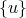
- **加速度历史**：直接指定为时间函数的加速度值。
- **速度历史**：直接指定为时间函数的速度值。
- **位移历史**：直接指定为时间函数的位移值。
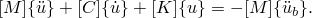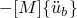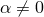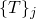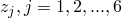- **响应谱**：定义峰值响应作为频率和阻尼比的函数（仅适用于响应谱分析）。

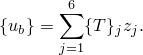### 惯性力方法

对于基础运动分析，Abaqus/Standard将基础加速度转换为等效节点力。这些力由质量矩阵和基础运动定义构造。对于节点*i*在方向*j*上的等效力为

其中*Mij*是质量矩阵中与节点*i*的方向*j*相关的部分，是基础加速度。

这些等效惯性力然后被投影到结构的特征模态上。每个模态的广义力为

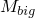
其中*φi*是第*i*个模态的特征向量，*Fi*是节点力向量。

### 约束和基础运动
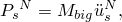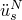
基础运动通常应用于结构的底部或基础区域。在有限元模型中，这些区域中的节点通过边界条件或接触条件被约束。当基础运动被指定时，这些约束保持不变，但约束点本身会按照指定的基础运动历史运动。

### 模态参与
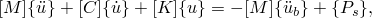
基础运动在每个模态中的参与程度由模态参与因子描述。模态参与因子*p*定义为
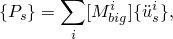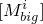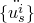

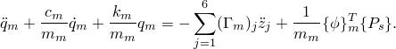
其中*φ*是特征向量，*M*是质量矩阵，*r*是基础运动方向向量。

### 相对响应与绝对响应

默认情况下，基于模态的响应分析计算相对于基础运动的响应（相对响应）。如果需要绝对响应，可以将基础运动添加到相对响应中：

其中*uTotal*是总响应，*uRelative*是相对响应，*uBase*是基础运动。

### 参考

### 参考

"Abaqus Analysis User's Guide" 第6.3.7节"瞬态模态动力学分析"

"Abaqus Analysis User's Guide" 第6.3.10节"响应谱分析"
