# 2.6.1 直接稳态动力学分析

### 2.6.1 直接稳态动力学分析

**产品：** Abaqus/Standard

对于承受连续谐波激励的结构，Abaqus/Standard除了在"稳态线性动力学分析"第2.5.7节中描述的"模态"过程和在"直接稳态动力学分析"第2.6.1节中描述的"直接"过程外，还提供了一种"直接"稳态动力学分析过程。该过程是一种摄动过程，其中摄动解通过关于当前基态的线性化获得。对于基态的计算，结构可以表现出材料和几何非线性行为以及接触非线性。结构和黏性阻尼可以结合使用材料定义中指定的Rayleigh阻尼系数和结构阻尼系数。离散阻尼如质量、黏壶、弹簧和连接器单元可以被包含。此外，可以在过程级别指定全局阻尼系数、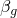和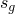来定义额外的黏性和结构阻尼贡献。该过程还可用于耦合声学-结构介质分析（"耦合声学-结构介质分析"第2.9.1节）、压电介质分析（"压电分析"第2.10.1节）和黏弹性材料建模（频域黏弹性"第4.8.3节）。所有属性都可以是频率相关的。

该 formulation 基于动力学虚功方程，

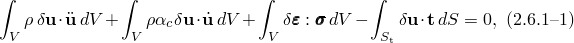其中和是速度和加速度，是材料的密度，是质量比例阻尼因子（Rayleigh阻尼假设的一部分），是应力，是表面牵引力，是与位移变分相兼容的应变变分。该方程的离散形式为

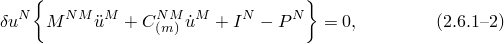其中适用以下定义：

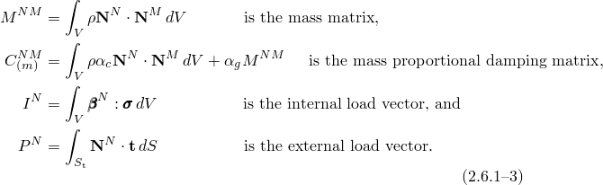

对于稳态谐波响应，我们假设结构围绕变形、受应力状态进行小幅谐波振动，由下标*0*定义。由于稳态动力学是一种摄动过程，步骤中的荷载和响应定义了相对于基态的变化。内力向量的变化通过线性化得到：

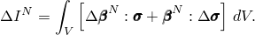应力的变化可以写成

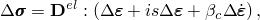其中是材料的弹性矩阵，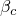是刚度比例阻尼因子（Rayleigh阻尼假设的另一部分），是形成刚度矩阵虚部的结构阻尼因子（称为结构阻尼矩阵）。应变和应变率的变化来自位移和速度的变化：

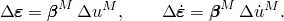这允许我们将[方程2.6.1-2](02s06a33-Direct-steady-state-dynamic-analysis.md)写为

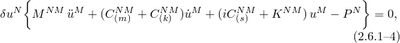其中我们定义了刚度矩阵

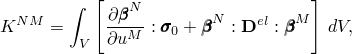刚度比例黏性阻尼矩阵

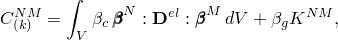和刚度比例结构阻尼矩阵

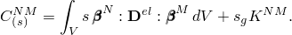

对于谐波激励和响应，我们可以写为

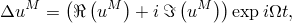和

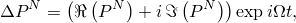其中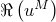和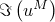是位移振幅的实部和虚部，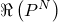和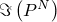是施加在结构上的力的振幅的实部和虚部，是圆频率。将谐波激励和响应的表达式代入[方程2.6.1-4](02s06a33-Direct-steady-state-dynamic-analysis.md)并以矩阵形式写出结果，得到

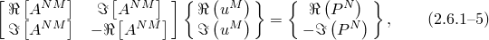其中

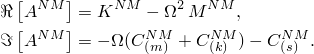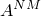的实部和虚部都是对称的。

该过程通过定义直接求解稳态动力学分析步骤来激活。可以定义实部和虚部荷载。

作为输出，Abaqus/Standard在请求的频率下为所有单元和节点变量提供振幅和相位。对于此过程，所有振幅参考必须在频域中给出。
### 参考

### 参考

"Abaqus Analysis User's Guide"第6.3.4节"直接求解稳态动力学分析"
