# 2.6.2 基于子空间的稳态动力学分析

### 2.6.2 基于子空间的稳态动力学分析

**产品：** Abaqus/Standard

对于承受连续谐波激励的结构，Abaqus/Standard除了在"稳态线性动力学分析"第2.5.7节中描述的"模态"过程和在"直接稳态动力学分析"第2.6.1节中描述的"直接"过程外，还提供了一种"子空间"稳态动力学分析过程。该过程通过定义基于子空间的稳态动力学分析步骤来激活。该过程是一种摄动过程，其中摄动解通过关于当前基态的线性化获得。对于基态的计算，结构可以表现出材料和几何非线性行为以及接触非线性。结构和黏性阻尼可以结合使用材料定义中指定的Rayleigh阻尼系数和结构阻尼系数。该过程还可用于黏弹性材料建模（"频域黏弹性"第4.8.3节）。可以包含离散阻尼如质量、黏壶、弹簧和连接器单元。这种方法的主要优点是，与通过"稳态线性动力学分析"第2.5.7节中描述的"模态"过程的纯线性分析相比，它允许以相对较小的成本增加考虑频率依赖行为。

固体或结构系统的线性化动力学虚功方程的离散形式可以写为

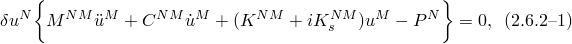其中适用以下定义：

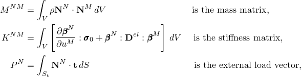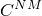是黏性阻尼矩阵，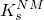是表示结构阻尼矩阵的虚部刚度比例阻尼矩阵，和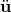是速度和加速度，是材料的密度，是基态中的应力，是表面牵引力，是材料的弹性矩阵。我们假设刚度和阻尼都是频率相关的。

对于声学介质，适用类似的方程（见"耦合声学-结构介质分析"第2.9.1节）：

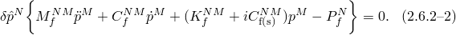该声学案例中的"结构阻尼"算子定义为将结构阻尼扩展到声学矩阵：

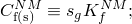即，声学刚度矩阵乘以常数。声学"结构阻尼"算子继承由体积 drag 引起的声学刚度矩阵的频率依赖性。

在基于子空间的稳态动力学分析之前的特征频率步骤使用

提取了无阻尼系统的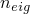个特征模态，其中是弧度/时间的特征频率。该过程假设阻尼系统的复位移变化可以写为

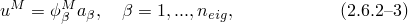其中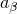是复模态振幅。将[方程2.6.2-3](02s06a34.md)代入[方程2.6.2-1](02s06a34.md)并左乘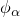，提供了投影到子空间上的运动方程：

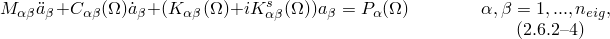其中

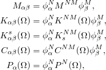且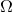是激励频率。由于特征模态在平衡方程中不与阻尼和刚度矩阵正交（由于频率依赖特性），投影的阻尼和刚度矩阵不是对角的。

对于谐波激励和响应，我们可以写为

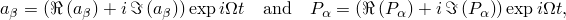其中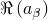和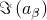是模态振幅的实部和虚部，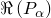和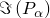是投影到子空间后施加在结构上的力的振幅的实部和虚部。将[方程2.6.2-4](02s06a34.md)中谐波激励和响应的表达式代入，并将结果写为矩阵形式，得到

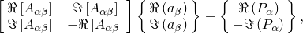其中

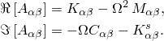

求解复模态振幅的实部和虚部，并使用[方程2.6.2-3](02s06a34.md)计算节点位移的实部和虚部。

对于耦合声学-结构分析，开发过程类似。然而，在这种情况下，"阻尼"矩阵还包含体积 drag、阻抗边界、辐射边界和流固耦合效应。虽然耦合声学-结构特征值提取问题的原始公式是非对称的，但方程被重新排列，使得流固耦合效应被保留而不使问题非对称。结果得到的模态和频率与耦合、无阻尼的流固系统相关联。基于子空间的稳态动力学过程将完整的、耦合的、有阻尼的声学-结构方程组投影到耦合流固模态所跨越的空间上。

对于纯声学分析，开发过程与纯固体情况非常相似。声学材料阻尼等效的体积 drag 以类似于固体材料阻尼效应的方式处理。
### 输出

作为输出，Abaqus/Standard在请求的频率下为所有单元和节点变量提供振幅和相位。所有振幅参考必须在频域中给出。
### 参考

### 参考

"Abaqus Analysis User's Guide"第6.3.9节"基于子空间的稳态动力学分析"
