# 2.7.1 稳态传输分析

### 2.7.1 稳态传输分析

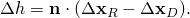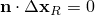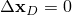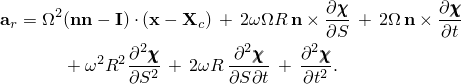**产品：** Abaqus/Standard

Abaqus/Standard提供了一种专门的分析能力来模拟圆柱形变形体沿平坦刚性表面滚动的稳态行为。该能力使用参考系来消除问题的显式时间依赖性，从而可以执行纯空间依赖分析。对于以恒定地面速度和恒定角滚动速度行驶的轴对称体，在以地面速度移动但不随身体在滚动运动中自旋的参考系中，稳态是可能的。这种参考系的选择允许有限元网格保持静止，因此只有接触区域中的身体部分需要精细网格划分。
### 稳态滚动的运动学

滚动问题的运动学用随身体地面运动一起移动的坐标架来描述。在这个移动参考系中，刚体旋转以空间或欧拉方式描述，变形以材料或拉格朗日方式描述。正是这种运动学描述将稳态移动接触场问题转换为纯空间依赖的模拟。

我们考虑如图2.7.1-1所示的情况，其中身体的地面速度以恒定转向运动描述。

图2.7.1-1 恒定转向运动。

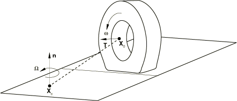身体以恒定角滚动速度绕刚性车轴旋转，，而车轴又以恒定角速度绕固定转向轴（通过点的运动由刚体滚动旋转到位置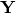组成，描述为

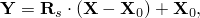然后变形到点，随后绕进行转向旋转（或进动）到位置，使得

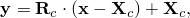其中是与旋转向量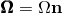相关的斜对称矩阵。类似地，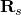是自旋旋转矩阵，定义为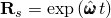，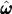是与旋转向量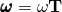相关的斜对称矩阵。粒子的速度变为

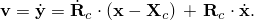为了描述身体的变形，我们定义映射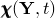，它给出时间*t*时点作为其时间*t*时位置函数的位置，所以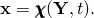因此

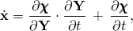其中

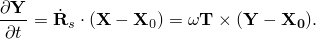注意到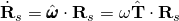，并引入周向方向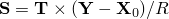，其中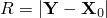是参考体上一点的半径，参考体的速度可以写为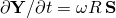，所以

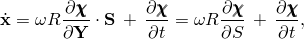其中*S*是沿流线的距离测量坐标。使用此结果，连同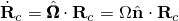，粒子的速度可以写为

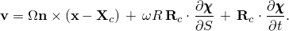加速度通过二次微分和一些操作获得：

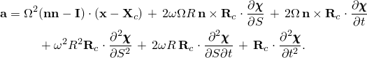

为了获得在身体相关参考系中的速度和加速度表达式，我们使用变换

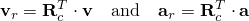从而得到

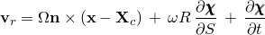和

对于稳态条件，这些表达式简化为

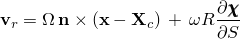和

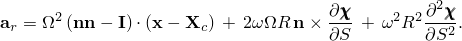

最后一个表达式中的第一项可以被识别为由于绕旋转而产生的离心力的加速度。注意到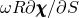是速度的度量，第二项可以被识别为产生科里奥利力的加速度。最后一项结合了由于绕旋转而产生的科里奥利和离心力。当变形沿周向均匀时，这种科里奥利效应消失，因此加速度仅产生离心力。

身体中心（必须位于轴线的位置，但保持相同。在这种情况下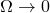，因此在极限情况下

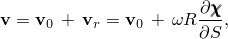

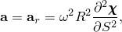这对应于直线滚动。

图2.7.1-2 直线滚动。

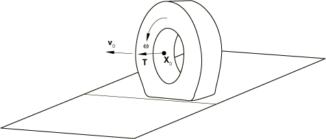
### 惯性

来自达朗贝尔力的虚功贡献为

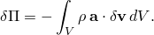使用散度定理，虚功贡献变为

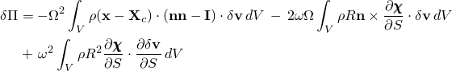虚功率变为

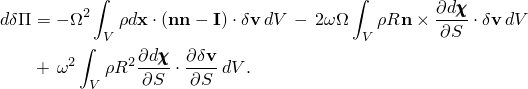对于纯直线滚动，每个表达式中只需考虑最后一项。
### 关于非线性基态进行谐波分析

为了对滚动轮胎进行稳态动力学或频率分析，有必要将虚功表达式关于基态线性化。假设形式的谐波解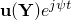，可以表明，对于直线滚动的情况，线性化虚功率为

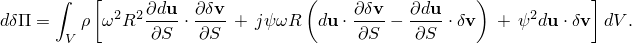第一项是由于绕车轴自转引起的荷载刚度贡献。第二项是虚部反对称陀螺算子。第三项是标准质量算子。
### 接触条件

为了获得接触条件，我们从上一节推导的速度表达式开始。对于变形体表面上的点

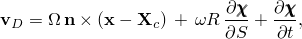其中是转向轴（必须垂直于刚性表面），是绕的转向角速度。假设基础（或刚性表面）上一点的速度为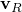，相对运动变为

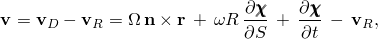其中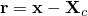。这个方程可以分解为法向和切向分量。渗透率为

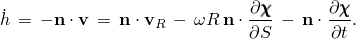对于任何接触点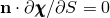；因此，

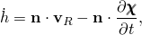其增量形式简化为标准接触条件

对于稳态条件，和。

类似地，滑移率为

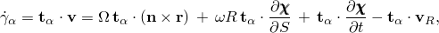其中是接触表面上两个正交的单位切向量，所以。对于稳态条件，，所以

的变化给出

对于直线滚动，我们可以用替换，从而得到

和

为了完成公式，必须建立摩擦应力与滑移速度之间的关系。Abaqus为稳态滚动提供了库仑摩擦定律。该定律假设如果摩擦应力

等于临界应力，则发生滑移，其中和是沿的剪切应力，是摩擦系数，*p*是接触压力。另一方面，当时，不发生相对运动。在Abaqus中，无相对运动条件通过刚性黏性行为近似

其中是切向滑移速度，是"黏附黏度"，由关系式得出

允许的黏性滑移速度定义为周向速度的一个分数

其中是用户定义的滑移容差。

这些表达式对滑移的标准虚功贡献，

和滑移的虚功率，

### 参考

### 参考

"Abaqus Analysis User's Guide"第6.4.1节"稳态传输分析"
