# 2.8.1 多孔介质的有效应力原理

### 2.8.1 多孔介质的有效应力原理

**产品：** Abaqus/Standard

多孔介质在Abaqus/Standard中通过常规方法建模，即将介质视为多相材料并采用有效应力原理来描述其行为。多孔介质建模考虑了介质中两种流体的存在。一种是"润湿液体"，假设是相对（但不完全）不可压缩的。另一种通常是气体，相对可压缩。这种系统的例子是含有地下水的土壤。当介质部分饱和时，两种流体都存在于一点；当完全饱和时，孔隙完全被润湿液体填充。基本体积由固体颗粒体积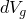、孔隙体积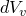和润湿液体体积组成，如果受到驱动，润湿液体可以自由流过介质。在某些系统中（例如，含有吸收润湿液体并在过程中膨胀的颗粒的系统），也可能存在相当体积的被困润湿液体。

作用于一点的 total 应力假设由润湿液体中的平均压力应力（称为"润湿液体压力"）、另一种流体中的平均压力应力和由以下定义的"有效应力"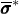组成：

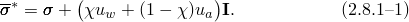应力分量存储为拉应力为正，但和是压力应力值。这解释了这个方程中的符号。是一个取决于饱和度和液体/固体系统表面张力的因子（[Wu，1976](07s01a01-References.md)）。当介质完全饱和时，为1.0，在 unsaturated 系统中介于0.0和1.0之间，其值取决于介质的饱和度。关于其对饱和度的依赖性的实验证据非常稀疏；由于缺乏这些数据，我们简单地假设等于介质的饱和度（我们稍后在本节中定义饱和度）。

我们通过假设施加到非润湿流体的压力在所建模的整个域中是恒定的，不随时间变化，并且足够小以至于其值可以忽略来简化模型。这要求非润湿流体能够足够自由地通过介质扩散，使得其压力永远不会超过在该过程边界处施加在该流体上的压力，该压力在整个建模过程中保持恒定。最常应用此简化的情况是对气体流动相当可渗透的多孔介质，其中非润湿流体是暴露在大气压下的空气。所建模区域的尺寸不能太大，以至于大气压力的重力梯度导致空气压力发生显著变化，并且不能有提供空气压力瞬态变化的外部事件。此假设允许从方程中移除，条件是相应的荷载项（例如，介质边界上的大气压力）也从平衡方程中省略，并且足够小，以至于其对介质变形的影响不重要（或者变形从状态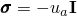开始测量）。此简化将有效应力原理还原为

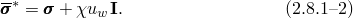

当系统中存在被困流体时，我们假设有效应力由两个分量组成，根据被困流体和多孔材料的相对体积进行加权：

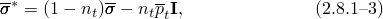其中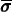是多孔材料骨架中的有效应力，是 trapped fluid 体积与总体积之比，详见本节下文。

我们假设多孔介质的本构响应由液体和土颗粒的简单体弹性关系以及土骨架的本构理论组成，由此定义为应变历史和土壤温度的函数：

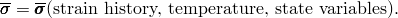适用于孔隙材料（如土壤）的本构模型在第4章"机械本构理论"中描述。

"多孔介质分析"第2.8节的其余部分讨论了多孔介质的平衡方程（"多孔介质离散平衡方程"第2.8.2节）、纳入上述有效应力原理的基本本构假设（"多孔介质中的本构行为"第2.8.3节）以及控制润湿液体流动的连续性方程（"多孔介质中润湿液相的连续性方程"第2.8.4节）。Newton法通常用于求解隐式时间积分过程的主导方程。有时还需要分析关于变形状态的小线性化摄动（例如，用于振动研究）。由于这些原因，发展中包括了双相模型Jacobian矩阵形式的定义。

作为初步，定义孔隙率、孔隙比和饱和度。介质的孔隙率*n*是孔隙体积与总体积之比：

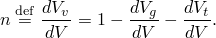使用上标表示某个方便参考配置中的值，允许将当前配置中的孔隙率表示为

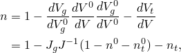使得

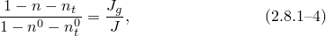其中

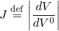是当前配置中介质体积与参考配置中体积之比，

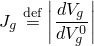是颗粒当前体积与参考体积之比，

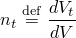是每单位当前体积的被困润湿液体体积。

Abaqus通常使用孔隙比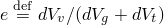而不是孔隙率。转换关系容易推导为

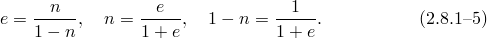

饱和度*s*是自由（未被困）润湿液体体积与孔隙体积之比：

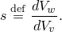

一点处自由润湿液体的体积比为

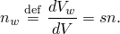

每单位当前体积的润湿液体总体积（自由液体加被困液体）为

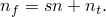
### 参考文献

### 参考文献

"Abaqus Analysis User's Guide"第6.8.1节"耦合孔隙流体扩散与应力分析"

"Abaqus Analysis User's Guide"第6.8.2节"地静应力状态"
