# 2.8.2 多孔介质离散平衡方程

### 2.8.2 多孔介质离散平衡方程

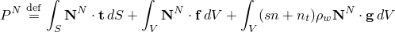**产品：** Abaqus/Standard

平衡通过在时间*t*的当前配置中写出所考虑体积的虚功原理来表达：

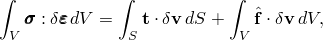其中是虚速度场，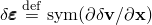是虚变形率，是真实（Cauchy）应力，是单位面积的表面牵引力，是单位体积的体力。

对于我们的系统，通常包括润湿液体的重量，

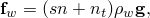其中是润湿液体的密度，是重力加速度，我们假设它是恒定的且方向不变（例如，因此formulation不能直接应用于离心机实验，除非机器中的模型足够小，以至于可以被视为恒定）。为简单起见，我们显式地考虑这种荷载，使得中的任何其他重力项仅与干多孔介质的重量相关。因此，我们将虚功方程写为

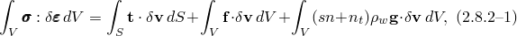其中是除润湿液体重量外的所有体力。

在有限元模型中，平衡通过引入插值函数近似为有限组方程。用于表示这种离散的符号是那些具有大写上标的量（例如，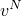)，它们表示节点变量，并对上标采用求和约定。插值假设基于材料骨架中的材料坐标（"拉格朗日"formulation）。

为简单起见，在本节中我们仅考虑没有问题内部约束（如不可压缩性）的情况，离散完全通过近似平衡来完成：这导致位移（或刚度）方法。Abaqus/Standard提供了用于多孔介质分析的混合公式（"混合"）单元，但对这些公式的考虑在此阶段不需要任何重要的扩展。

虚速度场通过以下方式插值

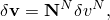其中是关于材料坐标定义的插值函数，。

虚变形率插值为

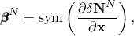其中，在最简单的情况下，

尽管在Abaqus的一些单元中使用了更一般的形式。

因此，虚功方程被离散为

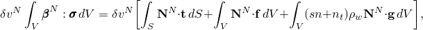其中假设是独立的。

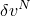方程左边与共轭的项随后称为内力数组，：

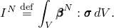

同样，外力数组取自右边：

（包括任何达朗贝尔力）。

依次选择每个非零，将平衡表达为内外力的平衡：

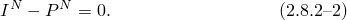

这些离散平衡方程，连同"多孔介质中润湿液相的连续性方程"第2.8.4节中讨论的连续性方程，定义了多孔介质的状态。当使用隐式积分时，平衡方程在时间增量结束时写出，对于除最简单情况外的所有情况，它们是非线性的。Newton法通常用于求解它们。此外，系统的 small linear perturbations 有时是令人关注的（例如，小振动问题）。这些考虑意味着需要系统的Jacobian矩阵，它定义方程中每项相对于离散问题基本变量的变化，对于这种情况，基本变量是节点位置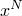（或等价地，位移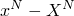）和节点润湿液体压力值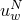。符号上我们将项*f*的变化写为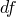，意思是

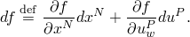

从离散平衡的变化，[方程2.8.2-2](02s08a37-Discretized-equilibrium-statement-for-a-.md)，项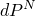产生质量矩阵（对于达朗贝尔力）和Jacobian中的"荷载刚度矩阵"。荷载刚度矩阵在第3章"单元"和第6章"荷载与约束"中针对特定荷载类型进行了讨论。与润湿液体重量相关的荷载刚度项为

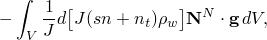其中

是当前配置中体积与参考配置中体积之比。

项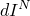是

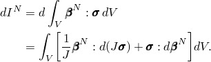

第一项包括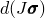，这是由节点位置和孔隙液体压力值的变化引起的应力变化。在连续体意义上（即，在求解变量的空间离散化之前），这项由有效应力原理和材料使用的本构假设定义，并在下面详细讨论。将空间离散化引入第二项提供了对初始应力矩阵的贡献。

由于有效应力通常存储为与空间方向相关的分量，因此在增量过程中材料的旋转必须包含在formulation中。这个问题在"变形率与应变增量"第1.4.3节、"应力率"第1.5.3节、"状态存储"第1.5.4节和"固体单元公式"第3.2.2节中详细讨论。为了当前发展的目的，我们假设应力的变化为

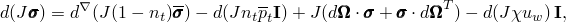其中是有效应力的变化，与材料中的本构响应相关（即，由应变或其他状态变量的变化引起），是材料的自旋。使用此假设，来自多孔介质中应力的Jacobian贡献为

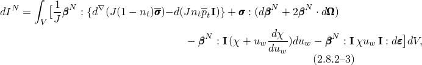其中是应变率（"变形率"），使得

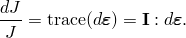
### 参考文献

### 参考文献

"Abaqus Analysis User's Guide"第6.8.1节"耦合孔隙流体扩散与应力分析"

"Abaqus Analysis User's Guide"第6.8.2节"地静应力状态"
