# 2.8.3 多孔介质中的本构行为

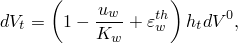### 2.8.3 多孔介质中的本构行为

**产品：** Abaqus/Standard

Abaqus/Standard中的多孔介质被认为是固体物质、含有液体和气体的孔隙以及附着在固体物质上的被困液体的混合物。多孔介质的力学行为包括液体和固体物质对局部压力的响应，以及整体材料对有效应力的响应。本节讨论对这些响应的假设。
### 液体响应

对于系统中的液体（孔隙中的自由液体和被困液体），我们假设

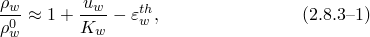其中液体的密度，液体在参考配置中的密度，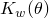液体的体积模量，

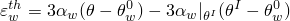是由温度变化引起的液体体积膨胀。这里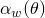液体的热膨胀系数，当前温度，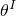介质中该点的初始温度，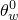热膨胀的参考温度。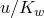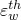被假设为很小。
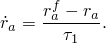### 颗粒响应
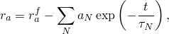
多孔介质中的固体物质假设在压力下具有局部力学响应

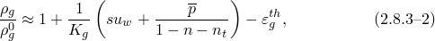其中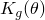固体物质的体积模量，*s*是润湿流体中的饱和度，

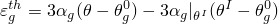是其体积热应变。这里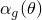固体物质的热膨胀系数，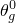此膨胀的参考温度。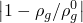假设为很小。

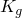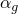重要的是将分为固体颗粒材料的属性。整个多孔介质将表现出比指示的更软（通常不可恢复）的整体体积行为，并且还将显示不同的热膨胀。这些效应部分是结构性的，由介质由部分接触的不规则颗粒组成引起。它们也可能是由系统仅部分饱和引起的，孔隙中含有相对可压缩的气体和相对不可压缩的液体。
### 液体捕获

液体捕获与吸收液体并膨胀成"凝胶"的特定材料相关。这种行为的简单模型基于将该凝胶理想化为等半径单个球形颗粒的体积。[Tanaka和Fillmore（1979）](07s01a01-References.md)表明，当这种材料的单个球体完全暴露于液体时，其半径变化可以建模为

其中当趋近的完全膨胀半径，*N*、材料参数。Tanaka和Fillmore还表明，级数中的第一项占主导地位，因此模型可以简化为

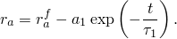这提供了速率形式
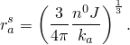

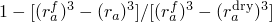当凝胶颗粒仅部分暴露于液体时（在 unsaturated 系统中），可以合理地假设膨胀速率将根据饱和度水平而降低。此外，我们假设凝胶仅在周围介质的饱和度超过凝胶的有效饱和度膨胀，其中完全干燥的凝胶颗粒的半径。我们将这些组合成一个简单的线性效应：

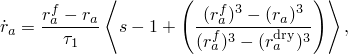其中如果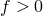则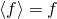否则为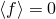

堆积密度和膨胀可能导致凝胶颗粒接触。在这种情况下，可用于吸收和捕获液体的表面积减少，直到如果凝胶颗粒占据除固体材料外的整个体积，液体捕获必须完全停止。每单位参考体积有凝胶颗粒，在它们必须接触之前（以面心立方排列）凝胶颗粒可以达到的最大半径为
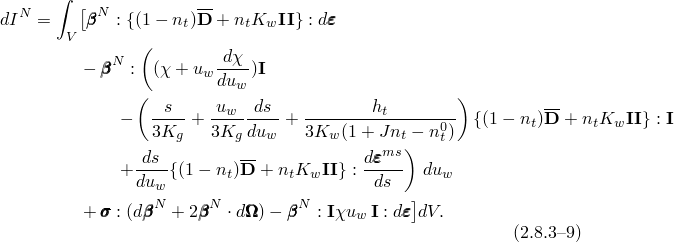
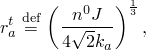当有效凝胶半径为

时，体积完全被凝胶和固体物质占据。因此，凝胶膨胀行为进一步修改为

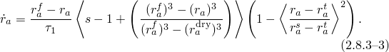因此，在无应力介质中，被困液体体积假设为

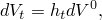其中

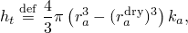其中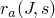[方程2.8.3-3](02s08a38-Constitutive-behavior-in-a-porous-medium.md)的积分定义。这个被困液体可以被压力压缩，因此，当多孔介质处于应力下时，我们假设

因此

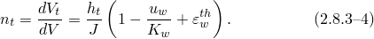将其与[方程2.8.3-1](02s08a38-Constitutive-behavior-in-a-porous-medium.md)结合并忽略与1相比很小的项，然后提供

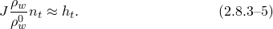

我们假设，在初始状态下，凝胶的有效饱和度与周围介质的饱和度相同：

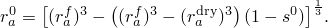

含有被困流体的凝胶的本构行为由弹性体积关系给出

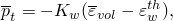其中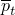凝胶流体中的平均压力应力，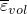其体积有效应变。
### 有效应变

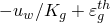从[方程2.8.3-2](02s08a38-Constitutive-behavior-in-a-porous-medium.md)，我们看到体积应变示由作用于多孔介质中固体物质上的孔隙压力和该固体物质的热膨胀引起的总体积应变的一部分。此外，介质中液体的捕获可能导致额外的体积变化比：

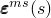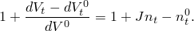最后，饱和驱动 moisture swelling strain，表示在部分饱和流动条件下固体骨架的体积膨胀。这个 moisture swelling 可以是各向同性或各向异性的。介质中应变的其余部分，

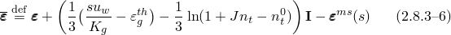假定改变介质中有效应力的应变。也就是说，我们假设

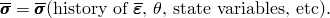这种特定类型的本构模型在第4章"机械本构理论"中讨论。从此假设，并使用[方程2.8.3-5](02s08a38-Constitutive-behavior-in-a-porous-medium.md)，我们可以将有效应力的Jaumann率写为运动学和孔隙液体压力变量变化率的函数为

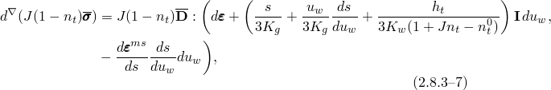其中第4章"机械本构理论"中为每个特定模型定义。

同样，对于被困在凝胶中的流体的有效压力应力，

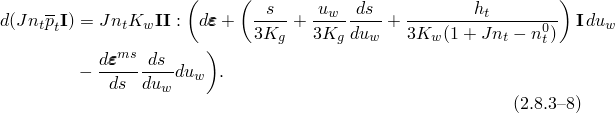

然后，从[方程2.8.2-3](02s08a37-Discretized-equilibrium-statement-for-a-.md)，

### 参考

### 参考

"Abaqus Analysis User's Guide"第26.6节"孔隙流体流动特性"
