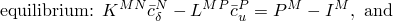
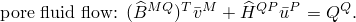
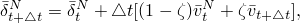
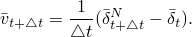
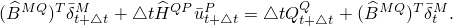
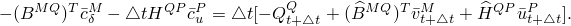
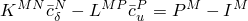
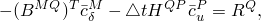
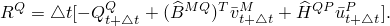

# 2.8.5 耦合扩散/变形求解策略

### 2.8.5 耦合扩散/变形求解策略

**产品：** Abaqus/Standard

孔隙流体扩散/变形的主导方程为

求解这些耦合方程有两种常见方法。一种方法是先求解一组方程，然后使用获得的结果求解第二组方程。然后这些结果被反馈到第一组方程中，以查看（如果有的话）结果中产生了什么变化。这个过程继续进行，直到后续迭代产生的变化可以忽略。这是耦合方程组求解的所谓交错方法。第二种方法是直接求解耦合系统。这种直接方法用于Abaqus/Standard，因为它即使在严重非线性情况下也具有快速收敛的优势。

我们首先在孔隙流体流动方程中引入时间积分算子。选择的算子是简单的单步方法：

其中。实际上，为确保数值稳定性，我们选择（向后差分）使得

使用这个算子，时间处的孔隙流体流动方程可以重写为

使用Newton线性化，流动方程变为

然后要求解的耦合方程组为

和

其中

这些方程构成了Abaqus/Standard中耦合流动变形求解时间步迭代求解的基础。它们通常是非对称的。缺乏对称性可能是由于多种效应：几何变化、渗透率对孔隙比的依赖性、部分饱和情况下饱和度的变化，以及总孔隙压力分析中流体重力荷载项的包含。耦合问题的稳态版本也是非对称的。

Abaqus/Standard在所有稳态或部分饱和耦合分析中默认使用非对称方程求解器；在其他情况下，默认使用对称求解器。在后一种情况下，如果几何变化或非线性渗透率的效应显著，或者如果执行了总孔隙压力（与 excess pore pressure 相比）分析，建议用户激活非对称求解器。
### 参考

### 参考

"Abaqus Analysis User's Guide"第6.8.1节"耦合孔隙流体扩散与应力分析"
