# 2.9.1 耦合声学-结构介质分析

### 2.9.1 耦合声学-结构介质分析

**产品：** Abaqus/Standard  Abaqus/Explicit

Abaqus提供了一组单元，用于建模承受小压力变化并具有将这些声学单元耦合到结构模型的界面条件的流体介质。这些单元用于建模涉及流体和固体介质之间动态相互作用的各种现象。

可以对耦合声学-结构系统执行稳态谐波（线性）响应分析，例如研究车辆内的噪音水平。稳态过程基于直接求解耦合复谐波方程，如"直接稳态动力学分析"第2.6.1节所述；或基于模态的过程，如"稳态线性动力学分析"第2.5.7节所述；或基于子空间的过程，如"基于子空间的稳态动力学分析"第2.6.2节所述。也可使用基于模态的线性瞬态动力学分析，如"模态动力学分析"第2.5.5节所述。

声学流体单元也可以与非线性响应分析（隐式或显式直接积分）过程结合使用：这些结果是否有用取决于流体中 小压力变化假设的适用性。在耦合流体-固体问题中，这种线性状态下的流体力量通常足够大，以至于需要考虑结构的非线性响应。例如，承受爆炸引起的入射波载荷的船舶可能经历塑性变形，或者内部机械的大运动可能发生。

Abaqus中的声学介质可能具有速度依赖的耗散，由流体粘度或 resistive porous matrix 材料内的流动引起。此外，还为声学介质提供了相当一般的边界条件，包括阻抗或"反应"边界。

声学介质表面可能的条件为：

在边界节点上规定压力（自由度8）。（边界条件可用于在模型中任何节点上指定压力。）

通过使用边界节点自由度8上的集中载荷，规定声学介质每单位密度的压力内法向导数。如果施加的载荷具有零大小（即如果没有集中载荷或其他边界条件存在），压力的内法向导数（和法向流体粒子加速度）为零，这意味着声学介质的默认边界条件是刚性固定壁（Neumann条件）。

声学-结构耦合通过使用基于表面的耦合过程（见"基于表面的声学-结构介质相互作用"第5.2.7节）或通过在声学介质和结构之间的界面上放置ASI耦合单元来定义。

阻抗条件，表示声学介质与刚性壁或振动结构之间的吸收边界，或表示向无限外部的辐射。

入射波载荷，表示由指定波的到达引起的声学介质每单位密度的压力内法向导数。这种载荷情况的公式在"入射膨胀波场的载荷"第6.3.1节中讨论。它适用于涉及爆炸载荷和声波散射问题。

在稳态响应分析中，流动阻力和吸收边界的特性可能是频率的函数，但在直接积分过程中被视为常数。本节定义这些单元中使用的公式。
### 声学方程

对于具有速度依赖动量损失的可压缩、绝热流体的小运动，平衡方程取为

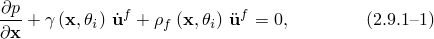其中*p*是流体中的过量压力（超过任何静压力的压力）；是流体粒子的空间位置；是流体粒子速度；是流体粒子加速度；是流体密度；是"体积 drag"（每单位体积每单位速度的力）；是*i*个独立场变量，如温度、空气湿度或水的盐度，和可能依赖于这些变量（见"Abaqus Analysis User's Guide"第26.3.1节"声学介质"）。达朗贝尔项被写成没有对流的假设，即流体没有稳态流动。这通常被认为对于高达马赫0.1的稳态流体速度足够准确。

流体的本构行为被假设为无粘、线性和可压缩的，所以

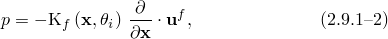其中是流体的体积模量。

对于能够发生空化的声学介质，绝对压力（静压力和动态过量压力的和）不能降至指定的空化极限以下。当绝对压力降至该极限值时，假设流体经历自由膨胀，而动态压力没有相应的下降。一旦在空化期间发生的自由膨胀被充分逆转以将体积应变降至空化极限处的水平，压力就会在声学介质中重建。对于能够发生空化的声学介质的本构行为可以表述为

其中伪压力，体积应变的度量，定义为

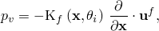其中是流体空化极限，是初始声学静压力。对于经历空化的非线性声学介质，使用总波公式。这个公式与下面介绍的散射波公式非常相似，只是定义为体积模量与压缩体积应变乘积的伪压力扮演着材料状态变量的角色，而不是声学过量压力。根据空化条件，可以从这个伪压力容易地获得声学过量压力。
### 声学分析中的物理边界条件

声场强烈依赖于声学介质边界上的条件。服从[方程2.9.1-1](02s09a41.md)和[方程2.9.1-2](02s09a41.md)的声学介质区域的边界可以分为以下条件被施加的子区域*S*：

| ， | 其中规定了声学压力*p*的值。 |
| --- | --- |
| ， | 其中我们规定了声学压力的法向导数。这个条件也规定了流体粒子的运动，可用于建模声源、刚性壁（隔板）、入射波场和对称平面。 |
| ， | "反应"声学边界，其中声学压力与其法向导数之间存在规定的线性关系。有相当多的物理效应可以用这种方式建模：特别是，其自身运动不重要的薄层材料，放置在声学介质和刚性隔板之间。例如，粘合在地毯上的地毯或汽车内部吸收和反射声波。这种薄层材料向声学介质提供"反应表面"或阻抗边界条件。这种类型的边界条件也称为施加阻抗、导纳或"Dirichlet到Neumann映射"。 |
| ， | "辐射"声学边界。通常，声学介质从感兴趣区域延伸足够远，以至于它们可以被建模为无限范围。在这种情况下，方便的做法是截断计算区域并施加边界条件以模拟完全向外传播的波从计算区域。 |
| ， | 其中声学介质的运动直接与固体的运动耦合。在这样的声学-结构边界上，声学和结构介质在边界法向具有相同的位移，但切向运动是解耦的。 |
| ， | 声学-结构边界，其中位移是线性耦合的，但由于存在柔顺或反应中间层，不一定相同。这个中间层在声学流体和固体结构之间的相对法向速度与声学压力之间引起阻抗条件。它类似于介于流体和固体颗粒之间的弹簧和黏壶。正如在Abaqus中实现的，阻抗边界条件表面不模拟与反应衬里相关的任何质量；如果存在这样的质量，它应该被纳入结构的边界。 |
| ， | 可能具有不同材料特性的声学流体之间的边界。在这样的界面上，位移连续性要求单位质量上流体粒子的法向力相等。这个量是Abaqus中的自然边界牵引力，因此在单元组装期间自动强制执行。这在一维分析（即管道或导管）中也是真实的，其中相关的声学特性包括单元的横截面积。因此，流体-流体边界在Abaqus中不需要特殊处理。 |
### 直接积分瞬态动力学的公式

在Abaqus中，有限元公式在直接积分瞬态和稳态或模态分析中略有不同，主要在于体积 drag 损失参数的处理和本构参数的空间变化。为了导出用于隐式积分的对称常微分方程组，在瞬态情况下做了一些在稳态中不需要的近似。对于线性瞬态动力学分析，可以使用模态过程，效率更高。

为了导出用于直接积分瞬态分析的双曲线偏微分方程，我们将[方程2.9.1-1](02s09a41.md)除以，取其关于的梯度，忽略的梯度，并将结果与[方程2.9.1-2](02s09a41.md)的时间导数结合，得到以流体压力表示的流体运动方程：

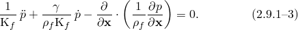假设的梯度很小，这在不连续的地方（例如，在具有不同值的两个单元之间的边界上）会被违反。
### 变分陈述

运动方程的等效弱形式，[方程2.9.1-3](02s09a41.md)，通过引入任意变分场并在整个流体上积分获得：

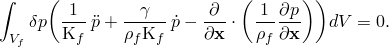Green定理允许这被重写为

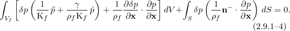假设*p*在上被规定，平衡方程，[方程2.9.1-1](02s09a41.md)，在边界的其余部分上用于将压力梯度与边界运动相关联：

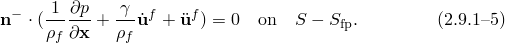使用这个方程，项从[方程2.9.1-4](02s09a41.md)中消除，产生

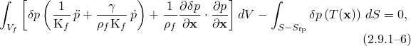其中，为方便起见，引入了边界"牵引力"项

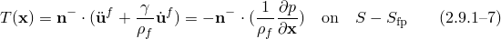

除了上施加的压力外，所有上述其他边界条件都可以用表述。这个项的维度是加速度；在没有体积 drag 的情况下，这个边界牵引力等于声学介质粒子的内加速度：

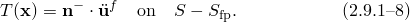当存在体积 drag 时，边界牵引力是压力场的法向导数除以真实质量密度：每单位流体质量的力。因此，当瞬态声学模型中存在体积 drag 时，一个单位的产生较低的局部体积加速度，由于 drag 损失。

在直接积分瞬态动力学中，我们按如下方式强制执行声学边界条件：
| 在上， | *p*被规定且。 |
| --- | --- |
| 在上， | 其中我们规定每单位密度的声学压力的法向导数：在介质中没有体积 drag 的情况下，这强制执行流体粒子加速度的值。。一个施加的可用于建模例如激发流体的刚性板或体的振荡。这个边界条件的一个特例是，它表示刚性固定边界。如上所述，如果介质具有非零体积 drag，在边界上施加的一个单位将导致相对较低的施加粒子加速度。入射波场在流体边界上建模为在空间和时间上变化的，对应于波到达边界的效果。见"入射膨胀波场的载荷"第6.3.1节。 |
| 在上， | 声学介质和刚性隔板之间的反应边界，我们应用将声学介质速度与压力和压力变化率相关联的条件：其中和是用户在边界上规定的参数。这个方程是导纳关系的形式；阻抗表达式就是它的倒数。材料层，以导纳形式，作为弹簧和黏壶串联分布，置于声学介质和刚性壁之间。弹簧和黏壶参数分别是和；它们是声学边界每单位面积的。使用这个流体速度的定义，变分陈述中的边界牵引力变为 |
| 在上， | 辐射边界，我们通过规定相应的阻抗来施加辐射边界条件：使用方程2.9.1-47和方程2.9.1-48定义的导纳参数，下面给出。 |
| 在上， | 声学-结构界面，我们通过将流体和固体的位移等价来施加声学-结构界面条件，强制执行条件其中是结构的位移。在存在体积 drag 的情况下，紧接着声学边界牵引力耦合流体到固体的是在Abaqus/Standard中，瞬态耦合问题的公式将由于项的存在而变得非对称。在绝大多数实际应用中，与流体惯性相关的声学牵引力相比，与体积 drag 相关的声学牵引力很小，因此在瞬态分析中忽略了这个项： |
| 在上， | 混合阻抗边界和声学-结构边界，我们应用将声学介质和结构之间的相对外法向速度与压力和压力变化率相关联的条件：这个相对法向速度表示中间层的压缩（或拉伸）速率。将这个方程应用于的定义，我们得到瞬态情况下的这的是对于和的定义之和。在稳态情况下，体积 drag 对结构位移项在声学牵引力中的影响包括在内： |

这些边界项的定义被引入[方程2.9.1-6](02s09a41.md)中，给出声学介质的最终变分陈述（这是结构虚功陈述的等效）：

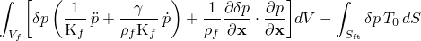

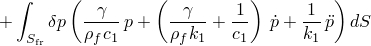

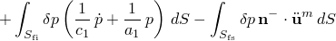

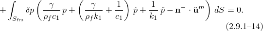结构行为由虚功方程定义，

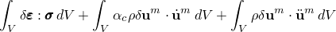

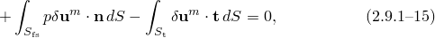其中是结构中一点的应力，*p*是作用在流体-结构界面的压力，是结构的外法线，是材料的密度，是质量比例阻尼因子（结构Rayleigh阻尼假设的一部分），是结构中一点的加速度，是施加在结构上的表面牵引力，是变分位移场，是与兼容的应变变分。为简单起见，在这个方程中，除了流体压力和表面牵引力之外的所有其他荷载项都被忽略了：它们以通常的方式施加。
### 离散有限元方程

[方程2.9.1-14](02s09a41.md)和[方程2.9.1-15](02s09a41.md)定义了耦合场和*p*的变分问题。问题通过引入插值函数离散化：在流体中，直到压力节点数，在结构中，直到位移自由度数。在这些和下面的方程中，我们假设对指代离散模型自由度的上标求和。我们还使用上标、来指代流体中的压力自由度，、来指代结构中的位移自由度。我们对结构系统使用Galerkin方法；变分场与位移具有相同的形式：。对于流体，我们使用，但随后进行Petrov-Galerkin替换

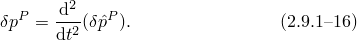 新函数使得从求和[方程2.9.1-14](02s09a41.md)和[方程2.9.1-15](02s09a41.md)获得的单个变分方程在维度上一致：

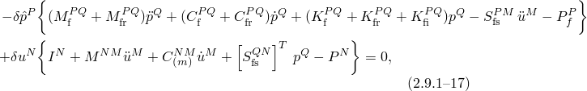其中，为简单起见，我们引入了以下定义：

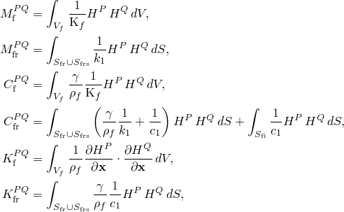

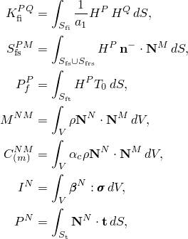其中是应变插值器。这个方程定义了离散模型。我们看到与体积 drag 相关的项是"类质量"的；即，与流体单元质量矩阵成正比。

项是声学自由度的节点右侧项，或施加在这个自由度上的"力"。这项通过将声学介质每单位密度的压力法向导数在边界节点支配的表面积上积分获得。

在耦合系统中，如果结构上的流体载荷————相对于结构的其余力非常小，则可以"顺序耦合"的方式求解。结构方程可以在忽略项的情况下求解；即，在没有流体耦合的分析中。随后，可以求解流体方程，作为边界条件施加。这个两步分析成本较低，对于例如空气中的金属结构等系统是有利的。
### 时间积分

方程使用标准隐式（Abaqus/Standard）和显式（Abaqus/Explicit）动态积分选项进行时间积分。从隐式积分算子，我们获得解变量（这里表示为及其时间导数变分之间的关系：

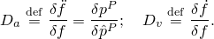自由度的演化方程可以为隐式情况写为

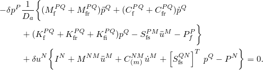这个方程的线性化是

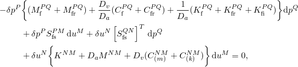其中和是从Newton迭代获得的解的修正，是结构刚度矩阵，是结构阻尼矩阵。这些方程是对称的，如果组成刚度、阻尼和质量矩阵是对称的。

对于显式积分，流体质量矩阵以类似于结构质量处理的方式对角化。应用于耦合方程组的显式中心差分程序在"显式动力学分析"第2.4.5节中描述。
### 直接积分瞬态公式的附加近似总结

如上所述，在存在体积 drag 的情况下推导对称常微分方程需要在任何有限元方法中固有的近似之外做一些额外的近似。首先，忽略了流体中体积 drag 与质量密度之比的空间梯度。这在有损耗的不均匀声学介质中可能很重要。其次，为了保持对称性，忽略了体积 drag 对流体-固体边界项的影响。最后，体积 drag 对辐射边界条件的影响是近似的。如果在分析中预期这些任何效应是显著的，用户应该意识到获得的结果是近似的。
### 使用节点自由度的稳态响应公式

如果体积 drag 显著，则直接求解稳态动力学过程优于瞬态公式。该公式直接使用固体和声学区域中的节点自由度来形成一个大线性方程组，在单个频率下定义耦合结构-声学力学。如果体积 drag 效应不显著，由于其效率，优选基于模态的过程（见下文）。

所有模型自由度和荷载都假设在角频率下谐波变化，所以我们可以写

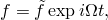其中是变量的常数复振幅。因此，

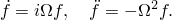我们从平衡方程开始

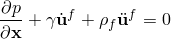并使用谐波时间导数关系获得

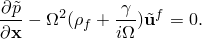我们定义复密度，，为

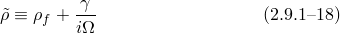因此，写为

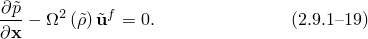平衡方程现在呈密度为复数且声学介质速度不进入的形式。我们将这个方程除以，获得

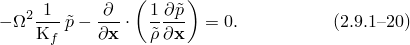我们没有使用瞬态动力学公式中所做的假设，即的空间梯度很小。
### 变分陈述

变分陈述的发展与瞬态动力学的情况平行，就好像体积 drag 不存在且密度为复数一样。变分陈述是

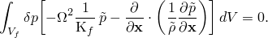通过分部积分，我们有

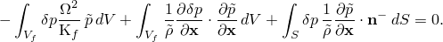

在稳态中，边界牵引力定义为

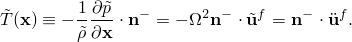这个表达式不是上面为瞬态情况定义的边界牵引力的傅里叶变换。稳态定义基于复密度，并以这样的方式包含体积 drag 效应，即它始终等于流体粒子的加速度。由于这个牵引力定义，一些情况下的边界条件应用在稳态中可能略有不同。| 在上， | 被规定，类似于瞬态分析。 |
| --- | --- |
| 在上， | 我们规定即使存在体积 drag，也强制执行条件。 |
| 在上， | 声学介质和刚性隔板之间的反应边界，我们应用 |
| 在上， | 辐射边界，我们以与反应边界相同的形式施加辐射边界条件阻抗，但参数如方程2.9.1-42和方程2.9.1-43所定义。 |
| 在上， | 声学-结构界面，我们像在瞬态情况中一样将流体和固体的位移等价。然而，耦合流体到固体的声学边界牵引力，可以应用而不影响整体公式的对称性。因此，在稳态情况中的声学牵引力不对体积 drag 做任何假设。 |
| 在上， | 混合阻抗边界和声学-结构边界，条件导致定义在这种情况下，体积 drag 的影响被无近似地包括在内。|

最终的变分陈述变为

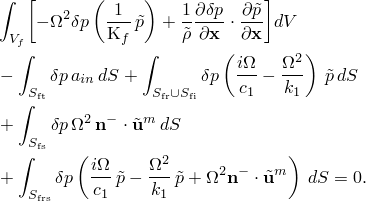这个方程在形式上与[方程2.9.1-4](02s09a41.md)相同，只是压力"刚度"项、辐射边界条件和施加的边界牵引力项不同。因为体积 drag 效应包含在复密度中，所以这个公式中的声学-结构边界项没有体积 drag 必须相对于声学介质中的其他效应很小的限制。此外，在这个公式中，施加在声学边界上的通量表示声学介质的内加速度，无论体积 drag 是否很大。最后，辐射边界条件对体积 drag 参数不做任何近似。

上述方程使用复密度，矩阵相同，除了声学单元的阻尼和刚度矩阵以及具有施加阻抗条件的表面，现在表现为

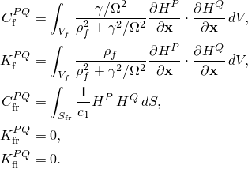在这个公式中，建模体积 drag 损失的矩阵与流体刚度矩阵成正比。

对于稳态谐波响应，我们假设结构围绕变形、受应力的基态进行小谐波振动，由前缀标识。因此，总应力可以写为

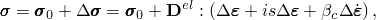其中是基态中的应力；是材料的弹性矩阵；是为材料选择的刚度比例阻尼因子（给出Rayleigh阻尼的刚度比例贡献，从而引入材料行为的粘性部分）；并且从离散化假设，

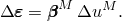

为了求解稳态问题，我们假设主导方程在基态中满足，并且我们在谐波振荡方面将这些方程线性化。对于内力向量，这产生

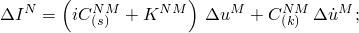并且[方程2.9.1-17](02s09a41.md)可以使用时间谐波关系重写为

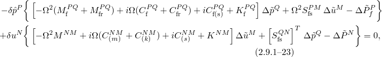其中

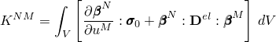（这个刚度包括初始应力矩阵，所以"应力刚化"和与基态应力和荷载相关的"荷载刚度"效应被包括在内）和

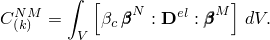我们还添加了"结构阻尼"项的"全局"部分

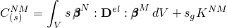和

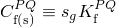到方程中。这些阻尼项在稳态动力学的低频极限中建模有限的能量损失——见"直接稳态动力学分析"第2.6.1节和"基于子空间的稳态动力学分析"第2.6.2节。应该注意的是，声学"结构阻尼"算子继承由体积 drag 引起的声学刚度矩阵的频率依赖性。

我们假设荷载和（由于线性）响应是谐波的；因此，我们可以写

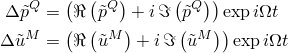和

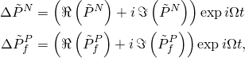其中、、和是响应振幅的实部和虚部；和是施加在结构上的力的振幅的实部和虚部；和是施加在流体上的声学牵引力（体积加速度维度）振幅的实部和虚部；是圆频率。我们将这些方程代入[方程2.9.1-23](02s09a41.md)并使用[方程2.9.1-16](02s09a41.md)的时间谐波形式，，这产生了耦合复线性方程组

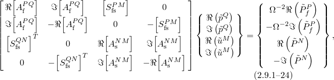其中

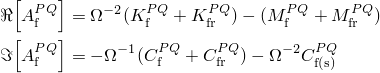和

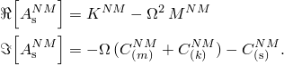如果是对称的，[方程2.9.1-24](02s09a41.md)是对称的。系统可能相当大，因为结构自由度的实部和虚部以及流体中的压力都出现在系统中。这个方程组在直接求解稳态动力学过程中为每个请求的频率求解。如果不存在阻尼，用户可以指定在分析中只对实矩阵方程进行因式分解。非零体积 drag 值（值对于阻抗表示阻尼。如上所述对于瞬态情况，如果结构上的流体力量很小，耦合系统可以拆分为解耦的结构分析和由结构响应驱动的声学分析。
### 特征值提取和基于模态过程的公式

从离散方程，[方程2.9.1-17](02s09a41.md)，我们可以将频域问题写为

其中是固有（而非强制响应）频率。为简洁起见省略了索引。这个系统归功于[Zienkiewicz和Newton（1969）](07s01a01-References.md)，在Abaqus中用作基于模态过程的起点。抑制任何阻尼项、荷载和任何与反应表面相关的项，

被解释为线性特征值问题（其中是特征值），由于非对称刚度和质量矩阵，这个方程不能在Abaqus中直接求解。然而，可以表明这些方程确实产生实值固有频率和模态，表明它们可以重写为对称形式。

应用[方程2.9.1-25](02s09a41.md)的模态来形成缩减系统（见下文）必须谨慎，因为这个非对称系统具有不同的左右特征向量集。特别是，与零频率相关的"奇异模态"是令人关注的，因为它们描述了系统的低频极限行为（或运动学意义上的"刚体运动"），因此对于构建准确的投影频域算子是必不可少的。耦合系统的右奇异模态是

换句话说，存在与的核相关的"结构"奇异右模态和与的核相关的"声学"奇异右模态。左奇异模态是

的解，是

右声学和左结构奇异模态是耦合的，在结构和声学域上具有非平凡场。这些耦合奇异模态是[方程2.9.1-25](02s09a41.md)中刚度项的结果，如果要投影这个系统，必须计算它们。

另一种频域公式，归功于[Everstine（1981）](07s01a01-References.md)，涉及替换并导致形式对称的系统：

相应的耦合特征问题是二次的，但这个系统的奇异模态结构要简单得多——由于对称性，左右特征向量对是相同的，并且由于刚度矩阵的对角结构，奇异模态是解耦的。模态 simplemente 是

### Lanczos公式

引入辅助变量，用增加方程组，并操纵方程得到

 这个增广方程组归功于Ohayon，仅用于Lanczos特征值提取。辅助变量是Abaqus/Standard内部的，不可用于输出。如果是非奇异的，则在Lanczos特征求解器中执行与奇异声学模态的正交化。

原始方程组[方程2.9.1-25](02s09a41.md)的左右特征向量可以从Lanczos解构造。如上所述，奇异模态对于构建准确的投影算子是必不可少的。容易验证Lanczos系统具有以下结构奇异模态：

然而，如果我们寻找非平凡的声学奇异模态（即，，使得)，我们容易发现，但也

如果存在非平凡，则是非奇异的；因此，为了使解存在，右端必须与的零空间正交。但我们很快观察到

因此，为了使用Lanczos公式找到声学奇异模态，我们构造一个扰动"力"，使得 Lanczos公式将产生非平凡奇异声学模态

原始非对称系统[方程2.9.1-25](02s09a41.md)的左右特征向量，包括奇异模态，可以从Lanczos解构造：

其中

对于任何非奇异声学模态，，其中是圆特征频率。然后，左右特征向量子空间用于计算模态量（广义质量、参与因子和有效质量），并在基于模态的过程中（如基于子空间的稳态动力学分析或瞬态模态动力学分析）投影质量、刚度和阻尼矩阵，以获得缩减的方程组。这些计算中的大多数与纯结构问题中的计算方式非常相似，这里不再讨论。此外，对于每个模态，声学广义质量的部分计算为声学对广义质量的贡献与总广义质量之比。

唯一值得简要讨论的例外是声学参与因子和有效质量的计算选择，如下所述。首先，选择一个"刚体"声学模态，类似于"与模型固有模态相关的变量"第2.5.2节中概述的结构问题的刚体模态，为统一的恒定压力场。然后定义总"声学质量"为。左右声学参与因子定义为

和

Abaqus/Standard然后报告计算出的声学参与因子为

和计算出的声学有效质量为

在方程中对的缩放是任意的。然而，这种缩放确保当所有特征模态被提取时，所有声学有效质量之和为1.0（减去在声学自由度上受约束的节点的贡献）。
### 使用模态空间投影的频域求解

在Abaqus中，耦合强制结构-声学响应的不同模态空间投影方法存在以下情况：使用来自Lanczos的耦合模态，使用来自Lanczos的非耦合模态，以及使用来自Abaqus/AMS的非耦合模态。在Lanczos模态情况下，强制响应使用Zienkiewicz-Newton方程计算，具有单独的右和左投影算子。在Abaqus/AMS非耦合模态情况下，Everstine方程用于强制响应，右和左投影算子是相同的。此情况在下面更详细地描述。
### 使用非耦合Abaqus/AMS模态

在这种情况下，Everstine方程用于耦合强制响应问题，模态从解耦的结构和声学Abaqus/AMS运行计算。在节点自由度上，强制响应由

其中和这里是结构和流体完整的组装阻尼矩阵，包括粘性和结构阻尼以及边界阻抗效应。使用由声学和结构模态构建的变换，

和结构和声学场在这些模态所跨越的空间中的表示，

我们获得

这个矩阵中的项对应于节点自由度算子，投影到模态空间上。模态坐标中的阻尼和耦合矩阵是满的和非对称的。
### 体积drag和流体粘度

支持声波的介质可能通过多孔基质流动，例如用于隔音的玻璃纤维。在这种情况下，参数是*流动阻力*，即迫使单位流动通过多孔基质所需的压力下降。具有标称粒子速度的传播平面波以速率

失去能量 流体还可以通过剪切粘度系数和体积粘度系数表现出动量损失。这些是应力与剪切应变率空间导数和体积应变率空间导数分量之间比例常数。在流体力学中，剪切粘度项通常比体积项更重要；然而，声学是对体积应变流动的研究，因此两个常数都可能重要。关于基态绝热扰动的线性化Navier-Stokes方程可以仅用压力场表示（[Morse和Ingard，1968](07s01a01-References.md)）：

在稳态中，这个线性化方程可以写成[方程2.9.1-19](02s09a41.md)的形式，其中

使得粘度效应可以被建模为具有值

的体积drag参数。

如果组合粘度效应很小，

所以我们可以写

在稳态形式中

其中是激励频率。这导致了粘性流体损失与体积drag或流动阻力之间的以下类比：

密度相对于频率为常数。在这个线性化、绝热、小粘度情况下，传播平面波的能量损失率为

### 声学输出量

几个二次量在声学分析中是有用的，从基本声学压力场变量推导。在稳态动力学中，任何场点的声学粒子速度为

 声学强度向量，一点处能量流率的度量，为

在声学介质中，应力张量简单地是声学压力乘以单位张量，，所以这个表达式简化为

"帽子"表示复共轭。强度的实部称为"有功强度"，虚部是"无功强度"。
### 声学贡献因子

声学贡献因子通过显示声学压力与特定结构表面或特定结构模态之间的关系来帮助用户解释耦合结构-声学系统的行为。在文献中，它们有时被称为声学"参与因子"，但由于这个术语在Abaqus中用于描述模态的特性（见"与模型固有模态相关的变量"第2.5.2节），这里选择了不同的名称。

首先，考虑与经历时间谐波振动的结构接触的声学介质。结构在湿润表面上每一点对流体施加牵引力，导致声学介质中的谐波压力。在给定耦合强制响应问题的解中，有时将压力分离成各个部分是有用的，每个部分由于湿润表面一部分的振动。例如，在汽车声学问题中，分别确定由于窗户、地板和其他面板产生的声压场部分可能是是有用的。由仅作用在结构表面上的给定结构振动产生的压力场，而湿润表面的所有其他部分保持固定，被定义为该表面的声学贡献因子：

其中和是与表面划分相关的耦合矩阵。可以对应于一组不相交的表面（例如，汽车中所有的窗玻璃）或单个节点。因为Abaqus中声学元素的自然边界条件是刚性壁，[方程2.9.1-34](02s09a41.md)在物理上对应于声学场仅在表面处与结构耦合，而所有其他边界表面都是刚性的。

例如，如果单个面板的声学贡献与总声学压力分离，

结构声学问题的耦合方程组可以写为

 其中。这个方程清楚地表明，面板的声学贡献因子取决于特定耦合谐波强制响应问题的解。然而，更高效的是求解和，然后使用[方程2.9.1-34](02s09a41.md)求解。

当使用基于子空间的稳态动力学或基于模态的稳态动力学时，和被投影；反过来，这些投影矩阵取决于前面的特征分析步骤是耦合的还是非耦合的。对于非耦合情况，单独的模态变换和对应于声学和结构模态，并且

定义的变换方程变为

感兴趣的可能还有特定模态对强制谐波耦合系统声学压力的贡献。物理上，模态声学贡献因子是强制响应问题中声学场的一部分，由于一个结构（或耦合）模态对声学流体的作用。模态声学贡献因子的计算取决于所讨论的模态是非耦合还是耦合的结构-声学模态。然而，它的定义类似于表面或面板声学贡献因子：它是由于仅感兴趣的单模态的作用而在湿润表面上由于荷载的声学响应，而所有其他模态保持固定。从[方程2.9.1-34](02s09a41.md)开始，但使用整个湿润表面耦合算子，

其中是耦合问题的结构响应，限制到模态。如果使用耦合模态变换，这个方程变为

如果感兴趣的耦合系统中没有声学力并且声学流体中没有阻尼或边界阻抗，这个方程简化为投影耦合谐波强制响应问题声学部分的第*J*行。因此，当使用耦合模态投影时，如果不存在声学激励，则不需要额外的求解来获得模态声学贡献因子。如果在定义的耦合响应问题中存在声学激励或阻尼，则必须在获得解后求解[方程2.9.1-37](02s09a41.md)。

当在耦合系统求解的投影中使用非耦合模态时，声学和结构模态形状之间没有直接关系。因此，将单独的非耦合模态变换应用于谐波强制响应问题不会产生与耦合模态情况相同的平凡结果。从[方程2.9.1-36](02s09a41.md)推导的，使用单独非耦合模态变换和得到的系统，必须为对应于通过结构模态激励的模态系数求解：

### 流体边界上的阻抗和导纳

[方程2.9.1-11](02s09a41.md)（或替代地[方程2.9.1-9](02s09a41.md)）可以为稳态分析写成复导纳形式：

其中我们定义

项是边界的复导纳，是对应的复阻抗。因此，可以通过使用[方程2.9.1-39](02s09a41.md)将数据拟合到参数和来为给定频率输入所需的复阻抗或导纳值。

对于在具有体积drag的无限介质中平面波的吸收，复阻抗可以显示为

对于Abaqus/Standard中基于阻抗的非反射边界条件，上述方程用于确定所需的常数和。如果体积drag非零，它们是频率的函数。这些方程的小drag版本在直接时间积分过程中使用，如[方程2.9.1-46](02s09a41.md)中所示。
### 辐射边界条件

许多声学研究涉及在无限域中的振动结构。在这些情况下，我们使用有限元对声学介质的一层进行建模，到完整波长的厚度，到一个"辐射"边界表面。然后我们在这个表面上施加条件，允许声波通过而不是反射回计算域。对于简单形状的辐射边界——如平面、球面等——简单的阻抗边界条件可以代表精确辐射条件的良好近似。特别是，我们包含形式为

的局部代数辐射条件，其中是波数，是复密度（见[方程2.9.1-18](02s09a41.md)）。*f*是与边界上使用的曲线坐标系度量因子相关的几何因子，是一个扩展损失项（见[表2.9.1-1](02s09a41.md)）。

表2.9.1-1 边界条件参数。
| 几何 | f |  |
| --- | --- | --- |
| 平面 | 1 | 0 |
| 圆或圆柱 | 1 |  |
| 椭圆或椭圆柱 |  |  |
| 球体 | 1 |  |
| 长球体 |  |  |

比较[方程2.9.1-41](02s09a41.md)和[方程2.9.1-9](02s09a41.md)表明，对于稳态分析，存在与反应边界方程[方程2.9.1-21](02s09a41.md)的直接类比，其中

和

对于瞬态过程，声学方程中体积drag的处理和辐射条件需要近似。在声学方程中，我们使用边界项

将[方程2.9.1-41](02s09a41.md)与[方程2.9.1-44](02s09a41.md)结合，关于展开，并仅保留一阶项导致

稳态形式的傅里叶逆得到瞬态边界条件

这个表达式包含压力及其时间一阶导数的独立系数，这与瞬态反应边界表达式（[方程2.9.1-10](02s09a41.md)）不同，后者仅包含压力的一阶和二阶导数的独立系数。因此，为了实现这个表达式，我们定义导纳参数

和

所以瞬态辐射边界条件的边界牵引力可以写为

参数*f*和的值随声学介质辐射表面边界几何形状而变化。Abaqus中支持的几何形状总结在[表2.9.1-1](02s09a41.md)中。在表中，指椭圆或球体的偏心率；指圆、球的半径或椭圆或球体的半长轴；是定位椭圆或球体上积分点的向量；是定位椭圆或球体中心的向量；是定向长轴的向量。

这些代数边界条件是向无限外部辐射的边界精确阻抗的近似。平面波条件是垂直入射到平面边界上平面波的精确阻抗。球面条件精确消除辐射球面的第一Legendre模式；圆条件对第一模式是渐近正确的（[Bayliss等，1982](07s01a01-References.md)）。椭圆和长球体条件基于低偏心率极限的椭圆和长球体波函数的展开（[Grote和Keller，1995](07s01a01-References.md)）；长球体条件精确消除其展开的第一项，而椭圆条件是渐近的。
### 平面波辐射边界条件的改进

正如已经指出的，上一节为平面波推导的辐射边界条件实际上基于声波从正交方向入射到边界的假设。但情况并非总是如此。图2.9.1-1显示了一个平面波的一般例子，其中声波方向与边界法线的夹角为。

图2.9.1-1 不垂直入射到边界的平面波。

为了准确考虑这种情况，我们采用[Sandler（1998）](07s01a01-References.md)中使用的平面波辐射方程；即，

其中是声速，和是对应于边界的法向速度。这是许多近似吸收边界条件发展的起点（例如，见[Engquist和Majda，1977](07s01a01-References.md)）。因此，我们有

使用第一个近似到上述方程平方根中第二项的一阶展开近似（类似于我们达到[方程2.9.1-45](02s09a41.md)所做的），我们可以获得改进的辐射边界条件

可以从比较中发现，这个方程与[方程2.9.1-46](02s09a41.md)的区别仅在于平面波的因子。在二维中，可以计算为

法向和切向导数和在积分点可以使用辐射边界表面上的相应单元来评估（即，见图2.9.1-2）；即，

其中是单元的节点压力值。

图2.9.1-2 沿边界的单元。

本节中描述的方法只能用于直接积分瞬态动力学；它不能与稳态或模态响应结合使用。此外，它适用于平面、轴对称和三维几何。

最后，该方法使平衡方程非线性，如[方程2.9.1-52](02s09a41.md)所示。虽然在理论上Abaqus/Standard中的迭代过程可以准确求解非线性平衡方程，但强烈建议使用小的半增量残差容差，因为在许多情况下，边界上压力及其相关残差相对于建模域中其他地方的量非常弱。积分点处的计算基于节点压力。节点压力使用"显式动力学分析"第2.4.5节中描述的显式中心差分程序更新。
### 参考文献

### 参考文献

"Abaqus Analysis User's Guide"第6.10.1节"声学、冲击和耦合声学-结构分析"

"Abaqus Analysis User's Guide"第26.3.1节"声学介质"

"Abaqus Analysis User's Guide"第34.4.6节"声学和冲击载荷"
