# 2.10.1 压电分析

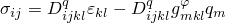### 2.10.1 压电分析

**产品：** Abaqus/Standard

压电效应是材料中应力与电场的耦合：电场导致材料应变，反之亦然。Abaqus/Standard具有执行完全耦合压电分析的能力。在这种情况下使用的单元同时包含位移自由度和电位作为节点变量。
### 平衡和通量守恒

压电效应受耦合机械平衡和电通量守恒方程控制。

机械平衡方程为

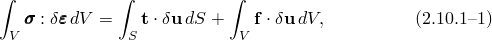其中当前位于点的"真实"（Cauchy）应力；物体表面一点处的牵引力；单位体积的体力（如达朗贝尔力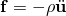其中物体的密度）；以及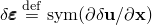其中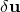任意连续向量场（虚速度场）。

电通量守恒方程为

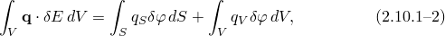其中电通量向量；单位面积的电通量，从物体表面一点进入身体；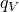单位体积进入身体的电通量；以及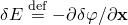其中任意连续标量场（虚电位）。这些量也以其他术语知道，这些术语在电气工程参考文献中经常使用。电通量向量*q*称为电位移，电位梯度*E*称为电场。
### 本构行为：材料耦合

目前使用线性材料假设。压电线性介质的基本方程定义如下。 following [Ikeda (1990)](07s01a01-References.md)，给出了三种替代形式的本构方程：

*e*-形式：

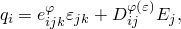

*d*-形式：

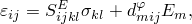

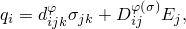

*g*-形式：

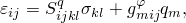

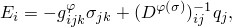其中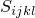材料柔度；材料刚度；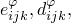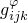压电常数；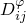介电常数。在这些方程中，上标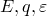或特定属性上方，表示该属性分别在零电位梯度、零电位移、零应变和零应力下定义。由于所有这些形式描述相同的本构关系，不同的机械和压电常数可以相互表示。属性之间存在以下关系（[Ikeda, 1990](07s01a01-References.md)）：

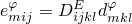
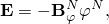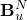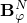
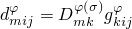

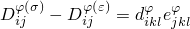

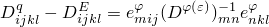在Abaqus中，使用*e*-形式的本构方程：

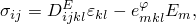

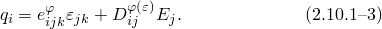这些用压电应力系数矩阵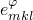示。然而，Abaqus也允许输入以压电应变系数矩阵示的压电常数。

*g*-形式的本构方程也可以表示为

和

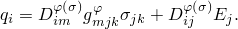这些方程在解释和验证压电分析结果时可能很方便。
### 运动学

对于压电单元，位移和电位都存在于节点位置。位移和电位在单元内近似为

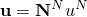和

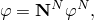其中插值函数数组，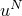节点量。体力、电荷以及表面力和电荷以类似方式插值。

应变和电位梯度给出为

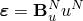和

其中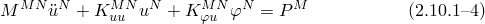和

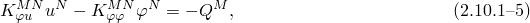其中

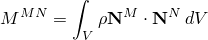是质量矩阵（电通量守恒方程不存在惯性项），质量密度，

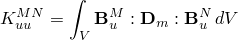位移刚度矩阵，

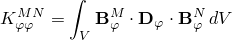介电"刚度"矩阵，

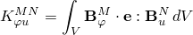压电耦合矩阵，

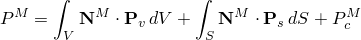机械力向量，

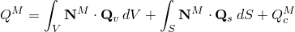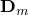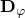电荷向量。在这些表达式中，本构特性以矩阵形式指定，其中力学关系，电学关系，压电关系。"荷载"向量包括体、表面和集中量，如图所示。未知数是节点位移和电位。一旦确定了这些，就可以使用上述表达式计算应变和电位梯度。应力和电通量密度通过本构关系计算。
### 参考

### 参考

"Abaqus Analysis User's Guide"第6.7.2节"压电分析"
