# 2.11.1 非耦合热传递分析

### 2.11.1 非耦合热传递分析

**产品：** Abaqus/Standard

Abaqus/Standard的非耦合热传递分析能力旨在模拟具有一般温度依赖热传导率、内部能量（包括潜热效应）以及相当一般的对流和辐射边界条件的固体热传导。本节描述了所使用的基本能量平衡、本构模型、边界条件、有限元离散化和时间积分过程。

流动材料中的热传递（对流）在"对流/扩散"第2.11.3节中讨论。腔体中的辐射热传递在"腔体辐射"第2.11.4节中讨论。所有这些热传递机制都可以存在于模型中。
### 能量平衡

基本能量平衡为（Green和Naghdi）

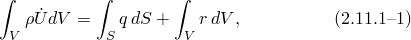其中*V*是固体材料的体积，表面积为*S*；材料密度；内部能量的材料时间变化率；*q*是单位面积的热通量，流入物体；*r*是单位体积内部提供给物体的热量。

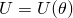假设热问题和力学问题是解耦的，即仅取决于温度，其中材料温度，*q*和*r*不依赖于物体的应变或位移。为简单起见，假设使用拉格朗日描述，因此"体积"和"表面积"是指参考配置中的体积和表面积。
### 本构定义

这个关系通常以比热表示，写成（忽略力学和热问题的耦合）：

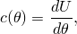除了相变时的潜热效应，这些效应根据固相线和液相线温度（相变范围的较低和较高温度界限）以及与相变相关的总内部能量（称为潜热）单独给出。当给出潜热时，假设它是比热效应的附加项（见图2.11.1-1）。

图2.11.1-1 比热、潜热定义。

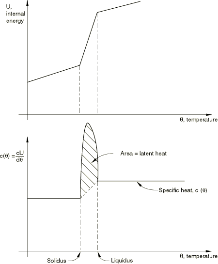 对于许多情况，假设相变发生在已知温度范围内是合理的，这可以由用户指定。然而，在某些情况下，可能需要包含相变的动力学理论来准确建模效应（例如，预测聚合物铸造过程中结晶的例子）。对于这种情况，用户可以使用Abaqus中的解决方案相关状态变量特性与用户子程序HETVAL相当详细地建模过程。

热传导假设由傅里叶定律控制，

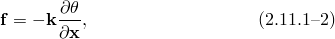其中电导率矩阵，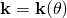热通量；位置。电导率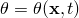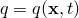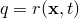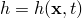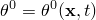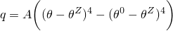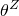边界条件可以指定为规定温度、规定表面热通量，每面积的规定体积热通量，每体积的表面對流：其中膜系数，汇温度；以及辐射：其中A是辐射常数（发射率乘以斯特藩-玻尔兹曼常数），所用温度标度的绝对零值。表面也可以参与腔体辐射效应。Abaqus中的腔体辐射公式在"腔体辐射"第2.11.4节中描述。
### 空间离散化

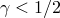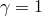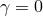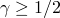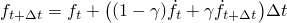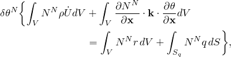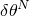能量平衡的变分陈述，[方程2.11.1-1](02s11a43-Uncoupled-heat-transfer-analysis.md)，以及傅里叶定律，[方程2.11.1-2](02s11a43-Uncoupled-heat-transfer-analysis.md)，通过标准Galerkin方法直接获得为

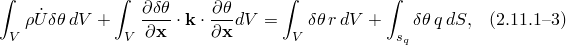其中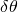满足本质边界条件的任意变分场。身体用有限元进行几何近似，因此温度插值为

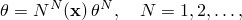其中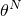节点温度。Galerkin方法假设变分场，由相同的函数插值：

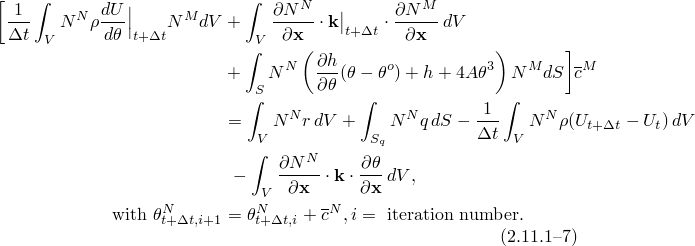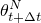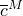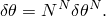一维、二维和三维中的一阶和二阶多项式用于通过这些插值，变分陈述，[方程2.11.1-3](02s11a43-Uncoupled-heat-transfer-analysis.md)，变为

由于任意选择的，这给出了方程组

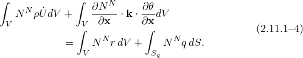这个方程组是几何近似的"连续时间描述"。
### 时间积分

Abaqus/Standard使用向后差分算法：

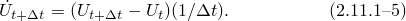选择这个算子有多种原因。首先，我们从形式的单步算子中选择

因为它们的实现简单（例如，不需要特殊的启动程序）且行为易于理解。对于这类算子仅对线性热传递问题有条件稳定。我们更喜欢使用无条件稳定的方法，因为Abaqus最常用于在非常长的时间段（相对于算子显式形式的稳定性极限内求解问题的场合，因此选择在这些算子中，中心差分法，具有最高的准确性。然而，那种形式的算子往往会在早期时间解中产生振荡，而在向后差分形式中不存在。因此，我们使用向后差分。引入算子，[方程2.11.1-5](02s11a43-Uncoupled-heat-transfer-analysis.md)，到能量平衡[方程2.11.1-4](02s11a43-Uncoupled-heat-transfer-analysis.md)给出

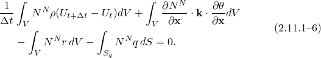这个非线性系统通过改进的Newton法求解。该方法是改进的Newton，因为切线矩阵（Jacobian矩阵）——即[方程2.11.1-6](02s11a43-Uncoupled-heat-transfer-analysis.md)左边相对于变分率——不是精确形成的。这个切线矩阵中项的形成现在描述。

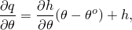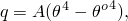内能项给出Jacobian贡献：

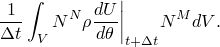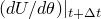比热，在潜热范围外；如果在积分点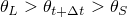则是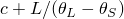其中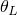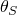液相线和固相线温度，*L*是与此相变相关的潜热。

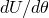在严重的潜热情况下，这一项可能导致数值不稳定，因为刚度项固相线-液相线温度范围之外很小，而在那个相当窄的范围内非常刚硬。为了在这些情况下避免这种不稳定，在求解时间步的早期迭代中，这个项被修改为割线项。由于修改仅发生在涉及潜热的情况下，因此它仅影响那些问题。

电导率项给出Jacobian贡献：

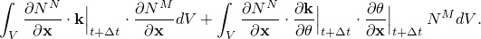第二项通常很小，因为电导率通常仅随温度缓慢变化。正因为如此，而且因为该项不是对称的，通常省略它更有效。除非选择非对称求解器，否则省略此项。规定的表面通量和体积通量也可能依赖温度，然后会产生Jacobian贡献。

对于膜和辐射条件，表面通量项给出Jacobian贡献：

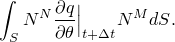对于膜条件，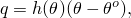

而对于辐射，

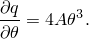这些项以这种精确形式包含在Jacobian中。改进的Newton方法然后是

对于纯线性系统，[方程2.11.1-7](02s11a43-Uncoupled-heat-transfer-analysis.md)在线性的，因此也在线性的，所以单个方程求解提供由于该方法通常只是Newton方法的微小修改，收敛很快。

Abaqus/Standard使用自动（自适应）时间步进算法来选择这是基于用户提供的关于时间增量中允许的最大温度变化容差，并根据此参数以及[方程2.11.1-7](02s11a43-Uncoupled-heat-transfer-analysis.md)在非线性情况下的收敛率来调整增量。

一阶热传递单元（如2节点连杆、4节点四边形和8节点砖）使用数值积分规则，积分站位于单元角落用于热容项。这意味着与内部能量率相关的Jacobian项是对角的。当存在强烈潜热效应时，这种方法特别有效。二阶单元使用常规高斯积分。因此，二阶单元在解将是平滑的问题（没有潜热效应）中更受欢迎，而一阶单元应在非平滑情况（有潜热）中使用。

HEATCAP单元可用于模拟一点的集中热容。相关的集中膜和集中辐射加载选项由用户指定。这些加载选项也允许在耦合温度-位移、耦合热-电和耦合热-电-结构分析中使用。
### 参考

### 参考

"Abaqus Analysis User's Guide"第6.5.2节"非耦合热传递分析"
